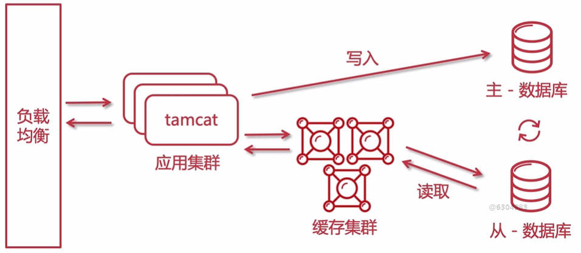

# 架构设计方案


## 架构

### 大型网站的特点与设计宗旨

#### 特点

- 高并发，流量大（日均访问巨大10亿+）
- 高可用 （稳定向用户提供7*24小时不间断服务）
- 大数据（图片、文字）
- 敏捷开发，迭代快（1~2周快速迭代一次）
- 用户体系庞大（分布在不同地区）
- 可持续升级（单体-集群-分布式-微服务）
- 安全级别高（运维+安全漏洞防范）
- 可弹性、可伸缩（弹性扩展、动态扩容）
- 吞吐量高，响应速度快（请求响应快）

#### 设计宗旨

- 合久必分（系统拆分，例如mvc模式）
- 集群（多台服务器节点部署相同的应用构成一个集群，保证负载均衡的同时提升系统的可用性（互相灾备），是高可用和负载均衡的手段）
- CDN（不会因为距离而使用户请求速度变慢）
- 分布式系统（分布式架构、分布式文件系统、分布式锁、分布式事务、分布式配置、分布式限流、日志收集等）
- 异步（通过消息队列对代码解耦，可以在高并发时进行流量削峰）
- 业务分离（业务模块进行合理分离，独立成服务）
- 数据备份（冷热备份、主从）


### 大型网站架构演进历程

#### 单体架构（单节点部署）


#### 集群（多节点部署 - 读写分离）



#### 集群（多节点部署 - 读写分离-分库分表）

单表数据量>700万，需要考虑分表。一旦分表，必须使用分布式主键。表中主键不可以使用自增Id，必须使用全局GUID。


#### 集群与其他中间件


#### 微服务


#### 微服务（公共组件）


### 架构师核心技术栈和具备的能力

#### 核心技术栈


#### 具备能力

- 技术全面，有广度
- 关注前沿技术（阅读英文咨询文档）
- 全局观、预判
- 把控团队，忙而不乱
- 系统分解与模块拆分
- 指导与培训
- 沟通和协调能力
- 抽象、举例、画图
- 软技能（项目管理）


### 技术选型

#### 考虑点

- 切合业务
- 社区活跃度
- 团队技术水平
- 版本更新迭代周期（考虑更新快的、周期短的）
- 试错精神（平时多验证，而不是正式中验证）
- 安全性（不能有安全漏洞）
- 成功案例
- 开源精神

#### 技术点

前端：MVVM开发模式，Jquery + VUE.JS

注意：前后端访问的跨域问题。


### 前后端分离开发模式（架构）

前后端页面交互，采用MVVM开发模式。

前端和后端项目彼此独立，属于两个不同的项目。可以放在不同的服务器，各自独立分开部署。


- common（Utils）：通用组件、工具类
- pojo（Entity）：实体层、entity、BO、VO
- mapper（DAO）：数据层
- service：业务层
- api-controller：api层

依赖关系：api => service => mapper => pojo => common


## 工具

### PDMan

```
jdbc:mysql://IP地址:端口号/数据库名?characterEncoding=UTF-8&useSSL=false&useUnicode=true&serverTimezone=UTC
```


## 数据库设计


### 数据库外键影响点

- 性能影响（外键是对数据完整性的一种约束，在分布式系统中，包含外键需要频繁的验证完整性）
- 热更新（不停机进行更新，有外键会影响数据更新）
- 降低耦合度
- 数据库分库分表（有外键，很难做分表）

### 特殊列说明

- 主键，全局ID，varchar类型。推荐使用开源的工具包来生成全局唯一ID值。


