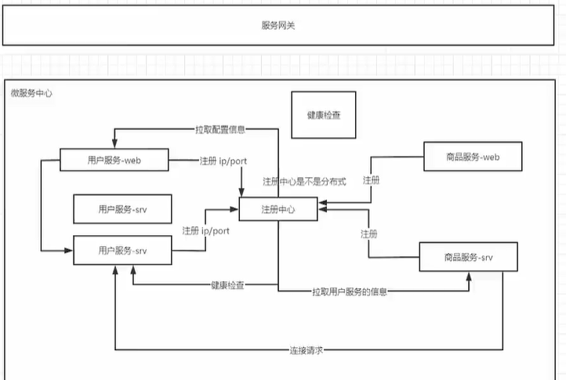
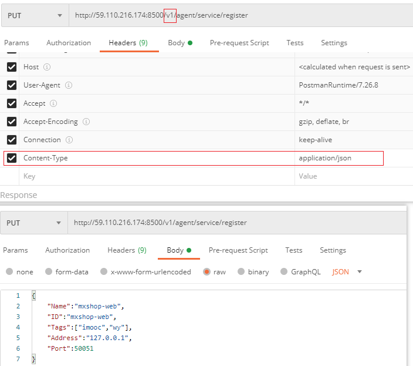
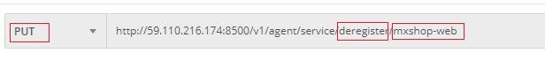

# 服务注册与发现

各个服务的配置信息的注册，和拉取各个服务的配置信息。



说明：

- 各个服务将 IP/Port 注册到服务中心；
- 外部通过服务网关访问注册中心；（疑问）
- 每个服务先通过服务中心获取到其他服务的配置信息（IP/Port等），得到这些配置信息后再去访问其他服务；
- 健康检查，注册中心会定时检查与各个服务之间是否连接正常。

注册中心，可以是分布式的。


## consul

github 地址：https://github.com/hashicorp/consul

### consul 的安装和配置

安装：

```shell
docker run -d -p 8500:8500 -p 8300:8300 -p 8301:8301 -p 8302:8302 -p 8600:8600/udp  consul consul agent  -dev -client=0.0.0.0
# 设置随容器自动启动
docker container update --restart=always 容器Id
```

8600 是 DNS 端口，8500 是 HTTP 端口。

安装完成之后，可以直接通过浏览器访问 127.0.0.1:8500，查看consul的主界面。

consul 提供了 dns 功能，可以通过 dig 命令行来测试，linux下的dig命令安装：

```
yum install bind-utils
```

consul 默认的 dns 端口是8600， 可以使用如下命令行测试 DNS 端口：

```
dig @192.168.1.103 -p 8600 consul.service.consul SRV
```


### consul 的 API 接口

#### 1. 添加服务

https://www.consul.io/api-docs/agent/service#register-service

直接通过PostMan添加服务：




#### 2. 删除服务

https://www.consul.io/api-docs/agent/service#deregister-service

使用PostMan删除注册的服务：

只需要在url中，指定要删除的服务的ID即可。




#### 3. 设置健康检查

https://www.consul.io/api-docs/agent/check

.net consul注册和设置健康检查的应用


#### 4. 同一个服务注册多个实例

#### 5. 获取服务

https://www.consul.io/api-docs/agent/service#list-services


