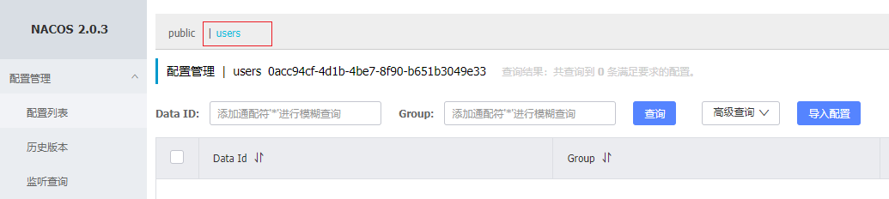

# 分布式配置中心

技术选型

- Apollo
- Nacos


## Nacos

- 能获取到配置
- 能监听到配置文件的修改
- nacos 既是一个配置中心，也是一个注册中心

### 下载并安装

```shell
docker run --name nacos-standalone -e MODE=standalone -e JVM_XMS=512m -e JVM_XMX=512m -e JVM_XMN=256m -p 8848:8848 -d nacos/nacos-server:latest

```

安装完成之后，访问nacos页面：

http://192.168.171.223:8848/nacos/index.html

初始用户名和密码均是nacos。

### Nacos 的基本使用

[3-4 nacos的组、配置集、命名空间-慕课网体系课 (imooc.com)](https://class.imooc.com/lesson/1912#mid=45643)

- 命名空间 -> 新建命名空间
- 配置管理 -> 配置列表 -> 新建配置信息

#### 新建命名空间

命名空间可以隔离配置，可以将某些配置放到某一个命名空间之下。

命名空间我们一般用来区分各个微服务，一个服务可以建立一个命名空间。

新建完命名空间之后，将会在配置列表界面看到相关信息，点击对应的命名空间，可以在其下查看和维护配置集。

下图中的users为新创建的命名空间：



#### 新建配置信息

- Data ID：配置集，一个配置集对应个配置文件，对应一个配置文件的 ID 标识，一般可以命名为配置文件名。
- Group：可以用来区别区别开发、测试、生产环境。


