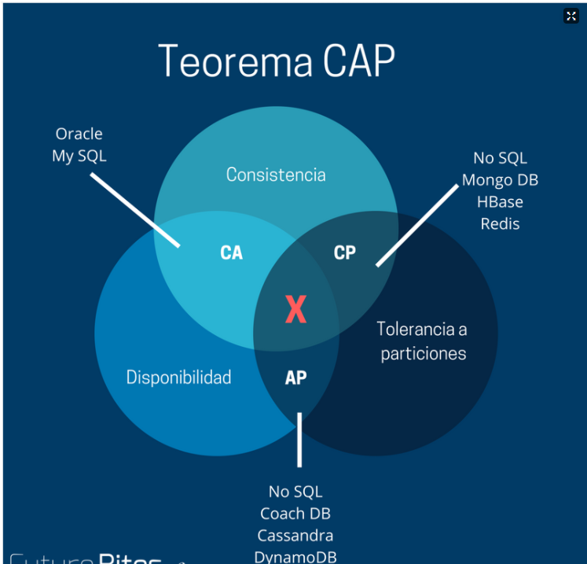

# 分布式事务


## 本地事务

### 原子性（atomicity）

功能不可再分，要么全部成功，要么全部失败。

### 一致性（consistency）（最重要、最关键）

一致性是指数据处于一种语义上的有意义且正确的状态。一致性是对数据可见性的约束，保证在一个事务中的多次操作的数据中间状态对其他事务不可见的。因为这些中间状态是一个过渡状态，与事务的开始状态和事务的结束状态是不一致的。

例如，张三给李四转账100元：

```
张三未扣减、李四未收到
张三已扣减、李四未收到
张三已扣减，李四已收到
```

上述过程中： 1. 是初始状态、2是中间状态、3是最终状态，1和3是我们期待的状态，但是2这种状态却不是我们期待出现的状态。

原子性和一致性的的侧重点不同：**原子性关注状态，要么全部成功，要么全部失败，不存在部分成功的状态。而一致性关注数据的可见性，中间状态的数据对外部不可见，只有最初状态和最终状态的数据对外可见。**

### 隔离性（isolation）

事务的隔离性是指多个用户并发访问数据库时，一个用户的事务不能被其它用户的事务所干扰，多个并发事务之间数据要相互隔离。

隔离性是多个事务的时候, 相互不能干扰，一致性是要保证操作前和操作后数据或者数据结构的一致性，而我提到的事务的一致性是**关注**数据的中间状态，也就是一致性需要监视中间状态的数据，如果有变化，即刻回滚。

如果不考虑隔离性，事务存在3种并发访问数据问题，也就是事务里面的脏读、不可重复读、虚度/幻读。

mysql的隔离级别：读未提交、读已提交、可重复读、串行化

### 持久性（durability）

是事务的保证，事务终结的标志(内存的数据持久到硬盘文件中)。


## 分布式事务

分布式事务顾名思义就是要在分布式系统中实现事务，它其实是由多个本地事务组合而成。

对于分布式事务而言几乎满足不了 ACID，其实对于单机事务而言大部分情况下也没有满足 ACID，不然怎么会有四种隔离级别呢？所以更别说分布在不同数据库或者不同应用上的分布式事务了。

### CAP 理论

[3-14 图文节-慕课网体系课 (imooc.com)](https://class.imooc.com/lesson/1230#mid=30731)

#### Consistency (一致性)

即更新操作成功并返回客户端后，所有节点在同一时间的数据完全一致，这就是分布式的一致性。

一致性的问题在并发系统中不可避免，对于客户端来说，一致性指的是并发访问时更新过的数据如何获取的问题。从服务端来看，则是更新如何复制分布到整个系统，以保证数据最终一致。

#### Availability (可用性)

即服务一直可用，而且是正常响应时间。好的可用性主要是指系统能够很好的为用户服务，不出现用户操作失败或者访问超时等用户体验不好的情况。

可用性和一致性是互斥的。

#### Partition Tolerance (分区容错性)

即分布式系统在遇到某节点或网络分区故障的时候，仍然能够对外提供满足一致性和可用性的服务。分区容错性要求能够使应用虽然是一个分布式系统，而看上去却好像是在一个可以运转正常的整体。比如现在的分布式系统中有某一个或者几个机器宕掉了，其他剩下的机器还能够正常运转满足系统需求，对于用户而言并没有什么体验上的影响。

分区容错性是分布式系统必须要满足的特性，如果连分区容错性都不满足，就不是一个分布式系统。

因此CAP理论中，三点一定不能同时满足，要么满足CP，要么满足AP。

#### 取舍策略

**CA without P：**如果不要求P（不允许分区），则C（强一致性）和A（可用性）是可以保证的。但放弃P的同时也就意味着放弃了系统的扩展性，也就是分布式节点受限，没办法部署子节点，这是违背分布式系统设计的初衷的。

**CP without A：**如果不要求A（可用），相当于每个请求都需要在服务器之间保持强一致，而P（分区）会导致同步时间无限延长(也就是等待数据同步完才能正常访问服务)，一旦发生网络故障或者消息丢失等情况，就要牺牲用户的体验，等待所有数据全部一致了之后再让用户访问系统。设计成CP的系统其实不少，最典型的就是分布式数据库，如Redis、HBase等。对于这些分布式数据库来说，数据的一致性是最基本的要求，因为如果连这个标准都达不到，那么直接采用关系型数据库就好，没必要再浪费资源来部署分布式数据库。

**AP wihtout C：**要高可用并允许分区，则需放弃一致性。一旦分区发生，节点之间可能会失去联系，为了高可用，每个节点只能用本地数据提供服务，而这样会导致全局数据的不一致性。典型的应用就如某米的抢购手机场景，可能前几秒你浏览商品的时候页面提示是有库存的，当你选择完商品准备下单的时候，系统提示你下单失败，商品已售完。这其实就是先在 A（可用性）方面保证系统可以正常的服务，然后在数据的一致性方面做了些牺牲，虽然多少会影响一些用户体验，但也不至于造成用户购物流程的严重阻塞。




### Base 理论

分布式系统中的一致性是 弱一致性 单数据库 mysql的一致性 强一致性。

BASE是Basically Available（基本可用）、Soft state（软状态）和Eventually consistent（最终一致性）三个短语的缩写。

BASE理论是对CAP中一致性和可用性权衡的结果，其来源于对大规模互联网系统分布式实践的总结， 是基于CAP定理逐步演化而来的。

BASE理论的核心思想是：即使无法做到强一致性，但每个应用都可以根据自身业务特点，采用适当的方式来使系统达到最终一致性。

接下来看一下BASE中的三要素。

#### BASE 三要素

**1、基本可用**

基本可用是指分布式系统在出现不可预知故障的时候，允许损失部分可用性—-注意，这绝不等价于系统不可用。

比如：

（1）响应时间上的损失。正常情况下，一个在线搜索引擎需要在0.5秒之内返回给用户相应的查询结果，但由于出现故障，查询结果的响应时间增加了1~2秒。

（2）系统功能上的损失：正常情况下，在一个电子商务网站上进行购物的时候，消费者几乎能够顺利完成每一笔订单，但是在一些节日大促购物高峰的时候，由于消费者的购物行为激增，为了保护购物系统的稳定性，部分消费者可能会被引导到一个降级页面。

**2、软状态**

软状态指允许系统中的数据存在中间状态，并认为该中间状态的存在不会影响系统的整体可用性，即允许系统在不同节点的数据副本之间进行数据同步的过程存在延时。

**3、最终一致性**

最终一致性强调的是所有的数据副本，在经过一段时间的同步之后，最终都能够达到一个一致的状态。因此，最终一致性的本质是需要系统保证最终数据能够达到一致，而不需要实时保证系统数据的强一致性。总的来说，BASE理论面向的是大型高可用可扩展的分布式系统，和传统的事物ACID特性是相反的，它完全不同于ACID的强一致性模型，而是通过牺牲强一致性来获得可用性，并允许数据在一段时间内是不一致的，但最终达到一致状态。但同时，在实际的分布式场景中，不同业务单元和组件对数据一致性的要求是不同的，因此在具体的分布式系统架构设计过程中，ACID特性和BASE理论往往又会结合在一起。


一句话：CAP就是告诉你：想要满足C、A、P就是做梦，BASE才是你最终的归宿。