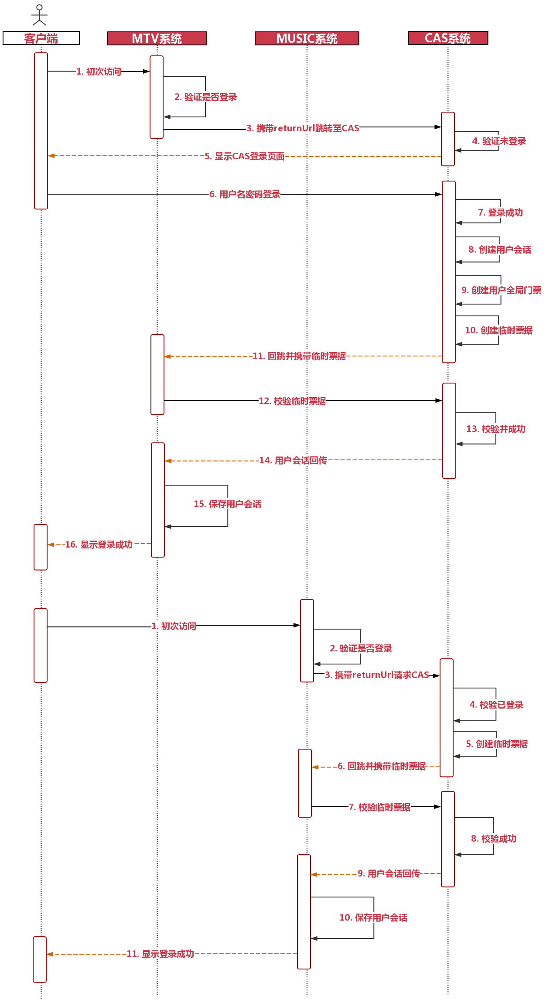

# 用户会话与单点登录


## 会话（Session）

会话（session）代表的是客户端与服务器的一次交互过程（浏览器关闭，会话就会丢失）。

由于HTTP请求是无状态的，用户向服务端发起多个请求时，服务端并不会知道多次请求来自同一用户，所以会话也是无状态的。为了有状态的记录用户，就需要使用cookie。

会话的应用场景：

- 单体应用下的会话

- 动静分离应用下的会话

- 集群分布式系统下的会话


### 单体应用下的会话

单体应用下的会话是有状态的，当用户首次请求服务器时，服务器会创建一个session，并将sessionid放入cookie中，后续用户每次请求都会携带sessionid以保持用户状态，服务器在接到用户请求时，会拿着这个session的ID在内存中找到对应的会话session，找到后就可以操作会话了。

### 动静分离应用下的会话设计

后端接收到前端的第一次请求时，会自定义一个token，作为用户会话来代替session，同时将这个token写入到前端cookie中，后续前端在交互的过程中，都携带这个cookie到后端，后端解析后得到token信息，就可以识别出用户请求来自谁了。

后端需要做的工作后：

- 第一次处理请求时，生成自定义token，并放入到cookie中，一般不会只存放token，还会携带一些用户其他不敏感的信息，一同写入到cookie中。（第一步）
- 在后续每次处理请求时，根据需要解析前端携带到后端的cookie信息，或从请求的header中取出token信息，来识别用户了。（第四步）

前端需要做的工作有：

- 解析后端写入的cookie信息，获取token（第二步）
- 为了方便（比如拦截器过滤用户身份），在后续每次请求时，可以将token或userid信息放到请求的header中发给后端（第三步）


### 集群分布式系统下的会话设计

实用redis保存用户的token信息，在不同系统之间进行比对。


## Redis 会话

后端在处理用户的第一次请求时，生成一个自定义的token，例如可以使用GUID作为token。

然后以携带有用户Id的信息作为key（建议以:隔开），token作为值存入到redis中。例如：

```
set redis_user_token:userid token信息
```

后端将该token写入到cookie中，以便前端进行解析。

前端解析cookie获取token信息，为了后续处理方便，前端每次请求，会在header中携带token和userId信息。

后端通过Redis中是否存有该用户的token来进行登录和退出以及用户会话是否失效等相关的判断。

- 用户登录，写入cookie和 redis 的会话信息；
- 用户退出，清除cookie和 redis 的会话信息；
- 异地登录，判断前端传入的token（前端从cookie中解析得到的）是否与redis中的token一致，不一致就是异地登录，提示重新登录。


## 单点登录（SSO)

单点登录，Single Sign On，简称 SSO。

单点登录的原理是分布式会话来实现，在一个站点登录后，其他相关的站点也会随之登录，即在一个站点产生的会话能共享给其他站点。


### Cookie在不用域名之间共享的逻辑关系

cookie的domain，直接影响cookie共享逻辑。

- 在setcookie中省略domain参数，那么domain默认为当前域名。
- domain参数可以设置父域名以及自身，但不能设置其它域名，包括子域名，否则cookie不起作用。
- 如果cookie设置为顶级域名，则全部的域名，包括顶级域名、二级域名、三级域名等，都可以共享该cookie。
- 如果cookie设置为当前域名，则当前域名及其下面的所有子域名可以共享该cookie

例如：

- 当cookieDomain设置为`.wy.com` 时（注意前面的`.`），此时所有`*.wy.com`的cookie值彼此都可以共享，同时其下的所有子域名也可以共享其cookie。

- 当cookieDomain设置为`abc.wy.com`时（注意前面没有`.`表示指定独立域名），此时其他同级的域名（比如：ee.wy.com）都不能共享获得该域名下的cookie，要共享必须设置为`.wy.com` 。


### 相同顶级域名的单点登录

只要前端网页和后端应用在同一个顶级域名下，那么Cookie就可以被共享，所以结合Redis就可以实现单点登录。


### 不同顶级域名的单点登录


如上图所示，多个系统之间的登录会通过一个独立的登录系统去做验证，它就相当于是一个中介公司，整合了所有人，你要看房经过中介允许拿钥匙就行，实现了统一的登录。那么这个就称之为CAS系统。

### CAS

CAS全称为Central Authentication Service，即中央认证服务。

CAS是一个单点登录的解决方案，可以用于不同顶级域名之间的单点登录。 

假如存在MTV系统和MUSIC系统，它们分别在不同的站点之下，此时CAS处理流程参考如下时序图：



- 创建用户会话：登录后创建用户的全局会话，并将会话存入redis中。=> uniqueToken
- 创建用户全局门票：用以表示在CAS端是否登录，全局门票会关联用户id，并且也会放入到redis中，代表这个用户有门票了，可以在各个系统中同行，为了能够携带全局门票，需要将全局门票写入到CAS端的cookie中。=>userTicket
- 创建用户临时票据：用于回调到调用端网站，是由CAS端签发的一个一次性的临时ticket，这个临时ticket也会写入到redis中，并设置过期时间； => tmpTicket


相关参考代码：

```java
package com.imooc.controller;

import com.imooc.pojo.Users;
import com.imooc.pojo.vo.UsersVO;
import com.imooc.service.UserService;
import com.imooc.utils.IMOOCJSONResult;
import com.imooc.utils.JsonUtils;
import com.imooc.utils.MD5Utils;
import com.imooc.utils.RedisOperator;
import org.apache.commons.lang3.StringUtils;
import org.springframework.beans.BeanUtils;
import org.springframework.beans.factory.annotation.Autowired;
import org.springframework.stereotype.Controller;
import org.springframework.ui.Model;
import org.springframework.web.bind.annotation.GetMapping;
import org.springframework.web.bind.annotation.PostMapping;
import org.springframework.web.bind.annotation.ResponseBody;

import javax.servlet.http.Cookie;
import javax.servlet.http.HttpServletRequest;
import javax.servlet.http.HttpServletResponse;
import java.util.UUID;

@Controller
public class SSOController {

    @Autowired
    private UserService userService;

    @Autowired
    private RedisOperator redisOperator;

    public static final String REDIS_USER_TOKEN = "redis_user_token";
    public static final String REDIS_USER_TICKET = "redis_user_ticket";
    public static final String REDIS_TMP_TICKET = "redis_tmp_ticket";

    public static final String COOKIE_USER_TICKET = "cookie_user_ticket";

    @GetMapping("/login")
    public String login(String returnUrl,
                        Model model,
                        HttpServletRequest request,
                        HttpServletResponse response) {

        model.addAttribute("returnUrl", returnUrl);

        // 1. 获取userTicket门票，如果cookie中能够获取到，证明用户登录过，此时签发一个一次性的临时票据并且回跳
        String userTicket = getCookie(request, COOKIE_USER_TICKET);

        boolean isVerified = verifyUserTicket(userTicket);
        if (isVerified) {
            String tmpTicket = createTmpTicket();
            return "redirect:" + returnUrl + "?tmpTicket=" + tmpTicket;
        }

        // 2. 用户从未登录过，第一次进入则跳转到CAS的统一登录页面
        return "login";
    }

    /**
     * 校验CAS全局用户门票
     * @param userTicket
     * @return
     */
    private boolean verifyUserTicket(String userTicket) {

        // 0. 验证CAS门票不能为空
        if (StringUtils.isBlank(userTicket)) {
            return false;
        }

        // 1. 验证CAS门票是否有效
        String userId = redisOperator.get(REDIS_USER_TICKET + ":" + userTicket);
        if (StringUtils.isBlank(userId)) {
            return false;
        }

        // 2. 验证门票对应的user会话是否存在
        String userRedis = redisOperator.get(REDIS_USER_TOKEN + ":" + userId);
        if (StringUtils.isBlank(userRedis)) {
            return false;
        }

        return true;
    }

    /**
     * CAS的统一登录接口
     *      目的：
     *          1. 登录后创建用户的全局会话                 ->  uniqueToken
     *          2. 创建用户全局门票，用以表示在CAS端是否登录  ->  userTicket
     *          3. 创建用户的临时票据，用于回跳回传          ->  tmpTicket
     */
    @PostMapping("/doLogin")
    public String doLogin(String username,
                          String password,
                          String returnUrl,
                          Model model,
                          HttpServletRequest request,
                          HttpServletResponse response) throws Exception {

        model.addAttribute("returnUrl", returnUrl);

        // 0. 判断用户名和密码必须不为空
        if (StringUtils.isBlank(username) ||
                StringUtils.isBlank(password)) {
            model.addAttribute("errmsg", "用户名或密码不能为空");
            return "login";
        }

        // 1. 实现登录
        Users userResult = userService.queryUserForLogin(username,
                MD5Utils.getMD5Str(password));
        if (userResult == null) {
            model.addAttribute("errmsg", "用户名或密码不正确");
            return "login";
        }

        // 2. 实现用户的redis会话
        String uniqueToken = UUID.randomUUID().toString().trim();
        UsersVO usersVO = new UsersVO();
        BeanUtils.copyProperties(userResult, usersVO);
        usersVO.setUserUniqueToken(uniqueToken);
        redisOperator.set(REDIS_USER_TOKEN + ":" + userResult.getId(),
                JsonUtils.objectToJson(usersVO));

        // 3. 生成ticket门票，全局门票，代表用户在CAS端登录过
        String userTicket = UUID.randomUUID().toString().trim();

        // 3.1 用户全局门票需要放入CAS端的cookie中
        setCookie(COOKIE_USER_TICKET, userTicket, response);

        // 4. userTicket关联用户id，并且放入到redis中，代表这个用户有门票了，可以在各个景区游玩
        redisOperator.set(REDIS_USER_TICKET + ":" + userTicket, userResult.getId());

        // 5. 生成临时票据，回跳到调用端网站，是由CAS端所签发的一个一次性的临时ticket
        String tmpTicket = createTmpTicket();

        /**
         * userTicket: 用于表示用户在CAS端的一个登录状态：已经登录
         * tmpTicket: 用于颁发给用户进行一次性的验证的票据，有时效性
         */

        /**
         * 举例：
         *      我们去动物园玩耍，大门口买了一张统一的门票，这个就是CAS系统的全局门票和用户全局会话。
         *      动物园里有一些小的景点，需要凭你的门票去领取一次性的票据，有了这张票据以后就能去一些小的景点游玩了。
         *      这样的一个个的小景点其实就是我们这里所对应的一个个的站点。
         *      当我们使用完毕这张临时票据以后，就需要销毁。
         */

//        return "login";
        return "redirect:" + returnUrl + "?tmpTicket=" + tmpTicket;
    }


    @PostMapping("/verifyTmpTicket")
    @ResponseBody
    public IMOOCJSONResult verifyTmpTicket(String tmpTicket,
                        HttpServletRequest request,
                        HttpServletResponse response) throws Exception {

        // 使用一次性临时票据来验证用户是否登录，如果登录过，把用户会话信息返回给站点
        // 使用完毕后，需要销毁临时票据
        String tmpTicketValue = redisOperator.get(REDIS_TMP_TICKET + ":" + tmpTicket);
        if (StringUtils.isBlank(tmpTicketValue)) {
            return IMOOCJSONResult.errorUserTicket("用户票据异常");
        }

        // 0. 如果临时票据OK，则需要销毁，并且拿到CAS端cookie中的全局userTicket，以此再获取用户会话
        if (!tmpTicketValue.equals(MD5Utils.getMD5Str(tmpTicket))) {
            return IMOOCJSONResult.errorUserTicket("用户票据异常");
        } else {
            // 销毁临时票据
            redisOperator.del(REDIS_TMP_TICKET + ":" + tmpTicket);
        }

        // 1. 验证并且获取用户的userTicket
        String userTicket = getCookie(request, COOKIE_USER_TICKET);
        String userId = redisOperator.get(REDIS_USER_TICKET + ":" + userTicket);
        if (StringUtils.isBlank(userId)) {
            return IMOOCJSONResult.errorUserTicket("用户票据异常");
        }

        // 2. 验证门票对应的user会话是否存在
        String userRedis = redisOperator.get(REDIS_USER_TOKEN + ":" + userId);
        if (StringUtils.isBlank(userRedis)) {
            return IMOOCJSONResult.errorUserTicket("用户票据异常");
        }

        // 验证成功，返回OK，携带用户会话
        return IMOOCJSONResult.ok(JsonUtils.jsonToPojo(userRedis, UsersVO.class));
    }

    @PostMapping("/logout")
    @ResponseBody
    public IMOOCJSONResult logout(String userId,
                               HttpServletRequest request,
                               HttpServletResponse response) throws Exception {

        // 0. 获取CAS中的用户门票
        String userTicket = getCookie(request, COOKIE_USER_TICKET);

        // 1. 清除userTicket票据，redis/cookie
        deleteCookie(COOKIE_USER_TICKET, response);
        redisOperator.del(REDIS_USER_TICKET + ":" + userTicket);

        // 2. 清除用户全局会话（分布式会话）
        redisOperator.del(REDIS_USER_TOKEN + ":" + userId);

        return IMOOCJSONResult.ok();
    }

    /**
     * 创建临时票据
     * @return
     */
    private String createTmpTicket() {
        String tmpTicket = UUID.randomUUID().toString().trim();
        try {
            redisOperator.set(REDIS_TMP_TICKET + ":" + tmpTicket,
                    MD5Utils.getMD5Str(tmpTicket), 600);
        } catch (Exception e) {
            e.printStackTrace();
        }
        return tmpTicket;
    }

    private void setCookie(String key,
                           String val,
                           HttpServletResponse response) {

        Cookie cookie = new Cookie(key, val);
        cookie.setDomain("sso.com");
        cookie.setPath("/");
        response.addCookie(cookie);
    }

    private void deleteCookie(String key,
                           HttpServletResponse response) {

        Cookie cookie = new Cookie(key, null);
        cookie.setDomain("sso.com");
        cookie.setPath("/");
        cookie.setMaxAge(-1);
        response.addCookie(cookie);
    }

    private String getCookie(HttpServletRequest request, String key) {

        Cookie[] cookieList = request.getCookies();
        if (cookieList == null || StringUtils.isBlank(key)) {
            return null;
        }

        String cookieValue = null;
        for (int i = 0 ; i < cookieList.length; i ++) {
            if (cookieList[i].getName().equals(key)) {
                cookieValue = cookieList[i].getValue();
                break;
            }
        }

        return cookieValue;
    }


}
```


 