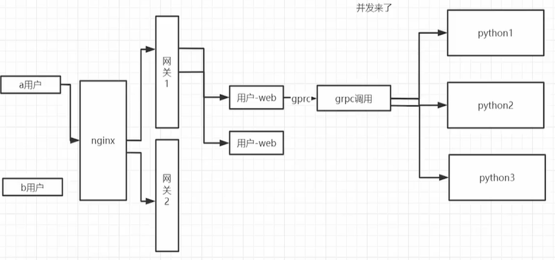
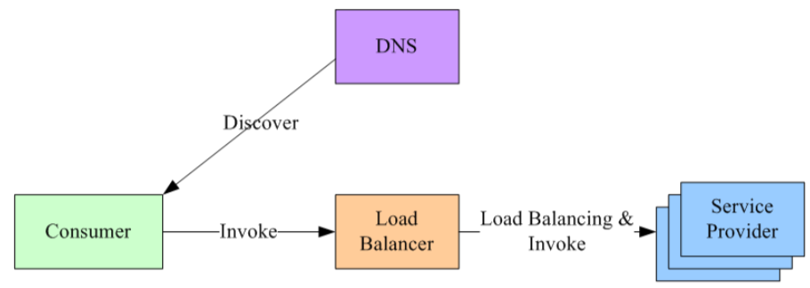
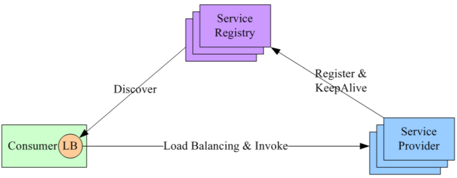
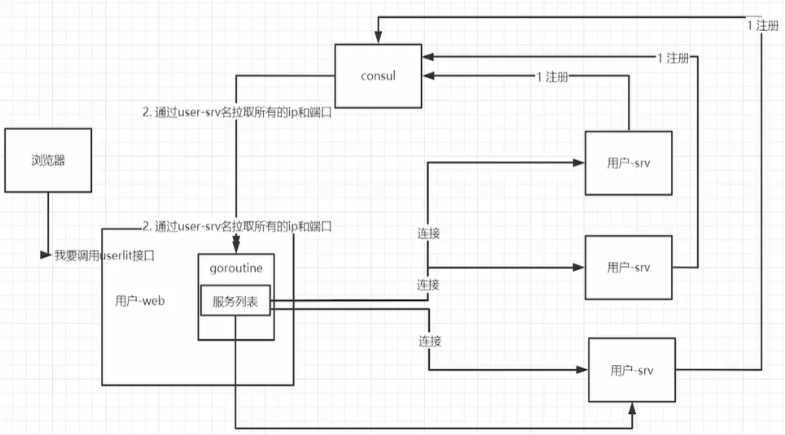
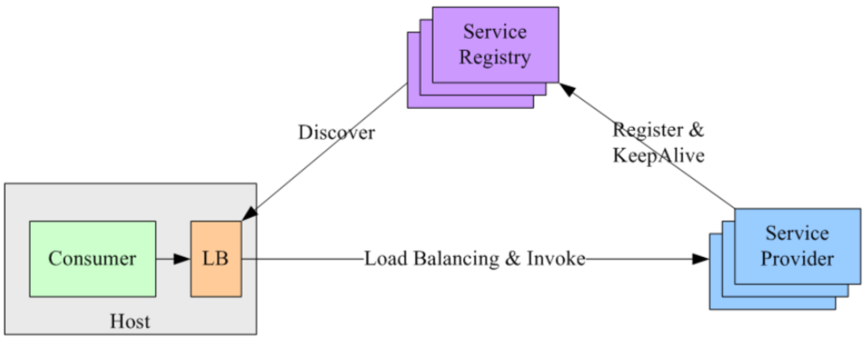

# 负载均衡

## 什么是负载均衡

## 负载均衡策略

### 集中式 load balance

集中式LB方案，如下图。首先，服务的消费方和提供方不直接耦合，而是在服务消费者和服务提供者之间有一个独立的LB（LB通常是专门的硬件设备如F5，或者基于软件如LVS，HAproxy等实现）。

LB上有所有服务的地址映射表，通常由运维配置注册，当服务消费方调用某个目标服务时，它向LB发起请求，由LB以某种策略（比如Round-Robin）做负载均衡后将请求转发到目标服务。

LB一般具备健康检查能力，能自动摘除不健康的服务实例。

服务消费方如何发现LB呢？通常的做法是通过DNS，运维人员为服务配置一个DNS域名，这个域名指向LB。

这种方案基本可以否决，因为它有致命的缺点：所有服务调用流量都经过load balance服务器，所以load balance服务器成了系统的单点，一旦LB发生故障对整个系统的影响是灾难性的。为了解决这个问题，必然需要对这个load balance部件做分布式处理（部署多个实例，冗余，然后解决一致性问题等全家桶解决方案），但这样做会徒增非常多的复杂度。

### 进程内 load balance（常用）

进程内load balance。将load balance的功能和算法以sdk的方式实现在客户端进程内。先看架构图：

可看到引入了第三方：服务注册中心。它做两件事：

1. 维护服务提供方的节点列表，并检测这些节点的健康度。检测的方式是：每个节点部署成功，都通知服务注册中心；然后一直和注册中心保持心跳。
2. 允许服务调用方注册感兴趣的事件，把服务提供方的变化情况推送到服务调用方。

这种方案下，整个load balance的过程是这样的：

1. 服务注册中心维护所有节点的情况。
2. 任何一个节点想要订阅其他服务提供方的节点列表，向服务注册中心注册。
3. 服务注册中心将服务提供方的列表（以长连接的方式）推送到消费方。
4. 消费方接收到消息后，在本地维护一份这个列表，并自己做load balance。

可见，服务注册中心充当什么角色？它是唯一一个知道整个集群内部所有的节点情况的中心。所以对它的可用性要求会非常高，这个组件可以用Zookeeper实现。
这种方案的缺点是：每个语言都要研究一套sdk，如果公司内的服务使用的语言五花八门的话，这方案的成本会很高。第二点是：后续如果要对客户库进行升级，势必要求服务调用方修改代码并重新发布，所以该方案的升级推广有不小的阻力。

go应用图示：

简单来说，就是在应用内部建立一个服务列表，通过该服务列表完成服务的消费。

### 独立进程 load balance

该方案是针对第二种方案的不足而提出的一种折中方案，原理和第二种方案基本类似，不同之处是，他将LB和服务发现功能从进程内移出来，变成主机上的一个独立进程，主机上的一个或者多个服务要访问目标服务时，他们都通过同一主机上的独立LB进程做服务发现和负载均衡。如图:

这个方案解决了上一种方案的问题，不需要为不同语言开发客户库，LB的升级不需要服务调用方改代码。
但新引入的问题是：这个组件本身的可用性谁来维护？还要再写一个watchdog去监控这个组件？另外，多了一个环节，就多了一个出错的可能，线上出问题了，也多了一个需要排查的环节。

## 负载均衡算法

在分布式系统中，多台服务器同时提供一个服务，并统一到服务配置中心进行管理，消费者通过查询服务配置中心，获取到服务到地址列表，需要选取其中一台来发起RPC远程调用。如何选择，则取决于具体的负载均衡算法，对应于不同的场景，选择的负载均衡算法也不尽相同。负载均衡算法的种类有很多种，常见的负载均衡算法包括轮询法、随机法、源地址哈希法、加权轮询法、加权随机法、最小连接法等，应根据具体的使用场景选取对应的算法。

### 1. 轮询（Round Robin）法

轮询很容易实现，将请求按顺序轮流分配到后台服务器上，均衡的对待每一台服务器，而不关心服务器实际的连接数和当前的系统负载。

### 2. 随机法

通过系统随机函数，根据后台服务器列表的大小值来随机选取其中一台进行访问。由概率概率统计理论可以得知，随着调用量的增大，其实际效果越来越接近于平均分配流量到后台的每一台服务器，也就是轮询法的效果。

### 3. 源地址哈希法

源地址哈希法的思想是根据服务消费者请求客户端的IP地址，通过哈希函数计算得到一个哈希值，将此哈希值和服务器列表的大小进行取模运算，得到的结果便是要访问的服务器地址的序号。采用源地址哈希法进行负载均衡，相同的IP客户端，如果服务器列表不变，将映射到同一个后台服务器进行访问。

### 4. 加权轮询（Weight Round Robin）法

不同的后台服务器可能机器的配置和当前系统的负载并不相同，因此它们的抗压能力也不一样。跟配置高、负载低的机器分配更高的权重，使其能处理更多的请求，而配置低、负载高的机器，则给其分配较低的权重，降低其系统负载，加权轮询很好的处理了这一问题，并将请求按照顺序且根据权重分配给后端。

### 5. 加权随机（Weight Random）法

加权随机法跟加权轮询法类似，根据后台服务器不同的配置和负载情况，配置不同的权重。不同的是，它是按照权重来随机选取服务器的，而非顺序。

### 6. 最小连接数法

前面我们费尽心思来实现服务消费者请求次数分配的均衡，我们知道这样做是没错的，可以为后端的多台服务器平均分配工作量，最大程度地提高服务器的利用率，但是，实际上，请求次数的均衡并不代表负载的均衡。因此我们需要介绍最小连接数法，最小连接数法比较灵活和智能，由于后台服务器的配置不尽相同，对请求的处理有快有慢，它正是根据后端服务器当前的连接情况，动态的选取其中当前积压连接数最少的一台服务器来处理当前请求，尽可能的提高后台服务器利用率，将负载合理的分流到每一台服务器。