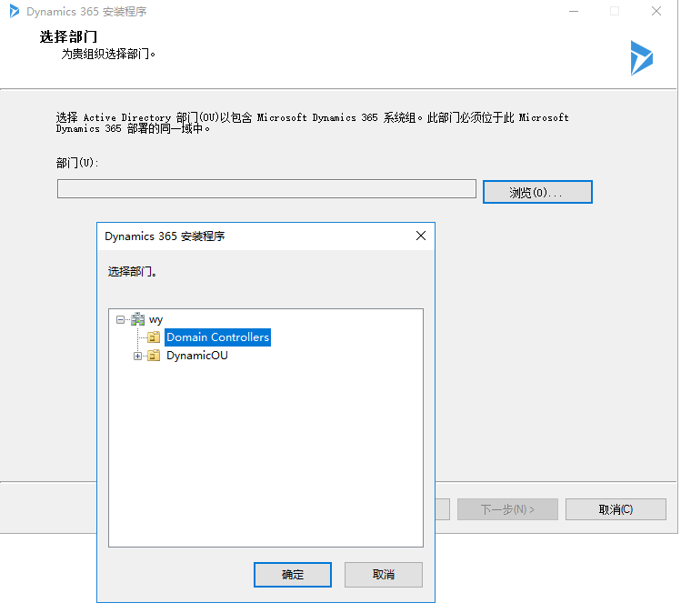

[Dynamic CRM9.0 环境安装部署手册步骤和遇到的一些问题解决方案（包含ADFS部署）-CSDN博客](https://blog.csdn.net/Houoy/article/details/122621559)

[Dynamics 365 环境安装指南（包含数据库）_ms dynamics 365数据库文件-CSDN博客](https://blog.csdn.net/mu_sang/article/details/109283802)

[CRM开发-安装Dynamics 365 9.0遇到的坑_报表服务器遇到配置错误-CSDN博客](https://blog.csdn.net/u014705952/article/details/120685858)


```
将该服务器配置为新林中的第一个 Active Directory 域控制器。

新域名为“wy.com”。这也是新林的名称。

该域的 NetBIOS 名称: WY

林功能级别: Windows Server 2016

域功能级别: Windows Server 2016

其他选项:

  全局编录: 是

  DNS 服务器: 是

  创建 DNS 委派: 否

数据库文件夹: C:\Windows\NTDS

日志文件文件夹: C:\Windows\NTDS

SYSVOL 文件夹: C:\Windows\SYSVOL

将在此计算机上配置 DNS 服务器服务。

此计算机将配置为使用此 DNS 服务器作为其首选 DNS 服务器。

新域管理员的密码将与此计算机本地管理员的密码相同。


```





检查Reporting Service时报错：安装程序无法验证指定的 Reporting Services 报表服务器，解决办法：

打开Reporting Services 配置管理器，配置 Web服务URL、数据库、Web门户URL，配置Web服务URL、Web门户URL时直接点击应用就好了。配置数据库时，点击 更改数据库” -> “创建新的报表服务器数据库” 即可。

==切记不要通过Reporting Services 配置管理器直接删除凭据，否则在安装到最后会报“id = 00000000-0000-0000-0000-00000000000000 的 CrmKey 不存在”的错误==


