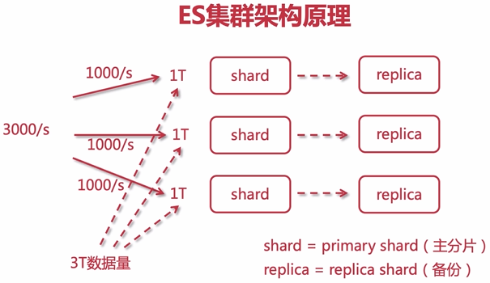
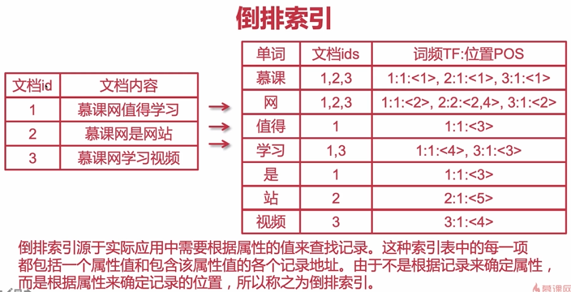

# Elasticsearch-介绍

[Elasticsearch 是什么？ | Elastic](https://www.elastic.co/cn/what-is/elasticsearch)

 

## Elasticsearch 核心术语

- 索引（index）：相当于 MySQL中的表；
- 类型（type）：相当于表的逻辑类型，用于区分索引，在最新版本的ES中，已经被移除了。
- 文档（document）：相当于表中的行；以json格式进行存储。一个索引包含多个document。
- 字段（fields）：相当于表中的列，一个document包含多个fields。
- 映射（mapping）：相当于表结构的定义。
- 近实时（NRT）：near real time，接近真实时间的(一种搜索)。
- 节点（node）：每一个服务器，一台服务器对应一个节点。
- 分片（shard）：把索引库拆分为多份，分别放在不同的节点上，比如有3个节点，3个节点的所有数据内容加在一起是一个完整的索引库。分别保存到三个节点上，目的为了水平扩展，提高吞吐量。
- 备份（replica）：每个分片的备份；

## Elasticsearch 集群架构原理

## 倒排索引

由通过ID找到值，变成了由值去找ID。

