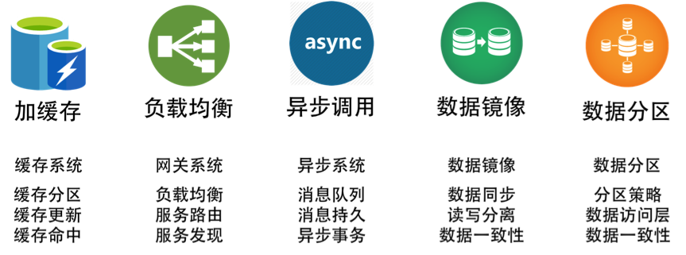

# 分布式系统架构摘要

常用术语

雪崩效应：也称为多米诺骨牌效应。

服务治理：解决服务之间的依赖问题。

## 分布式系统架构介绍

各式各样的架构，如高并发架构、异地多活架构、容器化架构、微服务架构、高可用架构、弹性化架构等。还有和这些架构相关的管理型的技术方法，如 DevOps、应用监控、自动化运维、SOA 服务治理、去 IOE 等。

使用分布式系统主要有两方面原因：

- 增大系统容量。一台机器的性能已经无法满足了，我们需要多台机器才能应对大规模的应用场景。所以，我们需要垂直或是水平拆分业务系统，让其变成一个分布式的架构。
- 加强系统可用。整个系统不会因为一台机器出故障而导致整体不可用。所以，需要通过分布式架构来冗余系统以消除单点故障，从而提高系统的可用性。

### 分布式系统发展

面向服务的架构有以下三个阶段：

- 单体架构，软件模块高度耦合。
- 比较松耦合的 SOA 架构。
- 微服务架构。

#### SOA

SOA （基于服务的架构）架构是构造分布式计算应用程序的方法。它将应用程序功能作为服务发送给最终用户或者其他服务。它采用开放标准与软件资源进行交互，并采用标准的表示方式。

开发、维护和使用 SOA 要遵循以下几条基本原则。

- 可重用，粒度合适，模块化，可组合，构件化以及有互操作性。
- 符合开放标准（通用的或行业的）。
- 服务的识别和分类，提供和发布，监控和跟踪。

SOA架构需要一个标准的协议或是中间件来联动其它相关联的服务（如 ESB）。这样一来，服务间并不直接依赖，而是通过中间件的标准协议或是通讯框架相互依赖。这其实就是 IoC（控制反转）和 DIP（依赖倒置原则）设计思想在架构中的实践。它们都依赖于一个标准的协议或是一个标准统一的交互方式，而不是直接调用。

#### 微服务

每一个微服务都能独立完整地运行（所谓的自包含），后端单体的数据库也被微服务这样的架构分散到不同的服务中。而它和传统 SOA 的差别在于，服务间的整合需要一个服务编排或是服务整合的引擎。就好像交响乐中需要有一个指挥来把所有乐器编排和组织在一起。

一般来说，这个编排和组织引擎可以是工作流引擎，也可以是网关。当然，还需要辅助于像容器化调度这样的技术方式，如 Kubernetes。

微服务是分布式中的一种。

## 分布式系统中需要注意的问题

分布式系统在技术上需要注意的问题：

### 问题一：异构系统的不标准问题

这主要表现在：

- 软件和应用不标准。不同的软件，不同的语言会出现不同的兼容性和不同的开发、测试、运维标准。不同的标准会让我们用不同的方式来开发和运维，引起架构复杂度的提升。
- 通讯协议不标准。不同的软件用不同的协议，就算是相同的网络协议里也会出现不同的数据格式。
- 数据格式不标准。
- 开发和运维的过程和方法不标准。不同的团队因为使用不同的技术，也会有不同的开发和运维方式。

错误的范例一：服务的 API 出错不返回 HTTP 的错误状态码，而是返回个正常的状态码 200，然后在 HTTP Body 里的 JSON 字符串中写着个：error，bla bla error message。（这简直就是一种反人类的做法。我实在不明白为什么会有众多这样的设计。这让监控怎么做啊？现在，你应该使用 Swagger 的规范了。）

错误的范例二：软件配置管理里就是一个 key-value 的东西，这样的东西灵活到可以很容易地被滥用。不规范的配置命名，不规范的值，甚至在配置中直接嵌入前端展示内容。（一个好的配置管理，应该分成三层：底层和操作系统相关，中间层和中间件相关，最上面和业务应用相关。于是底层和中间层是不能让用户灵活修改的，而是只让用户选择。比如：操作系统的相关配置应该形成模板来让人选择，而不是让人乱配置的。只有配置系统形成了规范，我们才 hold 得住众多的系统。）

再比如：数据通讯协议。通常来说，作为一个协议，一定要有协议头和协议体。协议头定义了最基本的协议数据，而协议体才是真正的业务数据。对于协议头，我们需要非常规范地让每一个使用这个协议的团队都使用一套标准的方式来定义，这样我们才容易对请求进行监控、调度和管理。

### 问题二：系统架构中的服务依赖性问题

分布式架构下，服务是会有依赖的，一个服务依赖链上的某个服务挂掉了，可能会导致出现“多米诺骨牌”效应。所以，在分布式系统中，服务的依赖也会带来一些问题。

- 如果非关键业务被关键业务所依赖，会导致非关键业务变成一个关键业务。
- 服务依赖链中，出现“木桶短板效应”——整个 SLA 由最差的那个服务所决定。

解决上述这些问题，就是服务治理。服务治理不但需要我们定义出服务的关键程度，还需要我们定义或是描述出关键业务或服务调用的主要路径。

分布式架构不仅要在应用层上做到业务隔离，数据库方面也需要作相应的隔离。也就是说，最好一个业务线用一套自己的数据库。这就是亚马逊服务器的实践——系统间不能读取对方的数据库，只通过服务接口耦合。这也是微服务的要求。我们不但要拆分服务，还要为每个服务拆分相应的数据库。

### 问题三：故障发生的概率更大

在分布式系统中，因为使用的机器和服务会非常多，所以，故障发生的频率会比传统的单体应用更大。只不过，单体应用的故障影响面很大，而分布式系统中，虽然故障的影响面可以被隔离，但是因为机器和服务多，出故障的频率也会多。另一方面，因为管理复杂，而且没人知道整个架构中有什么，所以非常容易犯错误。

- 出现故障不可怕，故障恢复时间过长才可怕。
- 出现故障不可怕，故障影响面过大才可怕。

“防火”胜于“救火”，首先需要定义出“Key Metrics”，也就是关键指标，针对关键指标去做监控，而不是盲目的添加各种监控指标。同时，还要考虑如何防火，这需要我们在设计或运维系统时都要为这些故障考虑，即所谓 Design for Failure。在设计时就要考虑如何减轻故障。如果无法避免，也要使用自动化的方式恢复故障，减少故障影响面。

### 问题四：多层架构的运维复杂度更大

通常来说，我们可以把系统分成四层：基础层、平台层、应用层和接入层。

- 基础层就是我们的机器、网络和存储设备等。
- 平台层就是我们的中间件层，Tomcat、MySQL、Redis、Kafka 之类的软件。
- 应用层就是我们的业务软件，比如，各种功能的服务。
- 接入层就是接入用户请求的网关、负载均衡或是 CDN、DNS 这样的东西。

对于这四层，我们需要知道：

- 任何一层的问题都会导致整体的问题；
- 没有统一的视图和管理，导致运维被割裂开来，造成更大的复杂度。

分工不是问题，问题是分工后的协作是否统一和规范。这点，你一定要重视。

采用分布式系统架构可能会出现的问题，以及亚马逊实践的重要几点内容，见专栏《22. 从亚马逊的实践，谈分布式系统的难点》。

## 分布式系统的技术栈

构建分布式系统的目的一是提高整体架构的吞吐量，服务更多的并发和流量，二是为了提高系统的稳定性，让系统的可用性更高。

### 提高系统性能的常用技术

#### 缓存系统

加入缓存系统，可以有效地提高系统的访问能力。从前端的浏览器，到网络，再到后端的服务，底层的数据库、文件系统、硬盘和 CPU，全都有缓存，这是提高快速访问能力最有效的手段。对于分布式系统下的缓存系统，需要的是一个缓存集群。这其中需要一个 Proxy 来做缓存的分片和路由。

#### 负载均衡系统

负载均衡系统是水平扩展的关键技术，它可以使用多台机器来共同分担一部分流量请求。

#### 异步调用

异步系统主要通过消息队列来对请求做排队处理，这样可以把前端的请求的峰值给“削平”了，而后端通过自己能够处理的速度来处理请求。这样可以增加系统的吞吐量，但是实时性就差很多了。同时，还会引入消息丢失的问题，所以要对消息做持久化，这会造成“有状态”的结点，从而增加了服务调度的难度。

#### 数据分区和数据镜像

数据分区是把数据按一定的方式分成多个区（比如通过地理位置），不同的数据区来分担不同区的流量。这需要一个数据路由的中间件，会导致跨库的 Join 和跨库的事务非常复杂。

而数据镜像是把一个数据库镜像成多份一样的数据，这样就不需要数据路由的中间件了。你可以在任意结点上进行读写，内部会自行同步数据。然而，数据镜像中最大的问题就是数据的一致性问题。

对于一般公司来说，在初期，会使用读写分离的数据镜像方式，而后期会采用分库分表的方式。

### 提高系统架构稳定性的常用技术

#### 服务拆分

服务拆分主要有两个目的：一是为了隔离故障，二是为了重用服务模块。但服务拆分完之后，会引入服务调用间的依赖问题。

#### 服务冗余

服务冗余是为了去除单点故障，并可以支持服务的弹性伸缩，以及故障迁移。然而，对于一些有状态的服务来说，冗余这些有状态的服务带来了更高的复杂性。其中一个是弹性伸缩时，需要考虑数据的复制或是重新分片，迁移的时候还要迁移数据到其它机器上。

#### 限流降级

当系统实在扛不住压力时，只能通过限流或者功能降级的方式来停掉一部分服务，或是拒绝一部分用户，以确保整个架构不会挂掉。这些技术属于保护措施。

#### 高可用架构

通常来说高可用架构是从冗余架构的角度来保障可用性。比如，多租户隔离，灾备多活，或是数据可以在其中复制保持一致性的集群。总之，就是为了不出单点故障。

#### 高可用运维

高可用运维指的是 DevOps 中的 CI/CD（持续集成 / 持续部署）。一个良好的运维应该是一条很流畅的软件发布管线，其中做了足够的自动化测试，还可以做相应的灰度发布，以及对线上系统的自动化控制。这样，可以做到“计划内”或是“非计划内”的宕机事件的时长最短。

### 分布式系统的关键技术

#### 服务治理

服务拆分、服务调用、服务发现、服务依赖、服务的关键度定义……服务治理的最大意义是需要把服务间的依赖关系、服务调用链，以及关键的服务给梳理出来，并对这些服务进行性能和可用性方面的管理。

#### 架构软件管理

服务之间有依赖，而且有兼容性问题，所以，整体服务所形成的架构需要有架构版本管理、整体架构的生命周期管理，以及对服务的编排、聚合、事务处理等服务调度功能。

#### DevOps

分布式系统可以更为快速地更新服务，但是对于服务的测试和部署都会是挑战。所以，还需要 DevOps 的全流程，其中包括环境构建、持续集成、持续部署等。

#### 自动化运维

有了 DevOps 后，我们就可以对服务进行自动伸缩、故障迁移、配置管理、状态管理等一系列的自动化运维技术了。

#### 资源调度管理

应用层的自动化运维需要基础层的调度支持，也就是云计算 IaaS 层的计算、存储、网络等资源调度、隔离和管理。

#### 整体架构监控

如果没有一个好的监控系统，那么自动化运维和资源调度管理只可能成为一个泡影，因为监控系统是你的眼睛。没有眼睛，没有数据，就无法进行高效的运维。所以说，监控是非常重要的部分。这里的监控需要对三层系统（应用层、中间件层、基础层）进行监控。

#### 流量控制

最后是我们的流量控制，负载均衡、服务路由、熔断、降级、限流等和流量相关的调度都会在这里，包括灰度发布之类的功能也在这里。

## 分布式系统的“纲”

分布式系统有五个关键技术，它们是：

1. 全栈系统监控；
2. 服务 / 资源调度；
3. 流量调度；
4. 状态 / 数据调度；
5. 开发和运维的自动化。

而最后一项——开发和运维的自动化，是需要把前四项都做到了，才有可能实现的。所以，最为关键是下面这四项技术，即应用整体监控、资源和服务调度、状态和数据调度及流量调度，它们是构建分布式系统最最核心的东西。

> 陈大讲的比较有高度，我来说点具体的，做Java后端开发可能会涉及的一些性能优化。进程内缓存，如用Map、List来缓存一些基础数据。如果需要更灵活的操作缓存数据，如自动过期或定期更新，可以使用Guava的LoadingCache。为了减少对Java GC的影响，或者避免用户态与内核态的数据拷贝成本，也可以使用直接内存。但要小心使用，无节制的使用或者没回收内存将可能带来灾难性的后果，例如Netty就有监测是否有内存泄漏的开关，Netty在这方面已经玩得很溜了。大数据量的缓存，或者需要支持分布式访问，可以考虑使用Redis，记得设置过期时间哦。对于不需要实时响应或同步处理的请求，可以通过消息队列来实现异步化，根据实际业务场景来异步反馈结果，或者只须持久化数据。消息队列在削峰方面非常有用，可以很好的应对突发流量，或者是业务在促销期间的高峰，从而让业务下游可以平滑的处理请求。应用服务间的调用可以采用批量发送来提高吞吐。IO密集型的操作或调用可以适当增加线程数，调高调用线程数对于跨机房调用有非常大的提升作用。服务之间尽量同机房或就近机房部署，降低延迟。减少大对象，降低对象存活时间，从而降低Full GC的可能性。有些语言或第三方的API内部逻辑很耗时，必要时可自己实现，如BeanUtils.copyProperties方法。无锁化，如数据分片存储，ThreadLocal。减小锁粒度，减小锁的范围，通常锁代码块优于锁方法。使用乐观锁，如Java中的原子类采用自旋+CAS。

## 全栈监控

全栈系统监控，它就像是我们的眼睛，没有它，我们就不知道系统到底发生了什么，我们将无法管理或是运维整个分布式系统。而在分布式或 Cloud Native 的情况下，系统分成多层，服务各种关联，需要监控的东西特别多。没有一个好的监控系统，我们将无法进行自动化运维和资源调度。

全栈监控，其实就是三层监控。

- 基础层：监控主机和底层资源。比如：CPU、内存、网络吞吐、硬盘 I/O、硬盘使用等。
- 中间层：就是中间件层的监控。比如：Nginx、Redis、ActiveMQ、Kafka、MySQL、Tomcat 等。
- 应用层：监控应用层的使用。比如：HTTP 访问的吞吐量、响应时间、返回码、调用链路分析、性能瓶颈，还包括用户端的监控。

### 什么才是好的监控系统

不好的监控系统有两大问题：

- 监控数据是隔离开来的。因为公司分工的问题，开发、应用运维、系统运维，各管各的，所以很多公司的监控系统之间都有一道墙，完全串不起来。
- 监控的数据项太多。有些公司的运维团队把监控的数据项多做为一个亮点到处讲，比如监控指标达到 5 万多个。老实说，这太丢人了。因为信息太多等于没有信息，抓不住重点的监控才会做成这个样子，完全就是使蛮力的做法。

一个好的监控系统应该有以下几个特征：

- 关注于整体应用的 SLA。主要从为用户服务的 API 来监控整个系统。
- 关联指标聚合。把有关联的系统及其指标聚合展示。主要是三层系统数据：基础层、平台中间件层和应用层。其中，最重要的是把服务和相关的中间件以及主机关联在一起，服务有可能运行在 Docker 中，也有可能运行在微服务平台上的多个 JVM 中，也有可能运行在 Tomcat 中。总之，无论运行在哪里，我们都需要把服务的具体实例和主机关联在一起，否则，对于一个分布式系统来说，定位问题犹如大海捞针。
- 快速故障定位。 对于现有的系统来说，故障总是会发生的，而且还会频繁发生。故障发生不可怕，可怕的是故障的恢复时间过长。所以，快速地定位故障就相当关键。快速定位问题需要对整个分布式系统做一个用户请求跟踪的 trace 监控，我们需要监控到所有的请求在分布式系统中的调用链，这个事最好是做成没有侵入性的。

换句话说，一个好的监控系统主要是为以下两个场景所设计的。

- 体验
  - 容量管理。 提供一个全局的系统运行时数据的展示，可以让工程师团队知道是否需要增加机器或者其它资源。
  - 性能管理。可以通过查看大盘，找到系统瓶颈，并有针对性地优化系统和相应代码。
- 急诊
  - 定位问题。可以快速地暴露并找到问题的发生点，帮助技术人员诊断问题。
  - 性能分析。当出现非预期的流量提升时，可以快速地找到系统的瓶颈，并帮助开发人员深入代码。

### 如何做出一个好的监控系统

一个好的监控系统应该实现的功能：

- 服务调用链跟踪。这个监控系统应该从对外的 API 开始，然后将后台的实际服务给关联起来，然后再进一步将这个服务的依赖服务关联起来，直到最后一个服务（如 MySQL 或 Redis），这样就可以把整个系统的服务全部都串连起来了。
- 服务调用时长分布。使用 Zipkin，可以看到一个服务调用链上的时间分布，这样有助于我们知道最耗时的服务是什么。
- 服务的 TOP N 视图。所谓 TOP N 视图就是一个系统请求的排名情况。一般来说，这个排名会有三种排名的方法：a）按调用量排名，b) 按请求最耗时排名，c）按热点排名（一个时间段内的请求次数的响应时间和）。
- 数据库操作关联。对于 Java 应用，我们可以很方便地通过 JavaAgent 字节码注入技术拿到 JDBC 执行数据库操作的执行时间。对此，我们可以和相关的请求对应起来。
- 服务资源跟踪。我们的服务可能运行在物理机上，也可能运行在虚拟机里，还可能运行在一个 Docker 的容器里，Docker 容器又运行在物理机或是虚拟机上。我们需要把服务运行的机器节点上的数据（如 CPU、MEM、I/O、DISK、NETWORK）关联起来。

## 服务调度（服务治理）

服务治理上的一些关键技术有：

- 服务关键程度
- 服务依赖关系
- 服务发现
- 整个架构的版本管理
- 服务应用生命周期全管理

### 服务关键程度和服务依赖关系

服务关键程度，主要是要我们梳理和定义服务的重要程度。

服务依赖关系，主要需要梳理服务间的依赖关系。依赖越多，依赖越复杂，系统就越易碎。微服务是服务依赖最优解的上限，而服务依赖的下限是千万不要有依赖环。如果系统架构中有服务依赖环，那么表明你的架构设计是错误的。循环依赖有很多的副作用，最大的问题是这是一种极强的耦合，会导致服务部署相当复杂和难解，而且会导致无穷尽的递归故障和一些你意想不到的问题。

解决服务依赖环的方案一般是，依赖倒置的设计模式。

### 服务发现

服务发现是一个中间件，这个中间件是非常非常关键的。因为这个“架构城市”是非常动态的，有的服务会新加进来，有的会离开，有的会增加更多的实例，有的会减少，有的服务在维护过程中（发布、伸缩等），所以我们需要有一个服务注册中心。这个服务注册中心主要用来追踪服务运作的状态和情况。比如：整个架构中有多少种服务？这些服务的版本是什么样的？每个服务的实例数有多少个，它们的状态是什么样的?每个服务的状态是什么样的？是在部署中，运行中，故障中，升级中，还是在回滚中，伸缩中，或者是在下线中……

### 服务应用生命周期管理

通过服务发现，有了这些服务的状态和运行情况之后，你就需要对这些服务的生命周期进行管理了。服务的生命周期通常会有以下几个状态：

- Provision，代表在供应一个新的服务；
- Ready，表示启动成功了；
- Run，表示通过了服务健康检查；
- Update，表示在升级中；
- Rollback，表示在回滚中；
- Scale，表示正在伸缩中（可以有 Scale-in 和 Scale-out 两种）；
- Destroy，表示在销毁中；
- Failed，表示失败状态。

### 整个架构的版本管理

由一堆服务的版本集所形成的整个架构的版本控制。在分布式架构中，我们也需要一个架构的版本，用来控制其中各个服务的版本兼容。比如，A 服务的 1.2 版本只能和 B 服务的 2.2 版本一起工作，A 服务的上个版本 1.1 只能和 B 服务的 2.0 一起工作。这就是版本兼容性。

如果架构中有这样的问题，那么我们就需要一个上层架构的版本管理。这样，如果我们要回滚一个服务的版本，就可以把与之有版本依赖的服务也一起回滚掉。

要做到这个事，你需要一个架构的 manifest，一个服务清单，这个服务清单定义了所有服务的版本运行环境，其中包括但不限于：

- 服务的软件版本；
- 服务的运行环境——环境变量、CPU、内存、可以运行的结点、文件系统等；
- 服务运行的最大最小实例数。

每一次对这个清单的变更都需要被记录下来，算是一个架构的版本管理。而我们上面所说的那个集群控制系统需要能够解读并执行这个清单中的变更，以操作和管理整个集群中的相关变更。

### 资源 / 服务调度

服务和资源的调度有点像操作系统。操作系统一方面把用户进程在硬件资源上进行调度，另一方面提供进程间的通信方式，可以让不同的进程在一起协同工作。服务和资源调度的过程，与操作系统调度进程的方式很相似，主要有以下一些关键技术。

- 服务状态的维持和拟合。
- 服务的弹性伸缩和故障迁移。
- 作业和应用调度。
- 作业工作流编排。
- 服务编排。

### 服务状态的维持和拟合

所谓服务状态不是服务中的数据状态，而是服务的运行状态，换句话说就是服务的 Status，而不是 State。也就是上述服务运行时生命周期中的状态——Provision，Ready，Run，Scale，Rollback，Update，Destroy，Failed……

服务运行时的状态是非常关键的。服务运行过程中，状态也是会有变化的。这样的变化有两种。

- 一种是不预期的变化。比如，服务运行因为故障导致一些服务挂掉，或是别的什么原因出现了服务不健康的状态。而一个好的集群管理控制器应该能够强行维护服务的状态。
- 另外一种是预期的变化。比如，我们需要发布新版本，需要伸缩，需要回滚。这时，集群管理控制器就应该把集群从现有状态迁移到另一个新的状态。这个过程并不是一蹴而就的，集群控制器需要一步一步地向集群发送若干控制命令。这个过程叫“拟合”——从一个状态拟合到另一个状态，而且要穷尽所有的可能，玩命地不断地拟合，直到达到目的。

### 服务的弹性伸缩和故障迁移

见专栏。

### 服务工作流和编排

正如上面和操作系统做的类比一样，一个好的操作系统需要能够通过一定的机制把一堆独立工作的进程给协同起来。在分布式的服务调度中，这个工作叫做 Orchestration，国内把这个词翻译成“编排”。Orchestration 的意思是，一个服务像大脑一样来告诉大家应该怎么交互，就跟乐队的指挥一样。

## 流量与数据调度

