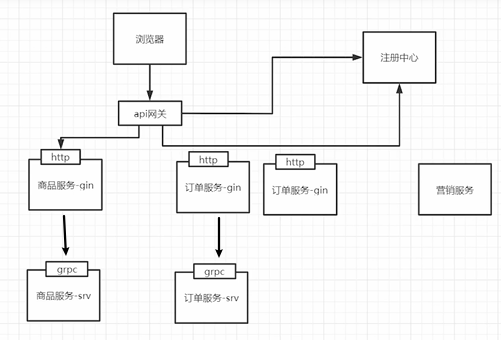

# API 网关

API网关应该具备的功能：

- 服务的路由
  - 动态路由
  - 负载均衡
- 服务发现
- 限流管理
- 熔断、降级
- 流量管理
  - 黑白名单
  - 反爬策略
- 如果想要直接通过HTTP调用gRPC API ，还需要有==gRPC协议转换：客户端可以通过HTTP/JSON 来访问 gRPC API。==

技术选型：

基于Go语言开发的，基于Java语言开发的，基于Nginx开发的；

- Kong（nginx+lua）
- Ocelot （C#）
- 