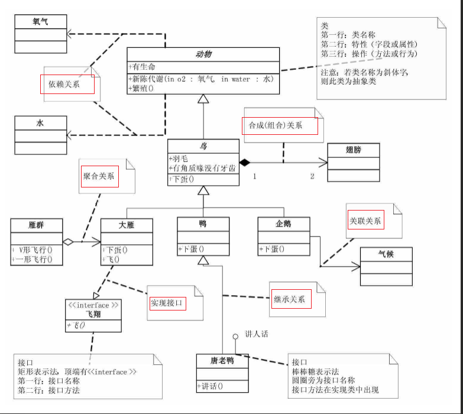

# UML 类图表示法


| 关系描述         | 表示方式              | 示例 |
| ---------------- | --------------------- | ---- |
| 继承关系         | 空心三角形 + 实线     |      |
| 实现接口         | 空心三角形 + 虚线     |      |
| 合成（组合）关系 | 实心的菱形 + 实线箭头 |      |
| 聚合关系         | 空心的菱形 + 实线箭头 |      |
| 依赖关系         | 虚线箭头              |      |
| 关联关系         | 实线箭头              |      |





### 继承关系

类与类之间的继承，继承关系用**空心三角形 + 实线**来表示。

继承关系代码表现：

```csharp
class Bird : Animal {}
```

### 实现接口

当一个类实现另一个接口时，可以使用**空心三角形 + 虚线**来表示。

实现接口代码表现：

```	csharp
class WideGoose : IFly {}
```

### 关联关系

当一个类“知道”另一个类时，即一个类中引用到了另一个类对象（这两个类是独立的个体，注意区分组合关系的不同），叫做关联，关联关系用**实线箭头**来表示。

```csharp
class Penguin : Bird
{
	private Climate climate;
}
```

### 聚合关系

聚合表示一种弱的“拥有”关系，体现的是A对象可以包含B对象，但B对象不是A对象的一部分。

聚合关系用**空心的菱形 + 实线箭头**来表示。

```csharp
class WideGooseAggregate 
{
	private WideGoose[] arrayWideGoose;
}
```

### 组合关系

也被称为合成关系，是一种强的“拥有”关系，体现了严格的**部分和整体**的关系，**部分和整体的生命周期一样**。

组合关系用**实心的菱形 + 实线箭头**来表示。

之所以在Go中使用组合代替继承，也是因为组合关系本身体现的就是部分和整体的关系。

```csharp
class Bird
{
	private Wing wing;
	public Bird()
	{
		wing = new Wing(); //在鸟Bird类中，初始化时，实例化翅膀Wing，它们之间同时生成
	}
}
```

### 依赖关系

当一个类依赖另一个类时，他们之间是依赖关系，用**虚线箭头**来表示。

大多通过方法参数注入依赖：

```csharp
abstract class Animal
{
	public Metabolism (Oxygen oxygen, Water water)
	{
	
	}
}
```

