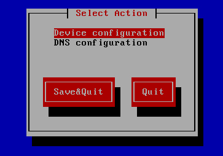
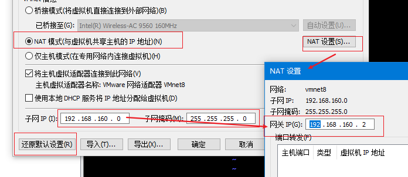

## 虚拟机中的CentOS网络配置


## 环境

虚拟机：VMware Workstation 15 Pro

Linux：CentOS 7 或 RedHat

主机：Win10 专业版

### 重要说明

- 在公司中的局域网内，推荐使用NAT模式
- 在家庭中的WiFi环境下，推荐使用桥接模式
- 无论选择哪种模式，虚拟机在安装CentOS系统时，也会有相关的网络设置，建议在安装虚拟机的时候，就要配置网络连接，可以选择以太网NAT，保证能够连接到外部网络，这样在配置的过程中，缺少相关组件时，可以在线下载安装。

### 检查当前主机环境

#### 方式一：通过界面查看

通过网络适配器管理界面，双击下图中的“网络连接”，单击“详细信息”可以看到DNS服务器IP、默认网关、子网掩码等信息。


#### 方式二：输入命令

启动cmd窗口，输入“ipconfig -all”命令。


### 查看Linux服务器的IP和连接状态

在虚拟机中开启Linux系统，输入用户名和密码进行登录。输入`ifconfig`指令，看有没有eth0（网卡）的信息，如果没有显示相关信息，可以输入`ifup eth0`指令启动网卡。随后再次输入`ifconfig`指令，查看IP信息。


 


## 桥接模式

### 第一步：配置虚拟机的“虚拟网络编辑器”

点击：“编辑” => “虚拟网络编辑器...”，打开虚拟网络编辑器对话框，点击”更改设置“按钮，选择列表中的第一行“桥接模式”，在下拉框中选择当前正在使用的网络固件。


### 第二步：为虚拟机选择网络适配器

打开“虚拟机设置”窗口，选择“网络适配器”。


### 第三步：为Linux配置固定IP

#### 方式一：编辑网络配置文件

方式同NAT模式下的配置相同，参见NAT模式下的“配置网卡信息实现固定IP的配置”部分。

唯一不同的地方在于，桥接模式下，网络相关的配置，例如网关等信息，要配置的和Windows主机的得到的信息一致，而NAT模式下，需要参考NAT设置项来决定网关如何配置。

可以通过“cmd” => 输入“ipconfig /all”命令，可以得到网络详细信息，找到主机的IP信息部分：


可以根据当前的IP设置目标IP，建议在设置前，先ping一下目标IP，防止要设置的IP被占用。

然后将上图中的值，使用vim在ifcfg-ens33文件中进行配置：

```shell
TYPE=Ethernet
BOOTPROTO=static
NAME=ens33
ONBOOT=yes
IPADDR=10.112.25.222 #目标IP
d=255.255.128.0 #子网掩码
GATEWAY=10.112.127.254 #默认网关
DNS1=10.96.1.18
DNS2=10.96.1.19
DNS3=10.176.2.1
PROXY_METHOD=none
BROWSER_ONLY=no
```

设置完成后，保存退出即可。


#### 方式二：使用setup工具

setup工具是CentOS（或RedHat）自带的工具，其他Linux版本不能使用。

1、在Linux系统中，输入`setup`指令，弹出如图所示，选择网络设置，回车：


2、选择Device Configuration项，回车：



3、选择eth0，回车：


4、将Use DHCP换成空格，表示非自动选择IP，使用手工输入：


下图是Xshell工具远程Linux执行setup需要进行网络配置的示例图：


关于右侧需要输入的内容，可以参考主机中的网络信息，双击下图中的“网络连接”，单击“详细信息”可以看到DNS服务器IP、默认网关、子网掩码等信息。


5、配置好后点击“OK”，一步步保存，直到退出。

6、在Linux系统中执行`service network restart`指令，用于重启网络服务。


7、再次输入`ifconfig`指令，如果不能看到，输入`ifup eth0`指令，然后再次输入`ifconfig`指令，查看网络信息（参阅上述第二步）。


## NAT 模式


### 第一步：配置虚拟机的“虚拟网络编辑器”

点击：“编辑” => “虚拟网络编辑器...”，打开虚拟网络编辑器对话框。

==在配置之前，如果已经进行过设置，为了保证正确性，建议先执行“还原默认设置”操作，然后再按照该文档进行配置。==

1、选择列表中的第三行”NAT模式“，默认已经填写了”子网IP“和”子网掩码“，这里不需要进行任何更改。如果之前已经重新设置过”子网IP“和”子网掩码“，可以直接点击”还原默认设置“按钮，将会对该对话框中所有已经设置的信息进行重置。重置后，“子网IP”和“子网掩码”将会被设置为默认值，使用默认值即可，不需要进行任何更改。


此处，子网IP为：192.168.171.0，子网掩码为：255.255.255.0。这两个信息很重要，将会被配置到CentOS中。

“DHCP设置”按钮只有在复选框选中时，才可以点击编辑。==强烈建议选中该复选框==。

2、点击“NAT设置...“按钮，配置网关IP。网关IP要和子网IP是同一个网段，一般可以配置为.1或者.2，如下：


==配置的网关IP，最终也会被配置到CentOS中。注意：这里最好以默认的网关IP为主，不要去改它。==

3、DHCP设置

“DHCP设置”按钮只有在复选框选中时，才可以点击编辑。

==强烈建议选择该复选框，否则会出现windows主机无法ping通虚拟机的情况。==

一旦启用了DHCP设置，那么在点击“DHCP设置...”按钮，查看IP地址的范围，最终CentOS设置的IP地址，必须在这个范围内。


上图中指示IP的范围在128~254之间，这里将最终设置的IP地址指定为：192.168.171.222。

注意：子网IP决定了网关IP和Linux的IP范围。

有了上述三个过程，得到以下信息：

- 子网IP：192.168.171.0
- **子网掩码：255.255.255.0**
- **网关IP：192.168.171.2**
- **目标IP：192.168.171.222**

其中，后三个是将要被配置到CenOS中，必须用到的。

### 第二步：为虚拟机选择网络适配器

选择NAT模式：


### 第三步：配置网卡信息实现固定IP的配置

第1步：首先切换到/etc/sysconfig/network-scripts目录中（存放着网卡的配置文件）。

```shell
[root@localhost ~]# cd /etc/sysconfig/network-scripts/
```

第2步：找到网卡设备，名字以ifcfg开头，这里的网卡设备文件是ifcfg-ens33。

```shell
[root@localhost network-scripts]# ls
ifcfg-ens33  ifdown-ppp       ifup-ib      ifup-Team
ifcfg-lo     ifdown-routes    ifup-ippp    ifup-TeamPort
...
```

第3步：使用vim对该文件进行编辑。

```shell
vim ifcfg-ens33 
```

该文件中，需要设置的选项有：

| 选项      | 说明         | 设定值                                                       |
| --------- | ------------ | ------------------------------------------------------------ |
| TYPE      | 设备类型     | TYPE=Ethernet                                                |
| BOOTPROTO | 地址分配模式 | BOOTPROTO=static（默认为dchp，表示自动获取；static表示手动设置） |
| NAME      | 网卡名称     | 不需要更改，保持原有值即可                                   |
| ONBOOT    | 是否启动     | ONBOOT=yes，默认为no.                                        |
| IPADDR    | 目标IP地址   | 必须设定                                                     |
| NETMASK   | 子网掩码     | 必须设定                                                     |
| GATEWAY   | 网关地址     | 必须设定                                                     |
| DNS1      | DNS地址      | 必须设定，可以设置多个，分别为DNS2、DNS3..                   |

上述中，最重要的是IPADDR、NETMASK、GATEWAY、DNS1的值的设置。这些值与所选择的连接模式紧密相关，==NAT模式和桥接模式对应的值各不相同==。

- ==桥接模式下，这些值可以参考windows主机相关信息进行配置；==
- ==NAT模式下，这些值来源于虚拟机的“NAT设置”中相关的内容。==

在”第一步：配置虚拟机的“虚拟网络编辑器”“中，已经得到了如下信息：

子网IP：192.168.171.0 （不重要）

子网掩码（NETMASK）：255.255.255.0

网关IP（GATEWAY）：192.168.171.2

目标IP（IPADDR）：192.168.171.222

还差DNS地址未得到。可以通过如下方式查看主机的网络对应的DNS地址：


可以看到共有三个DNS，在ifcfg-ens33文件中，按照上述的规则进行设置：


最后，使用vim保存并退出即可。

### NAT模式下的注意点

- ifcfg-ens33文件中的网关配置，来自于虚拟机中的“NAT设置”中的网关，非主机的默认网关，而“NAT设置”中的网关，一般使用默认值即可。

  

- 虚拟机的“子网IP”的设置，直接决定了目标IP和网关IP的地址范围，建议在配置之前，先执行“还原默认设置”操作，子网IP和网关IP直接使用默认值即可。

  

- 子网IP和Windows主机IP没有任何关系，不要混为一谈。


### 第四步：重启网络服务并测试网络是否联通

```shell
[root@localhost network-scripts]# systemctl restart network
[root@localhost network-scripts]# ping -c 4 192.168.171.222
PING 192.168.171.222 (192.168.171.222) 56(84) bytes of data.
64 bytes from 192.168.171.222: icmp_seq=1 ttl=64 time=0.778 ms
64 bytes from 192.168.171.222: icmp_seq=2 ttl=64 time=0.395 ms
64 bytes from 192.168.171.222: icmp_seq=3 ttl=64 time=1.96 ms
64 bytes from 192.168.171.222: icmp_seq=4 ttl=64 time=3.84 ms

--- 192.168.171.222 ping statistics ---

[root@localhost network-scripts]# ping -c 4  baidu.com
PING baidu.com (39.156.69.79) 56(84) bytes of data.
64 bytes from 39.156.69.79 (39.156.69.79): icmp_seq=1 ttl=128 time=6.87 ms
64 bytes from 39.156.69.79 (39.156.69.79): icmp_seq=2 ttl=128 time=7.97 ms
64 bytes from 39.156.69.79 (39.156.69.79): icmp_seq=3 ttl=128 time=6.75 ms
64 bytes from 39.156.69.79 (39.156.69.79): icmp_seq=4 ttl=128 time=6.85 ms

--- baidu.com ping statistics ---

```


## 问题汇总

### NAT模式下，主机无法ping通虚拟机

在NAT模式下，虚拟机可以ping通主机，但主机无法ping通虚拟机，解决方式，勾选DHCP设置复选框，并保证虚拟机的IP在DHCP设置的范围内，然后重启虚拟机或计算机。


### 解决虚拟机无法ping通主机的问题

其中一种可能的情况是被防火墙所阻止，可以进行如下设置。


需要根据当前使用的网络环境，来决定要配置哪个内容。由于当前网络使用的是“专用网络”，因此需要在“专用配置文件”选项卡中，进行相关设置。需要将入站连接配置为“允许”。


点击应用，确定退出。


### 解决电脑睡眠后，虚拟机无法连接的问题


### 解决主机无法Ping通虚拟机IP问题

在虚拟机中的Windows系统防火墙，开启下述规则即可（右击“启用规则”）。


