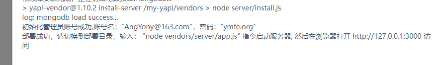

# yapi 安装与配置

推荐使用docker一键安装，参考地址：https://github.com/Ryan-Miao/docker-yapi

安装前提：已安装好Git、Nodejs、npm

```
git clone https://github.com/Ryan-Miao/docker-yapi.git
cd docker-yapi
```

 打开docker-compose.yml文件，去掉#号 command: "yapi server"，给命令 command: "node /my-yapi/vendors/server/app.js" 这个前面加#号。


注意：第一次执行docker-compose up命令前，必须修改docker-compose.yml文件。

然后执行：

```
docker-compose up
```

可以通过docker ps -a 命令，查看容器运行状态。


## yapi的配置

通过浏览器访问yapi服务器的9090端口，即可打开YApi的管理界面。





部署完成之后，重新打开docker-compose.yml文件，启用command: "node /my-yapi/vendors/server/app.js"语句，注释掉 command: "yapi server"。


重新执行`docker-compose up`命令。

重新通过浏览器进行访问，注意，此时的端口不再是9090，而是变成了上面设置的3000端口。

点击页面的登录/注册按钮，输入管理员账号和密码即可。（密码：ymfe.org）


