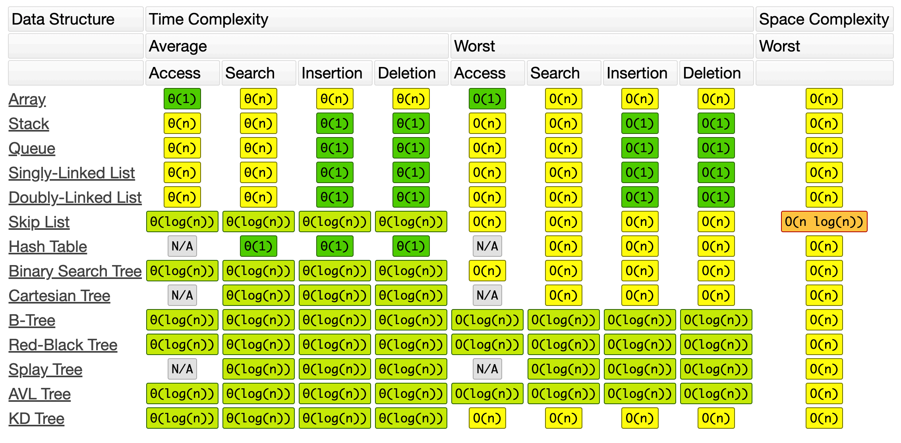

# 期末复习

## 数据结构

- 一维：
  - 基础：数组 array (string), 链表 linked list
  - 高级：栈 stack, 队列 queue, 双端队列 deque, 集合 set, 映射 map (hash or map), etc
- 二维：
  - 基础：树 tree, 图 graph
  - 高级：二叉搜索树 binary search tree (red-black tree, AVL), 堆 heap, 并查集 disjoint set, 字典树 Trie, etc
- 特殊：
  - 位运算 Bitwise, 布隆过滤器 BloomFilter
  - LRU Cache

## 时间复杂度

## 算法

-  If-else, switch —> branch
- for, while loop —> Iteration
- 递归 Recursion (Divide & Conquer, Backtrace)
- 搜索 Search: 深度优先搜索 Depth first search, 广度优先搜索 Breadth first search, A*, etc
- 动态规划 Dynamic Programming
- 二分查找 Binary Search
- 贪心 Greedy
- 数学 Math , 几何 Geometry

注意：在头脑中回忆上面每种算法的思想和代码模板

## 脑图

https://naotu.baidu.com/file/b832f043e2ead159d584cca4efb19703?token=7a6a56eb2630548c

https://naotu.baidu.com/file/0a53d3a5343bd86375f348b2831d3610?token=5ab1de1c90d5f3ec

## 化繁为简的思想

1. 人肉递归低效、很累
2. 找到最近最简方法，将其拆解成可重复解决的问题
3. 数学归纳法思维 

本质：寻找重复性 —> 计算机指令集

## 学习要点

- 基本功是区别业余和职业选⼿的根本。深厚功底来⾃于 — 过遍数
- 最⼤的误区：只做⼀遍
- 五毒神掌
- 刻意练习 - 练习缺陷弱点地⽅、不舒服、枯燥
- 反馈 - 看题解、看国际版的⾼票回答

## 经典习题

爬楼梯、硬币兑换

括号匹配、括号⽣成、直⽅图最⼤⾯积、滑动窗⼝

⼆叉树遍历、分层输出树、判断⼆叉排序树

股票买卖、偷房⼦、字符串编辑距离、最⻓上升⼦序列、最⻓公共⼦序列

异位词（判断和归类）、回⽂串（最⼤回⽂串）、 regex和通配符匹配

⾼级数据结构（Trie、 BloomFilter、 LRU cache、 etc）

## 五毒神掌

第⼀遍：不要死磕，要看代码学习（⼀定要看国际版的⾼票回答）

第⼆遍：⾃⼰写

第三遍： 24⼩时后

第四遍：⼀周后

第五遍：⾯试前

## ⾯试技巧

1. Clarification：明确题⽬意思、边界、数据规模
2. Possible solutions：穷尽所有可能的解法

   - compare time/space

   - optimal solution
3. Coding：代码简洁、⾼性能、美感
 https://shimo.im/docs/rHTyt8hcpT6D9Tj8
4. Test cases

