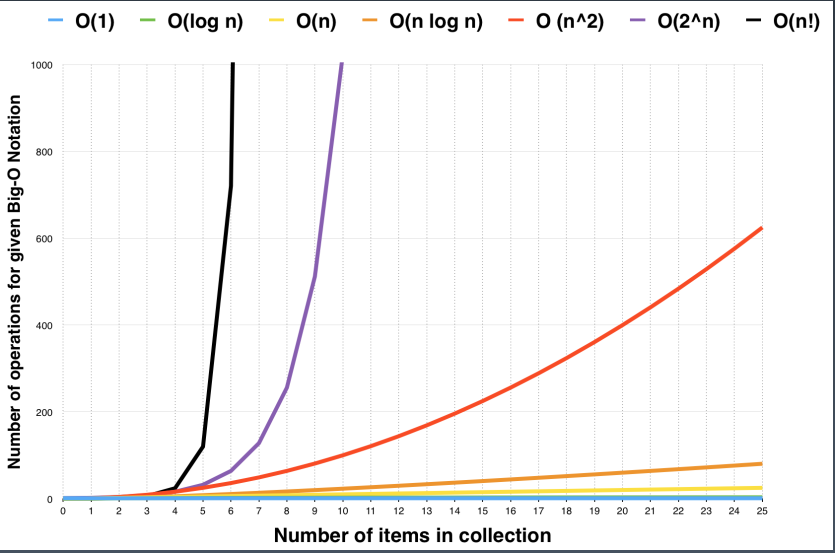
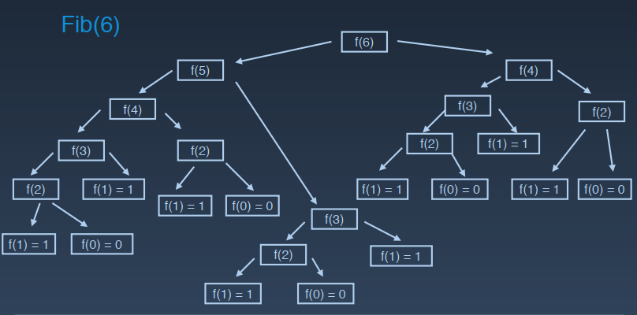
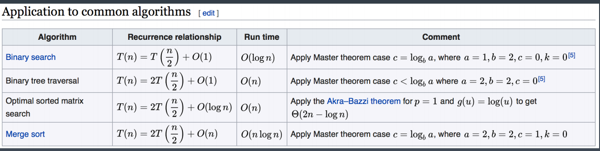

# 第02课 训练准备和复杂度分析


### 第1节：训练环境设置、编码技巧和Code Style

#### 电脑设置

- Google（Best Practices或Top tips）
- Mac: iTerm2 + zsh (oh my zsh)

- Windows: Microsoft new terminal: (https://github.com/microsoft/terminal)
- VSCode; Java: IntelliJ; Python: Pycharm
- LeetCode plugin (VSCode & IntelliJ)
- https://vscodethemes.com/
- 骚操作：
  - https://juejin.im/entry/587e0f2f570c352201113e14

  - https://juejin.im/post/5ce1365151

#### LeetCode

- leetcode-cn.com 和 题解
- leetcode.com 和 Discuss board

Google搜索资料和内容

VSCode   LeetCode插件

LeetCode英文网站，Discuss-Most Votes选项

Google code style


5遍练习法的第3、4遍时，一定要去LeetCode英文网站查看题目的Most Votes下的前三个回答。


工具使用技巧：Google搜索Top tips vs code

#### ⾃自顶向下的编程⽅方式


自顶向下的编程方式：关键函数和逻辑放在最上面，小的函数放在下面。


### 第2节：时间复杂度和空间复杂度分析

#### Big O notation

O(1): Constant Complexity 常数复杂度

```java
int n = 1000;
System.out.println("Hey - your input is: " + n);
```


O(log n): Logarithmic Complexity 对数复杂度

```java
for (int i = 1; i < n; i = i * 2) {
	System.out.println("Hey - I'm busy looking at: " + i);
}
```


O(n): Linear Complexity 线性时间复杂度

```java
for (int i = 1; i <= n; i++) {
	System.out.println("Hey - I'm busy looking at: " + i);
}
```


O(n^2): N square Complexity 平方

```java
for (int i = 1; i <= n; i++) {
	for (int j = 1; j <=n; j++) {
		System.out.println("Hey - I'm busy looking at: " + i + " and " +j);
	}
}
```

O(n^3): N square Complexity 立方

O(2^n): Exponential Growth 指数

```java
int fib(int n) {
	if (n <= 2) return n;
	return fib(n - 1) + fib(n - 2);
}
```


O(n!): Factorial 阶乘


注意：只看最⾼高复杂度的运算

#### 时间复杂度曲线



### 更复杂的情况：递归

递归的关键是要找出语句一共执行了多少次，可以将递归的执行顺序画出一个树形结构，称为递归状态的递归树，例如：

```
Fib: 0, 1, 1, 2, 3, 5, 8, 13, 21
F(n) = F(n - 1) + F(n - 2)
```

直接用递归的写法（不推荐）：

```java
int fib(int n) {
	if (n <= 2) return n;
	return fib(n - 1) + fib(n - 2);
}
```



#### Master Theorem（主定理）

所有递归函数如何计算时间复杂度：

二分查找

二叉树遍历：每个节点都会访问一次，且仅访问一次，总的次数由节点数决定，所以是O(n)

拍好序的二维矩阵

归并排序



只要是树的查找，时间复杂度都是O(n)。

二分查找：时间复杂度是O(logn)

