# 第3课 数组、链表、跳表

## Array（数组）

Java, C++: int a[100];

Python: list = []

JavaScript: let x = [1, 2, 3]

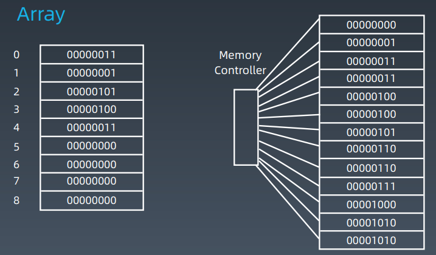

上述图片中的右侧部分是内存控制器。

在数组中，访问任何一个元素的时间复杂度是一样的：O(1)

### Array增加元素

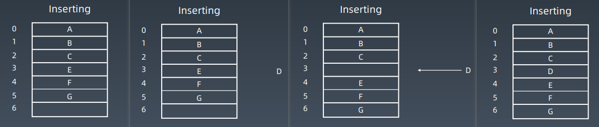

如果将D添加到Index为3的位置时，需要挪动E、F、G的位置，这样的话，复杂度就会发生变化，为O(n)，最坏的情况下，要挪整个数组，在好的情况下，插到最后面的话，就变成O(1)。

### Array删除元素

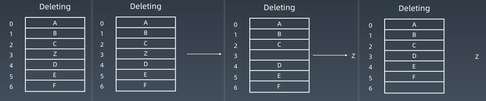

Array删除元素时，先把z移除，然后之后的元素的位置前移一位，最后一个位置设为空。

## Linked List（链表）

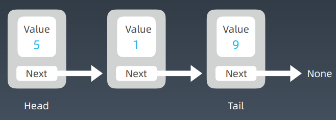

Next表示的是指针，指向下一个元素。只有一个next指针，被称为单链表，如果有先前指针，被称为双向链表。

### Linked List增加结点

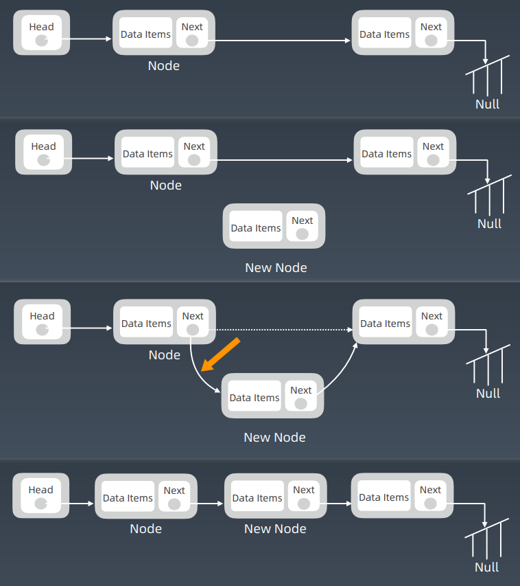

### Linked List 删除结点

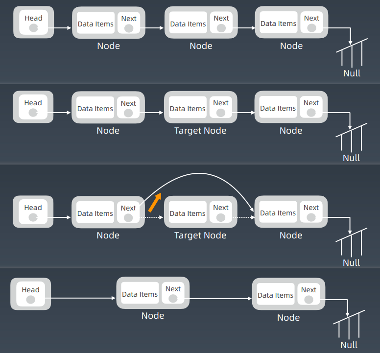

链表增加和删除的效率非常高，为O(1)。

### Double Linked List

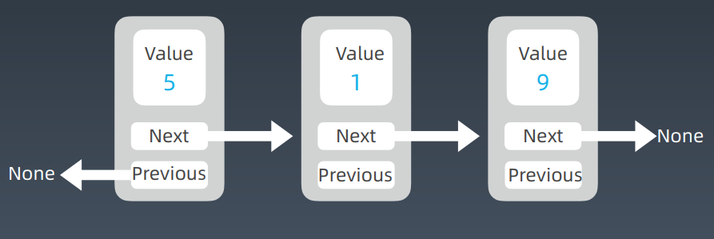

但是访问链表的任意位置变得不再是简单的，如果是头结点和尾结点，访问比较简单，如果是中间节点，必须从头的位置一步步的挪到中间节点才能访问，变为了O(n)

### 链表时间复杂度

| 操作               | 链表时间复杂度 | Array时间复杂度 |
| ------------------ | -------------- | --------------- |
| prepend（增加）    | O(1)           | O(1)            |
| append             | O(1)           | O(1)            |
| lookup（随机访问） | ==O(n)==       | ==O(1)==        |
| insert             | O(1)           | O(n)            |
| delete             | O(1)           | O(n)            |

## 跳表（Skip List）

### 链表的缺陷

lookup：O(n)

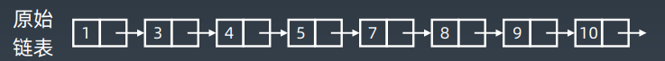

### 如何给链表加速

时间复杂度：查询 O(n)

简单优化：添加头尾指针（不足以解决问题 ）

解决办法：升维或空间换时间

#### 添加第一级索引

如何提高链表线性查找的效率？

next+1

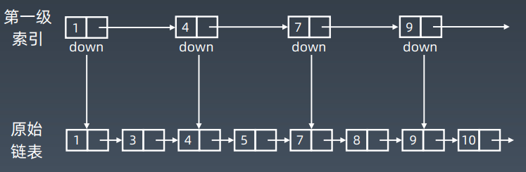

#### 添加第二级索引

如何进一步提高链表查找的效率？

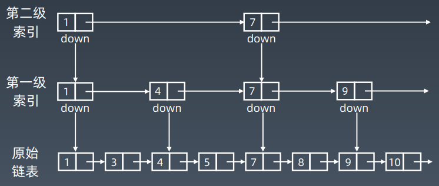

#### 添加多级索引  

以此类推，增加多级索引。增加log2n个级索引

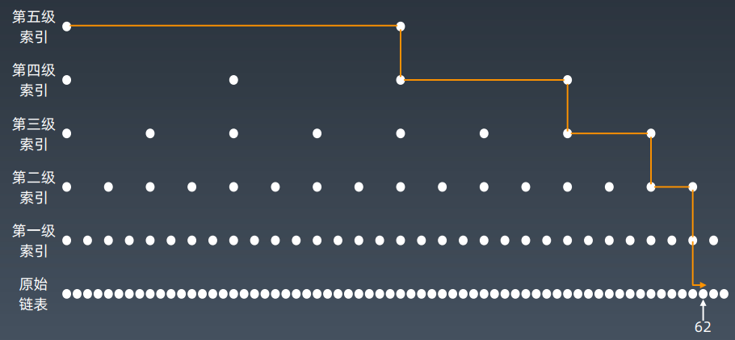

### 跳表查询的时间复杂度分析

n/2、n/4、n/8、第 k 级索引结点的个数就是 n/(2^k)

假设索引有 h 级，最高级的索引有 2 个结点。n/(2^h) = 2，从而求得 h =log2(n)-1

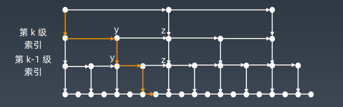

索引的高度：logn，每层索引遍历的结点个数：3

在跳表中查询任意数据的时间复杂度就是 O(logn)

### 现实中跳表的形态

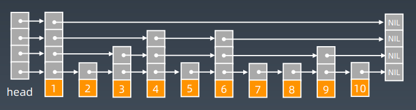

### 跳表的空间复杂度分析

原始链表大小为 n，每 2 个结点抽 1 个，每层索引的结点数： 
$$
\dfrac{n}{2},\dfrac{n}{4},\dfrac{n}{8},...,8,4,2
$$
原始链表大小为 n，每 3 个结点抽 1 个，每层索引的结点数：
$$
\dfrac{n}{3},\dfrac{n}{9},\dfrac{n}{27},...,9,3,1
$$
空间复杂度是 O(n)

## 实战题目解析

#### 练习步骤

1. 5-10分钟：读题和思考
2. 有思路：自己开始做和写代码；不然，马上看题解！
3. 默写背诵、熟练
4. 然后开始自己写（闭卷）

#### 实战练习题目 - Array

1. https://leetcode-cn.com/problems/container-with-most-water/
2. https://leetcode-cn.com/problems/move-zeroes/
3. https://leetcode-cn.com/problems/climbing-stairs/
4. https://leetcode-cn.com/problems/3sum/ (高频老题）

#### 实战练习题目 - Linked List

1. https://leetcode-cn.com/problems/reverse-linked-list/
2. https://leetcode-cn.com/problems/swap-nodes-in-pairs
3. https://leetcode-cn.com/problems/linked-list-cycle
4. https://leetcode-cn.com/problems/linked-list-cycle-ii
5. https://leetcode-cn.com/problems/reverse-nodes-in-k-group/

解法固定，熟能生巧

#### Homework

1. https://leetcode-cn.com/problems/remove-duplicates-from-sorted-array/
2. https://leetcode-cn.com/problems/rotate-array/
3. https://leetcode-cn.com/problems/merge-two-sorted-lists/
4. https://leetcode-cn.com/problems/merge-sorted-array/
5. https://leetcode-cn.com/problems/two-sum/
6. https://leetcode-cn.com/problems/move-zeroes/
7. https://leetcode-cn.com/problems/plus-one/

## 实战题目解析：移动零

## 实战题目解析：盛水最多的容器、爬楼梯

## 实战题目解析：3数之和、环形链表