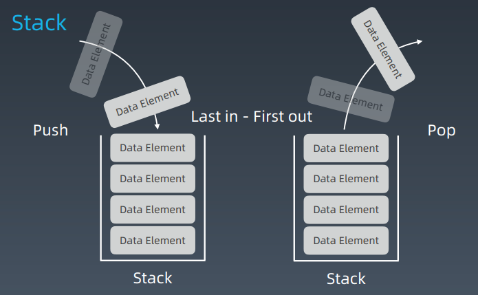
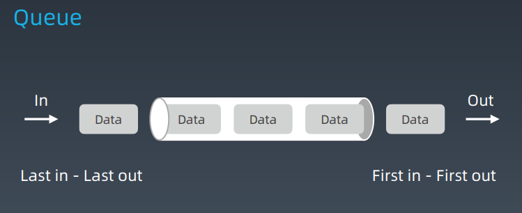
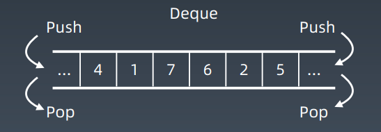
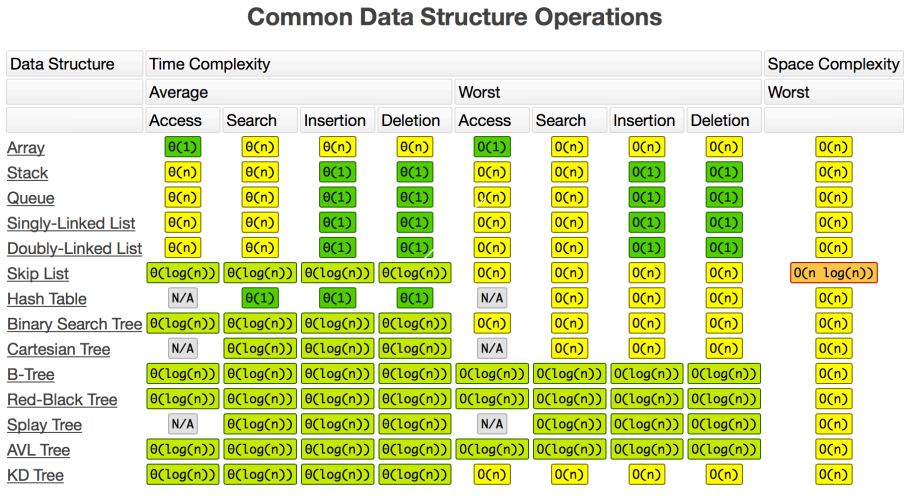

# 第4课 栈、队列、优先队列、双端队列


## 堆和队列的实现与特征

### 堆（Stack ）



### 队列（Queue）



### Stack & Queue 关键点

- Stack：先入后出；添加、删除皆为 O(1)
- Queue：先入先出；添加、删除皆为 O(1)


## 双端队列（Deque ：Double-End Queue）



简单理解：两端可以进出的 Queue，Deque - double ended queue

插入和删除都是 O(1) 操作


## Stack、Queue、Deque 的工程实现

### 示例代码 - Stack

```
Stack<Integer> stack = new Stack<>();
stack.push(1);
stack.push(2);
stack.push(3);
stack.push(4);
System.out.println(stack);
System.out.println(stack.search(4));
stack.pop();
stack.pop();
Integer topElement = stack.peek();
System.out.println(topElement);
System.out.println(" 3的位置 " + stack.search(3));
```

### 示例代码 - Queue

```
Queue<String> queue = new LinkedList<String>();
queue.offer("one");
queue.offer("two");
queue.offer("three");
queue.offer("four");
System.out.println(queue);
String polledElement = queue.poll();
System.out.println(polledElement);
System.out.println(queue);
String peekedElement = queue.peek();
System.out.println(peekedElement);
System.out.println(queue);
while(queue.size() > 0) {
System.out.println(queue.poll());
}
```

### 示例代码 - Deque

```
Deque<String> deque = new LinkedList<String>();
deque.push("a");
deque.push("b");
deque.push("c");
System.out.println(deque);
String str = deque.peek();
System.out.println(str);
System.out.println(deque);
while (deque.size() > 0) {
System.out.println(deque.pop());
}
System.out.println(deque);
```


## Priority Queue（优先队列）

插入操作：O(1)

取出操作：O(logN) - 按照元素的优先级取出

底层具体实现的数据结构较为多样和复杂：heap、bst、treap

Java 的 PriorityQueue

https://docs.oracle.com/javase/10/docs/api/java/util/PriorityQueue.html

### Stack 和 Queue 的实现

Java 源码分析:

Stack: http://developer.classpath.org/doc/java/util/Stacksource.html

Queue: http://fuseyism.com/classpath/doc/java/util/Queuesource.html

Priority Queue: 学员自己分析source code！

#### Python Stack

```
class Stack:
def __init__(self):
self.items = ['x', 'y']
def push(self, item):
self.items.append(item)
def pop(self):
self.items.pop()
def length(self):
return len(self.items)
```

#### Python Queue

```
class Queue:
def __init__(self):
	 self.queue = []
def enqueue(self, item):
	 self.queue.append(item)
def dequeue(self):
if len(self.queue) < 1:
return None 
return self.queue.pop(0)
def size(self):
return len(self.queue)
```

heapq : https://docs.python.org/2/library/heapq.html

高性能的 container 库：https://docs.python.org/2/library/collections.html


## 复杂度分析




## 实战题目解析：有效的括号、最小栈等问题

### 预习题目

https://leetcode-cn.com/problems/valid-parentheses/

最近相关性 —> 栈！

https://leetcode-cn.com/problems/min-stack/

### 实战题目

https://leetcode-cn.com/problems/largest-rectangle-inhistogram 

https://leetcode-cn.com/problems/sliding-window-maximum

## Homework

https://leetcode.com/problems/design-circular-deque

https://leetcode.com/problems/trapping-rain-water/

