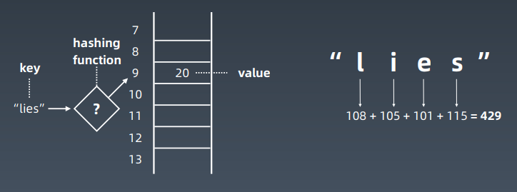
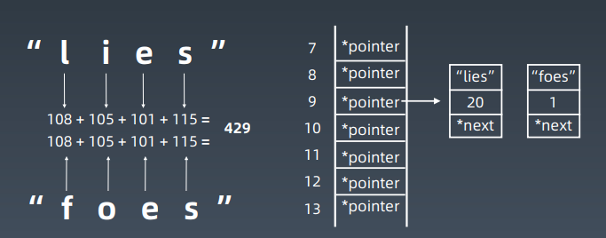
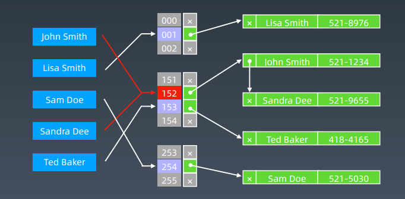
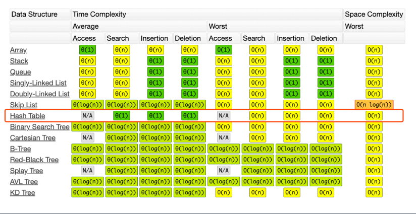
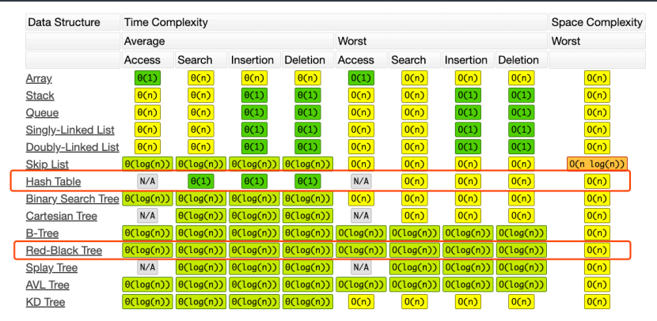

# 第05课 哈希表、映射、集合


## Hash table

哈希表（Hash table），也叫散列表，是根据关键码值（Key value）而直接进行访问的数据结构。

它通过把关键码值映射到表中一个位置来访问记录，以加快查找的速度。

这个映射函数叫作散列函数（Hash Function），存放记录的数组叫作哈希表（或散列表）。

### 工程实践

电话号码簿

用户信息表

缓存（LRU Cache）

键值对存储（Redis）


## Hash Function



## Hash Collisions



#### 完整结构



## 复杂度分析




## Java code

Map：key-value对，key不重复

- new HashMap() / new TreeMap()
- map.set(key, value)
- map.get(key)
- map.has(key)
- map.size()
- map.clear()

Set：不重复元素的集合

- new HashSet() / new TreeSet()
- set.add(value)
- set.delete(value)
- set.hash(value)

## Python code

```python
list_x = [1, 2, 3, 4]
map_x = {
'jack': 100,
'张三': 80,
'selina': 90,
…
}
set_x = {'jack', 'selina', 'Andy'}
set_y = set(['jack', 'selina', 'jack'])
```

## Map, Set : interfaces

Java set classes:

TreeSet, HashSet,

ConcurrentSkipListSet, CopyOnWriteArraySet, EnumSet, JobState

Reasons, LinkedHashSet

https://docs.oracle.com/en/java/javase/12/docs/api/

java.base/java/util/Set.html


Java map classes:

HashMap, Hashtable, ConcurrentHashMap

https://docs.oracle.com/en/java/javase/12/docs/api/

java.base/java/util/Map.html

## 复杂度分析



## 实战题目

https://leetcode-cn.com/problems/valid-anagram/description/

https://leetcode-cn.com/problems/group-anagrams/

https://leetcode-cn.com/problems/two-sum/description/

小技巧

养成收藏精选代码的习惯：https://shimo.im/docs/R6g9WJV89QkHrDhr