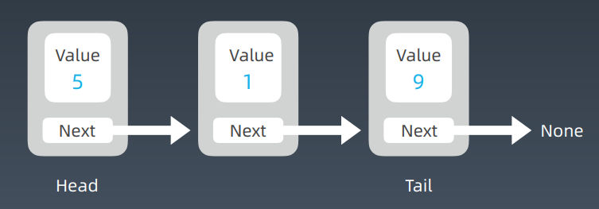
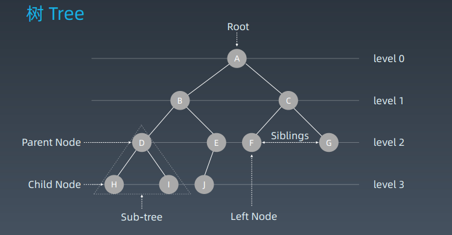
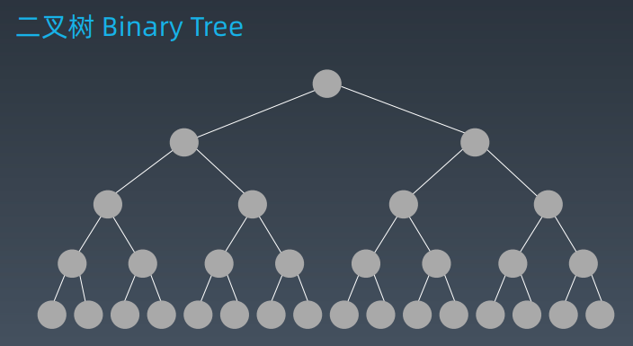
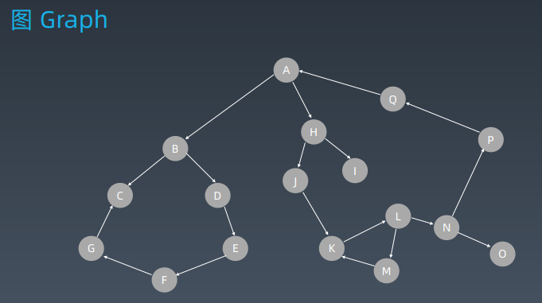
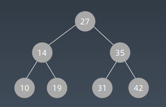
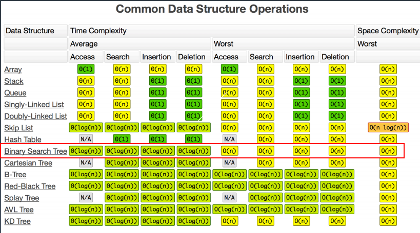

## 第06课 树、二叉树、二叉搜索树

### 前序知识回顾：链表等一维结构

#### 单链表 Linked List



### 树 Tree



### 二叉树 Binary Tree



### 图 Graph



==Linked List 是特殊化的 Tree==

==Tree 是特殊化的 Graph==

### 示例代码

```python
class TreeNode:
def __init__(self, val):
	self.val = val
	self.left, self.right = None, None
```

```java
public class TreeNode {
	public int val;
	public TreeNode left, right;
	public TreeNode(int val) {
		this.val = val;
		this.left = null;
		this.right = null;
	}
}
```

### 二叉树遍历 Pre-order/In-order/Post-order

前序（Pre-order）：根-左-右

中序（In-order）：左-根-右

后序（Post-order）：左-右-根

#### 示例代码

```python
def preorder(self, root):
	if root:
		self.traverse_path.append(root.val)
		self.preorder(root.left)
		self.preorder(root.right)
        
def inorder(self, root):
	if root:
		self.inorder(root.left)
		self.traverse_path.append(root.val)
		self.inorder(root.right)
        
def postorder(self, root):
    if root:
        self.postorder(root.left)
        self.postorder(root.right)
        self.traverse_path.append(root.val)
```

### 二叉搜索树 Binary Search Tree



二叉搜索树，也称二叉搜索树、有序二叉树（Ordered Binary Tree）、排序二叉树（Sorted Binary Tree），是指一棵空树或者具有下列性质的二叉树：

1. 左子树上所有结点的值均小于它的根结点的值；
2. 右子树上所有结点的值均大于它的根结点的值；
3. 以此类推：左、右子树也分别为二叉查找树。 （这就是 重复性！）

中序遍历：升序排列

#### 二叉搜索树常见操作

查询

插入新结点（创建）

删除

Demo: https://visualgo.net/zh/bst



 树的面试题解法一般都是递归

#### 示例代码

```python
class TreeNode:
	def __init__(self, val):
		self.val = val
		self.left, self.right = None, None
```

```java
public class TreeNode {
    public int val;
    public TreeNode left, right;
    public TreeNode(int val) {
        this.val = val;
        this.left = null;
        this.right = null;
    }
}
```

```python
def preorder(self, root):
	if root:
		self.traverse_path.append(root.val)
		self.preorder(root.left)
		self.preorder(root.right)
        
def inorder(self, root):
	if root:
		self.inorder(root.left)
		self.traverse_path.append(root.val)
		self.inorder(root.right)
        
def postorder(self, root):
    if root:
        self.postorder(root.left)
        self.postorder(root.right)
        self.traverse_path.append(root.val)
```

### 树的遍历 DEMO

### 实战题目

1. https://leetcode-cn.com/problems/binary-tree-inorder-traversal/ 
2. https://leetcode-cn.com/problems/binary-tree-preorder-traversal/ 
3. https://leetcode-cn.com/problems/n-ary-tree-postorder-traversal/ 
4. https://leetcode-cn.com/problems/n-ary-tree-preorder-traversal/
5. https://leetcode-cn.com/problems/n-ary-tree-level-order-traversal/