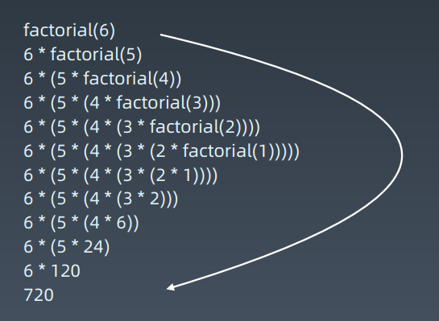

# 第07课 泛型递归、树的递归

### 前序知识回顾

树的面试题解法一般都是递归。

- 节点的定义
- 重复性（自相似性）

#### 示例代码

```python
def preorder(self, root):
    if root:
        self.traverse_path.append(root.val)
        self.preorder(root.left)
        self.preorder(root.right)
        
def inorder(self, root):
    if root:
        self.inorder(root.left)
        self.traverse_path.append(root.val)
        self.inorder(root.right)
        
def postorder(self, root):
    if root:
        self.postorder(root.left)
        self.postorder(root.right)
        self.traverse_path.append(root.val)
```

### 递归 Recursion

递归 - 循环

通过函数体来进行的循环

1. 从前有个山
2. 山里有个庙
3. 庙里有个和尚讲故事
4. 返回1

计算 n!

n！= 1 * 2 * 3 * … * n

```python
def Factorial(n):
    if n <= 1:
        return 1
    return n * Factorial(n — 1)
```



#### Python 代码模版

```python
def recursion(level, param1, param2, ...):
	# recursion terminator
	if level > MAX_LEVEL:
        process_result
        return
	# process logic in current level
    process(level, data...)
    
	# drill down
	self.recursion(level + 1, p1, ...)
	# reverse the current level status if needed
```

#### Java 递归代码模版

```java
public void recur(int level, int param) {
    //递归终结条件
    if (level > MAX_LEVEL) {
        // process result
        return;
    }
    // 当前层需要处理的逻辑
    process(level, param);
    
    // 进入到下一层
    recur( level: level + 1, newParam);
    
    // 清理当前层
}
```

#### 思维要点

1. 不要人肉进行递归（最大误区）
2. 找到最近最简方法，将其拆解成可重复解决的问题（重复子问题）
3. 数学归纳法思维

### 实战题目

1. https://leetcode-cn.com/problems/climbing-stairs/
2. https://leetcode-cn.com/problems/generate-parentheses/
3. https://leetcode-cn.com/problems/invert-binary-tree/description/
4. https://leetcode-cn.com/problems/validate-binary-search-tree
5. https://leetcode-cn.com/problems/maximum-depth-of-binarytree
6. https://leetcode-cn.com/problems/minimum-depth-of-binary-tree
7. https://leetcode-cn.com/problems/serialize-and-deserializebinary-tree/ 

### Homework

1. https://leetcode-cn.com/problems/lowest-common-ancestorof-a-binary-tree/
2. https://leetcode-cn.com/problems/construct-binary-tree-frompreorder-and-inorder-traversal
3. https://leetcode-cn.com/problems/combinations/
4. https://leetcode-cn.com/problems/permutations/
5. https://leetcode-cn.com/problems/permutations-ii/

