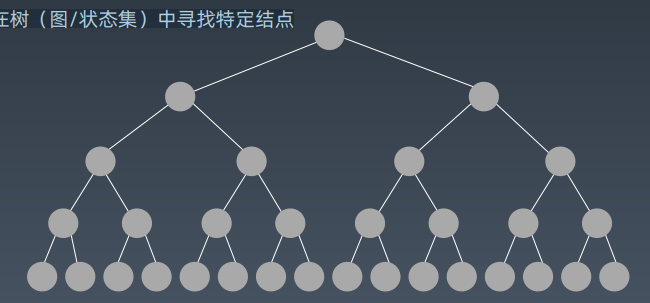
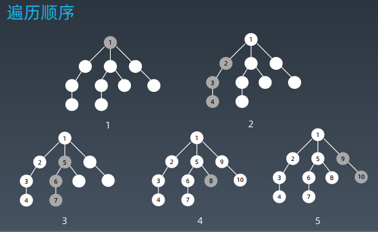
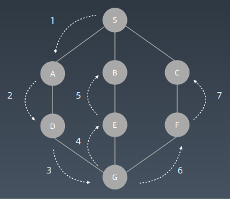
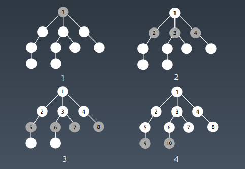
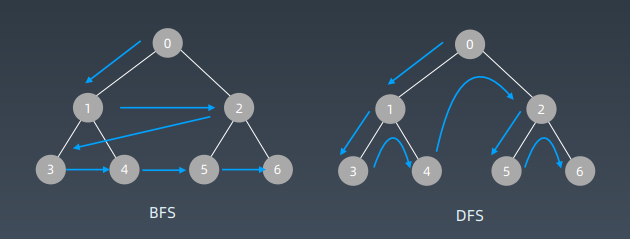

## 第09课 深度优先搜索和广度优先搜索

### 搜索

#### 遍历搜索

在树（图/状态集）中寻找特定结点



#### 示例代码

Python

```python
class TreeNode:
	def __init__(self, val):
		self.val = val
		self.left, self.right = None, None
```

Java

```java
public class TreeNode {
	public int val;
	public TreeNode left, right;
    public TreeNode(int val) {
        this.val = val;
        this.left = null;
        this.right = null;
	}
}
```

#### 搜索 - 遍历

- 每个节点都要访问一次
- 每个节点仅仅要访问一次
- 对于节点的访问顺序不限
  - 深度优先：depth first search
  - 广度优先：breadth first search 

#### 示例代码

```python
def dfs(node):
    if node in visited:
    # already visited
    return
    visited.add(node)
    # process current node
    # ... # logic here
    dfs(node.left)
    dfs(node.right)
```

### 深度优先搜索(Depth-First-Search)

#### DFS 代码 - 递归写法

程序模板：

```python
visited = set()
def dfs(node, visited):
    if node in visited: # terminator
        # already visited
        return
    
    visited.add(node)
    # process current node here.
    ...
    for next_node in node.children():
    	if not next_node in visited:
    		dfs(next_node, visited)
```

#### 遍历顺序



#### 遍历顺序



#### DFS 代码 - 递归写法

将上述的模板代码中的return提前，得到最终代码模板：

```python
visited = set()
def dfs(node, visited):
    if node in visited: # terminator
        # already visited
        return
    
    visited.add(node)
    
    # process current node here.
    ...
    for next_node in node.children():
        if not next_node in visited:
        	dfs(next_node, visited)
```

#### DFS 代码 - 非递归写法

```python
def DFS(self, tree):
	if tree.root is None:
		return []
    
    visited, stack = [], [tree.root]
    
    while stack:
        node = stack.pop()
        visited.add(node)
        process (node)
        nodes = generate_related_nodes(node)
        stack.push(nodes)
        
    # other processing work
    ...
```

#### DFS 代码 - 递归写法

```python
visited = set()
def dfs(node, visited):
    visited.add(node)
    
    # process current node here.
    ...
    
    for next_node in node.children():
    	if not next_node in visited:
    		dfs(next node, visited)
```

### 广度优先搜索 Breadth-First-Search

#### 遍历顺序



#### 遍历顺序对比



#### BFS 代码

```python
def BFS(graph, start, end):
    queue = []
    queue.append([start])
    visited.add(start)
    
    while queue:
        node = queue.pop()
        visited.add(node)
        process(node)
        nodes = generate_related_nodes(node)
        queue.push(nodes)
        
    # other processing work
    ...
```

#### DFS 代码 - 递归写法

```python
visited = set()
def dfs(node, visited):
    visited.add(node)
    
    # process current node here.
    ...
    for next_node in node.children():
        if not next_node in visited:
        	dfs(next node, visited)
```

#### BFS 代码

```python
def BFS(graph, start, end):
    queue = []
    queue.append([start])
    visited.add(start)
    
    while queue:
        node = queue.pop()
        visited.add(node)
        
        process(node)
        nodes = generate_related_nodes(node)
        queue.push(nodes)
```

### 实战题目

1. https://leetcode-cn.com/problems/binary-tree-level-ordertraversal/#/description
2. https://leetcode-cn.com/problems/minimum-geneticmutation/#/description
3. https://leetcode-cn.com/problems/generate-parentheses/#/description
4. https://leetcode-cn.com/problems/find-largest-value-in-eachtree-row/#/description

### Homework

1. https://leetcode-cn.com/problems/word-ladder/description/
2. https://leetcode-cn.com/problems/word-ladder-ii/description/
3. https://leetcode-cn.com/problems/number-of-islands/
4. https://leetcode-cn.com/problems/minesweeper/description/

