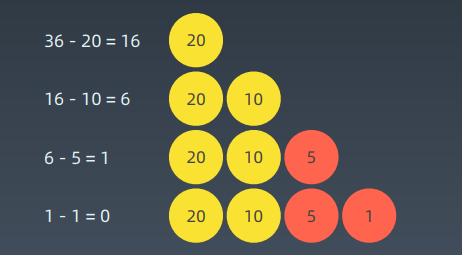
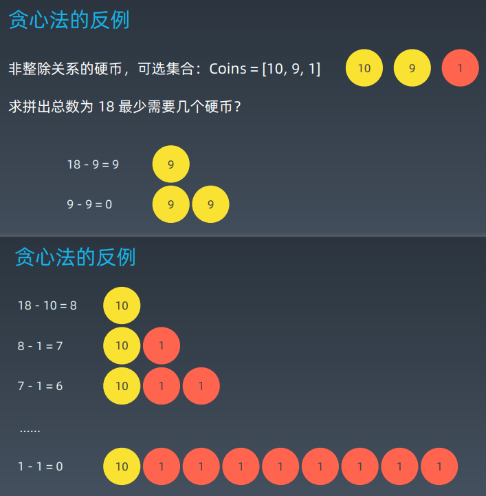

# 第10课 贪心算法

### 贪心算法 Greedy

贪心算法是一种在每一步选择中都采取在当前状态下最好或最优（即最有利）的选择，从而希望导致结果是全局最好或最优的算法。

贪心算法与动态规划的不同在于它对每个子问题的解决方案都做出选择，不能回退。动态规划则会保存以前的运算结果，并根据以前的结果对当前进行选择，有回退功能。

贪心法可以解决一些最优化问题，如：求图中的最小生成树、求哈夫曼编码等。然而对于工程和生活中的问题，贪心法一般不能得到我们所要求的答案。

一旦一个问题可以通过贪心法来解决，那么贪心法一般是解决这个问题的最好办法。由于贪心法的高效性以及其所求得的答案比较接近最优结果，贪心法也可以用作辅助算法或者直接解决一些要求结果不特别精确的问题。

### 实战题目

Coin Change 特别版本：https://leetcode-cn.com/problems/coin-change/

当硬币可选集合固定：Coins = [20, 10, 5, 1]，求最少可以几个硬币拼出总数。 比如 total = 36

#### 贪心算法 Greedy

### 何种情况下用到贪心算法？

#### 适用贪心算法的场景

简单地说，问题能够分解成子问题来解决，子问题的最优解能递推到最终问题的最优解。这种子问题最优解称为最优子结构。

贪心算法与动态规划的不同在于它对每个子问题的解决方案都做出选择，不能回退。动态规划则会保存以前的运算结果，并根据以前的结果对当前进行选择，有回退功能。

### Homework

1. https://leetcode-cn.com/problems/lemonade-change/description/
2. https://leetcode-cn.com/problems/best-time-to-buy-and-sellstock-ii/description/
3. https://leetcode-cn.com/problems/assign-cookies/description/
4. https://leetcode-cn.com/problems/walking-robot-simulation/description/ 
5. https://leetcode-cn.com/problems/jump-game/
6. https://leetcode-cn.com/problems/jump-game-ii/

