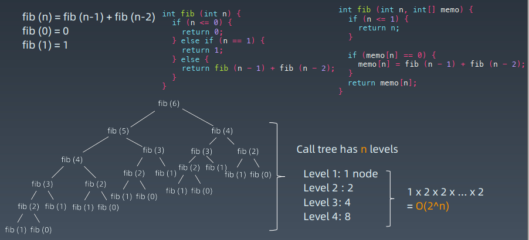

# 第12课 动态规划

### 分治 + 回溯 + 递归 + 动态规划

#### 递归代码模版

```java
public void recur(int level, int param) {
    // terminator
    if (level > MAX_LEVEL) {
        // process result
        return;
    }
    // process current logic
    process(level, param);
    // drill down
    recur( level: level + 1, newParam);
    // restore current status
}
```

### 分治 Divide & Conquer

#### 递归状态树 


#### 分治代码模板

```python
def divide_conquer(problem, param1, param2, ...):
    # recursion terminator
    if problem is None:
        print_result
        return
    
    # prepare data
    data = prepare_data(problem)
    subproblems = split_problem(problem, data)
    
    # conquer subproblems
    subresult1 = self.divide_conquer(subproblems[0], p1, ...)
    subresult2 = self.divide_conquer(subproblems[1], p1, ...)
    subresult3 = self.divide_conquer(subproblems[2], p1, ...)
    …
    # process and generate the final result
    result = process_result(subresult1, subresult2, subresult3, …)
    # revert the current level states
```

#### 感触 

1. 人肉递归低效、很累
2. 找到最近最简方法，将其拆解成可重复解决的问题
3. 数学归纳法思维（抵制人肉递归的诱惑）

本质：寻找重复性 —> 计算机指令集

#### Fib(6) 状态树、重复子状态


### 动态规划 Dynamic Programming 

1. Wiki 定义：https://en.wikipedia.org/wiki/Dynamic_programming
2. “Simplifying a complicated problem by breaking it down into simpler sub-problems” (in a recursive manner)
3. Divide & Conquer + Optimal substructure 分治 + 最优子结构

#### 关键点

动态规划 和 递归或者分治 没有根本上的区别（关键看有无最优的子结构）

共性：找到重复子问题

差异性：最优子结构、中途可以淘汰次优解

### 实战例题一斐波拉契数列 





### 实战例题二路径计数 


#### 状态转移方程（DP 方程）

```
opt[i , j] = opt[i + 1, j] + opt[i, j + 1]
```

完整逻辑：

```python
if a[i, j] = ‘空地’: 
	opt[i , j] = opt[i + 1, j] + opt[i, j + 1]
else:
	opt[i , j] = 0 
```


#### 动态规划关键点

1. 最优子结构 `opt[n] = best_of(opt[n-1], opt[n-2], …)`

2. 储存中间状态：`opt[i]`

3. 递推公式（美其名曰：状态转移方程或者 DP 方程）

   Fib: `opt[i] = opt[n-1] + opt[n-2]`

   二维路径：`opt[i,j] = opt[i+1][j] + opt[i][j+1] `(且判断a[i,j]是否空地） 


### 实战例题三最长公共子序列

#### 字符串问题

https://leetcode-cn.com/problems/longest-common-subsequence/

给定两个字符串 text1 和 text2，返回这两个字符串的最长公共子序列。

“ABAZDC” , “BACBAD” 

1. S1 = “”

   S2 = 任意字符串

2. S1 =“A”

   S2 = 任意

3. S1 =“…….A”

   S2 = “.….A” 


#### 子问题

- `S1 = “ABAZDC”`

  `S2 = “BACBAD”`

- `If S1[-1] != S2[-1]: LCS[s1, s2] = Max(LCS[s1-1, s2], LCS[s1, s2-1]) `

  `LCS[s1, s2] = Max(LCS[s1-1, s2], LCS[s1, s2-1], LCS[s1-1, s2-1])`

- `If S1[-1] == S2[-1]: LCS[s1, s2] = LCS[s1-1, s2-1] + 1 `

  `LCS[s1, s2] = Max(LCS[s1-1, s2], LCS[s1, s2-1], LCS[s1-1, s2-1], LCS[s1-1][s2-1] + 1) `

#### DP 方程

- `If S1[-1] != S2[-1]: LCS[s1, s2] = Max(LCS[s1-1, s2], LCS[s1, s2-1])`
- `If S1[-1] == S2[-1]: LCS[s1, s2] = LCS[s1-1, s2-1] + 1 `

#### 动态规划小结

1. 打破自己的思维惯性，形成机器思维
2. 理解复杂逻辑的关键
3. 也是职业进阶的要点要领 


#### MIT algorithm course

B 站搜索： mit 动态规划 

https://www.bilibili.com/video/av53233912?from=search&seid=2847395688604491997 


### 实战题目

1. https://leetcode-cn.com/problems/climbing-stairs/description/

2. https://leetcode-cn.com/problems/triangle/description/

   ( https://leetcode.com/problems/triangle/discuss/38735/Python-easy-to-understand-solutions-(top-down-bottom-up). )

3. https://leetcode-cn.com/problems/maximum-subarray/

4. https://leetcode-cn.com/problems/maximum-productsubarray/description/

5. https://leetcode-cn.com/problems/coin-change/description/

### Coin change 的状态树


### 实战题目

1. https://leetcode-cn.com/problems/house-robber/
2. https://leetcode-cn.com/problems/house-robber-ii/description/
3. https://leetcode-cn.com/problems/best-time-to-buy-and-sell-stock/#/description
4. https://leetcode-cn.com/problems/best-time-to-buy-and-sell-stock-ii/
5. https://leetcode-cn.com/problems/best-time-to-buy-and-sell-stock-iii/
6. https://leetcode-cn.com/problems/best-time-to-buy-and-sell-stock-with-cooldown/
7. https://leetcode-cn.com/problems/best-time-to-buy-and-sell-stock-iv/
8. https://leetcode-cn.com/problems/best-time-to-buy-and-sell-stock-with-transactionfee/
9. https://leetcode-cn.com/problems/best-time-to-buy-and-sell-stock/solution/yi-gefang-fa-tuan-mie-6-dao-gu-piao-wen-ti-by-l-3/ 

### 实战题目

1. https://leetcode-cn.com/problems/perfect-squares/
2. https://leetcode-cn.com/problems/edit-distance/ （重点）
3. https://leetcode-cn.com/problems/jump-game/
4. https://leetcode-cn.com/problems/jump-game-ii/
5. https://leetcode-cn.com/problems/unique-paths/
6. https://leetcode-cn.com/problems/unique-paths-ii/
7. https://leetcode-cn.com/problems/unique-paths-iii/
8. https://leetcode-cn.com/problems/coin-change/
9. https://leetcode-cn.com/problems/coin-change-2/

### Homework

1. https://leetcode-cn.com/problems/longest-valid-parentheses/
2. https://leetcode-cn.com/problems/minimum-path-sum/
3. https://leetcode-cn.com/problems/edit-distance/
4. https://leetcode-cn.com/problems/decode-ways
5. https://leetcode-cn.com/problems/maximal-square/
6. https://leetcode-cn.com/problems/max-sum-of-rectangle-no-larger-than-k/
7. https://leetcode-cn.com/problems/frog-jump/
8. https://leetcode-cn.com/problems/split-array-largest-sum
9. https://leetcode-cn.com/problems/student-attendance-record-ii/
10. https://leetcode-cn.com/problems/task-scheduler/
11. https://leetcode-cn.com/problems/palindromic-substrings/
12. https://leetcode-cn.com/problems/minimum-window-substring/
13. https://leetcode-cn.com/problems/burst-balloons/ 

