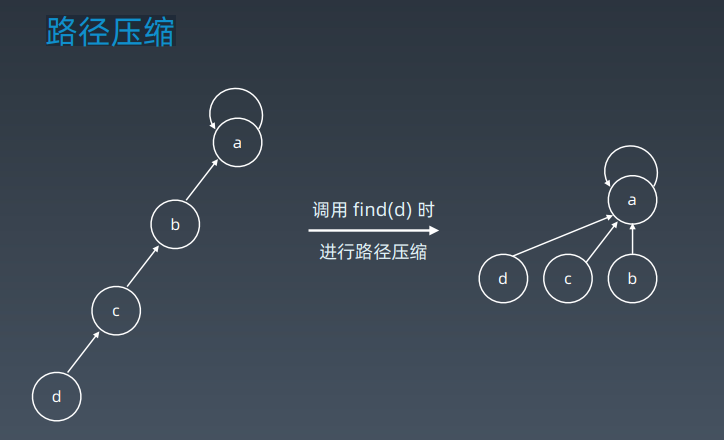

# 第13课 字典树和并查集

## 字典树 Trie

### 回顾树和二叉搜索树


### 字典树的基本结构

字典树，即 Trie 树，又称单词查找树或键树，是一种树形结构。典型应用是用于统计和排序大量的字符串（但不仅限于字符串），所以经常被搜索引擎系统用于文本词频统计。

它的优点是：最大限度地减少无谓的字符串比较，查询效率比哈希表高。


### 字典树的基本性质

1. 结点本身不存完整单词；
2. 从根结点到某一结点，路径上经过的字符连接起来，为该结点对应的字符串；
3. 每个结点的所有子结点路径代表的字符都不相同。

### 结点存储额外信息


### 结点的内部实现 


### 字典树的核心思想

Trie 树的核心思想是空间换时间。

利用字符串的公共前缀来降低查询时间的开销以达到提高效率的目的。

### 实战题目

https://leetcode-cn.com/problems/implement-trie-prefix-tree/#/description

https://leetcode-cn.com/problems/word-search-ii/

Search suggestion - system design

```python
class Trie(object):
    def __init__(self):
        self.root = {}
        self.end_of_word = "#"
        
    def insert(self, word):
        node = self.root
        for char in word:
        	node = node.setdefault(char, {})
        node[self.end_of_word] = self.end_of_word
        
    def search(self, word):
        node = self.root
        for char in word:
            if char not in node:
            	return False
        	node = node[char]
        return self.end_of_word in node

    def startsWith(self, prefix):
        node = self.root
        for char in prefix:
            if char not in node:
            	return False
        	node = node[char]
        return True
```

Trie: https://leetcode-cn.com/problems/word-search-ii/ 

```python
dx = [-1, 1, 0, 0]
dy = [0, 0, -1, 1]
END_OF_WORD = "#"
class Solution(object):
    def findWords(self, board, words):
        if not board or not board[0]: return []
        if not words: return []
        self.result = set()
        
        # 构建trie
        root = collections.defaultdict()
        for word in words:
        	node = root
        	for char in word:
        		node = node.setdefault(char, collections.defaultdict())
        	node[END_OF_WORD] = END_OF_WORD
            
        self.m, self.n = len(board), len(board[0])
        for i in xrange(self.m):
        	for j in xrange(self.n):
        		if board[i][j] in root:
        			self._dfs(board, i, j, "", root)
        return list(self.result)
    
    def _dfs(self, board, i, j, cur_word, cur_dict):
        cur_word += board[i][j]
        cur_dict = cur_dict[board[i][j]]
        if END_OF_WORD in cur_dict:
        	self.result.add(cur_word)
        tmp, board[i][j] = board[i][j], '@'
        for k in xrange(4):
        	x, y = i + dx[k], j + dy[k]
        	if 0 <= x < self.m and 0 <= y < self.n \
        		and board[x][y] != '@' and board[x][y] in cur_dict:
        		self._dfs(board, x, y, cur_word, cur_dict)
        board[i][j] = tmp
```


## 并查集 Disjoint Set 

### 适用场景

- 组团、配对问题
- Group or not ?

### 基本操作

- makeSet(s)：建立一个新的并查集，其中包含 s 个单元素集合。
- unionSet(x, y)：把元素 x 和元素 y 所在的集合合并，要求 x 和 y 所在的集合不相交，如果相交则不合并。
- find(x)：找到元素 x 所在的集合的代表，该操作也可以用于判断两个元素是否位于同一个集合，只要将它们各自的代表比较一下就可以了。

### 初始化


### 查询、合并 


### 路径压缩



### Java实现

```java
class UnionFind {
    private int count = 0;
    private int[] parent;
    public UnionFind(int n) {
        count = n;
        parent = new int[n];
        for (int i = 0; i < n; i++) {
        	parent[i] = i;
        }
    }
    public int find(int p) {
        while (p != parent[p]) {
            parent[p] = parent[parent[p]];
            p = parent[p];
        }
        return p;
    }
    public void union(int p, int q) {
        int rootP = find(p);
        int rootQ = find(q);
        if (rootP == rootQ) return;
        parent[rootP] = rootQ;
        count--;
    }
}
```

### Python实现

```python
def init(p):
    # for i = 0 .. n: p[i] = i;
    p = [i for i in range(n)]
    
    def union(self, p, i, j):
        p1 = self.parent(p, i)
        p2 = self.parent(p, j)
        p[p1] = p2
        
    def parent(self, p, i):
        root = i
        while p[root] != root:
        	root = p[root]
        while p[i] != i: # 路径压缩 ?
        	x = i; i = p[i]; p[x] = root
        return root
```

### 实战题目

1. https://leetcode-cn.com/problems/friend-circles
2. https://leetcode-cn.com/problems/number-of-islands/
3. https://leetcode-cn.com/problems/surrounded-regions/


