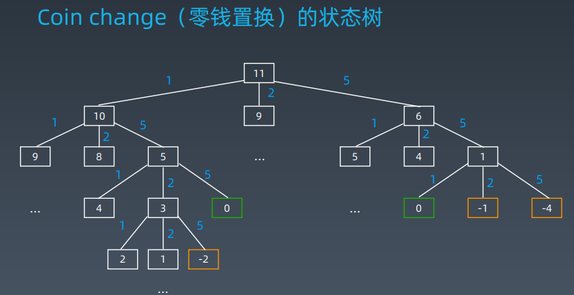
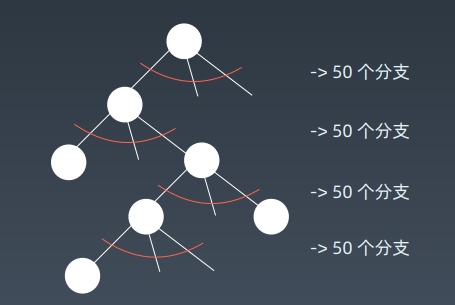
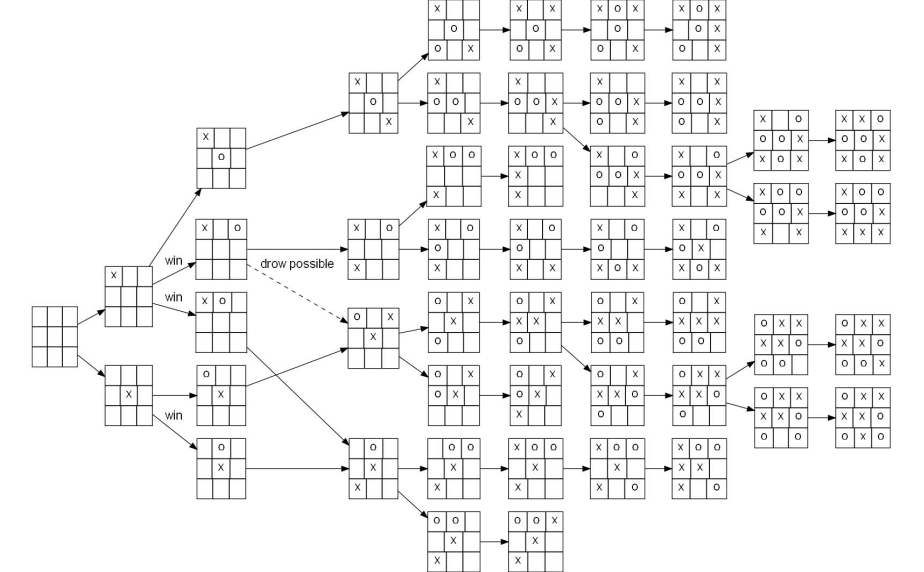
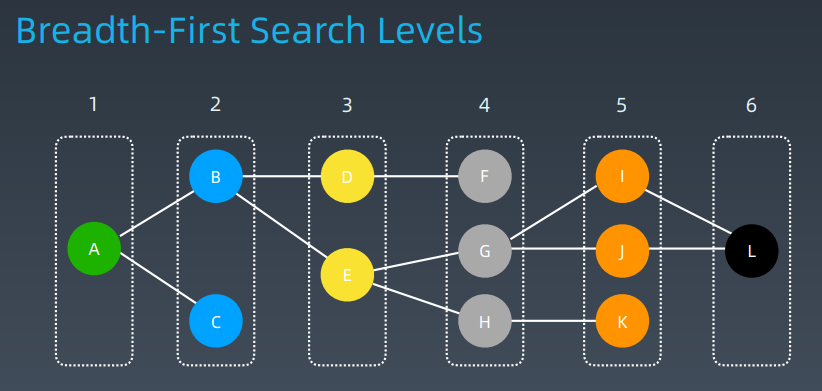
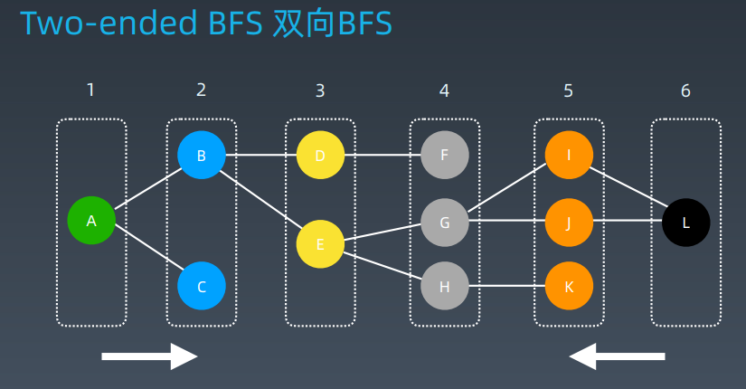

# 高级搜索

剪枝

双向 BFS

启发式搜索（A*）


## 初级搜索

1. 朴素搜索

2. 优化方式：不重复（fibonacci）、剪枝（生成括号问题）

3. 搜索方向：

   DFS: depth first search 深度优先搜索

   BFS: breadth first search 广度优先搜索

   双向搜索、启发式搜索

### Coin change（零钱置换）的状态树



#### DFS 代码 - 递归写法

```python
visited = set()

def dfs(node, visited):
    if node in visited: # terminator
        # already visited
        return
    
    visited.add(node)
    
    # process current node here.
    ...
    for next_node in node.children():
    	if not next_node in visited:
    		dfs(next_node, visited)
```

#### DFS 代码 - 非递归写法

```python
def DFS(self, tree):
    if tree.root is None:
    	return []
    
    visited, stack = [], [tree.root]
    
    while stack:
        node = stack.pop()
        visited.add(node)
        process (node)
        nodes = generate_related_nodes(node)
        stack.push(nodes)
	# other processing work
    ...
```

#### BFS 代码 

```python
def BFS(graph, start, end):
    
    queue = []
    queue.append([start])
    visited.add(start)
    
    while queue:
        node = queue.pop()
        visited.add(node)
        
        process(node)
        nodes = generate_related_nodes(node)
        queue.push(nodes)
```


## 剪枝






### 回溯法

回溯法采用试错的思想，它尝试分步的去解决一个问题。在分步解决问题的过程中，当它通过尝试发现现有的分步答案不能得到有效的正确的解答的时候，它将取消上一步甚至是上几步的计算，再通过其它的可能的分步解答再次尝试寻找问题的答案。

回溯法通常用最简单的递归方法来实现，在反复重复上述的步骤后可能出现两种情况：

- 找到一个可能存在的正确的答案
- 在尝试了所有可能的分步方法后宣告该问题没有答案
- 在最坏的情况下，回溯法会导致一次复杂度为指数时间的计算。

### 实战练习

1. https://leetcode-cn.com/problems/climbing-stairs/
2. https://leetcode-cn.com/problems/generate-parentheses/
3. https://leetcode-cn.com/problems/n-queens/
4. https://leetcode-cn.com/problems/valid-sudoku/description/
5. https://leetcode-cn.com/problems/sudoku-solver/#/description

### 八皇后代码

```python
def solveNQueens(self, n):
    if n < 1: return []
    self.result = []
    self.cols = set(); self.pie = set(); self.na = set()
    self.DFS(n, 0, [])
    return self._generate_result(n)

def DFS(self, n, row, cur_state):
    # recursion terminator
    if row >= n:
        self.result.append(cur_state)
        return
    
    for col in range(n):
    	if col in self.cols or row + col in self.pie or row - col in self.na:
            # go die!
            continue
            
        # update the flags
        self.cols.add(col)
        self.pie.add(row + col)
        self.na.add(row - col)
        
        self.DFS(n, row + 1, cur_state + [col])
        
        self.cols.remove(col)
        self.pie.remove(row + col)
        self.na.remove(row - col)
```

### LeetCode 讨论区代码剖析

https://leetcode.com/problems/n-queens/discuss/19808/Accepted-4ms-c%2B%2B-solution-use-backtracking-and-bitmaskeasy-understand

https://leetcode.com/problems/n-queens/discuss/19810/Fast-shortand-easy-to-understand-python-solution-11-lines-76ms


## 双向 BFS

### Breadth First Search (BFS)


### Breadth-First Search Levels



### Two-ended BFS 双向BFS



### 实战题目

https://leetcode-cn.com/problems/word-ladder/

https://leetcode-cn.com/problems/minimum-geneticmutation/


## 启发式搜索 Heuristic Search (A*)

### 基于 BFS 代码

```python
def BFS(graph, start, end):
    queue = []
    queue.append([start])
    visited.add(start)
    
    while queue:
        node = queue.pop() # can we add more intelligence here ?
        visited.add(node)
        process(node)
        nodes = generate_related_nodes(node)
        queue.push(nodes)
```

### A* search

```python
def AstarSearch(graph, start, end):
    pq = collections.priority_queue() # 优先级 —> 估价函数
    pq.append([start])
    visited.add(start)
    
    while pq:
        node = pq.pop() # can we add more intelligence here ?
        visited.add(node)
        
        process(node)
        nodes = generate_related_nodes(node)
        unvisited = [node for node in nodes if node not in visited]
        pq.push(unvisited)
```

### 估价函数

启发式函数： h(n)，它用来评价哪些结点最有希望的是一个我们要找的结点，h(n) 会返回一个非负实数,也可以认为是从结点n的目标结点路径的估计成本。

启发式函数是一种告知搜索方向的方法。它提供了一种明智的方法来猜测哪个邻居结点会导向一个目标。

### 实战题目

1. https://leetcode-cn.com/problems/shortest-path-in-binarymatrix/
2. https://leetcode-cn.com/problems/sliding-puzzle/
3. https://leetcode-cn.com/problems/sudoku-solver/

### Shortest Pat

1. BFS: 经典的BFS代码

2. A* search

   估价函数：

   h(current_point) = dist(current_point, destination_point)

   https://dataaspirant.com/2015/04/11/five-most-popular-similaritymeasures-implementation-in-python/

3. https://leetcode.com/problems/shortest-path-in-binary-matrix/discuss/313347/A*-search-in-Python

### Sliding Puzzle

1. BFS: 经典的BFS代码:

   https://leetcode-cn.com/problems/sliding-puzzle/submissions/

2. A* search 

   估价函数：

   h(current_state) = distance(current_state, target_state)

3. https://zxi.mytechroad.com/blog/searching/8-puzzlesbidirectional-astar-vs-bidirectional-bfs/


