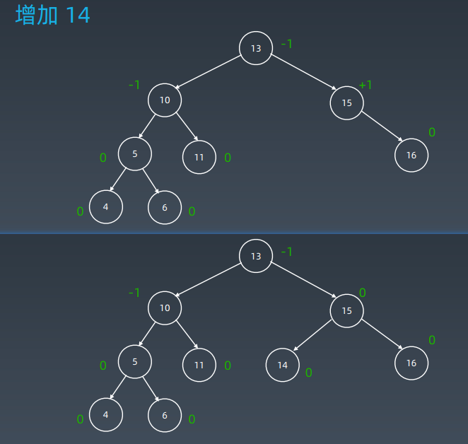
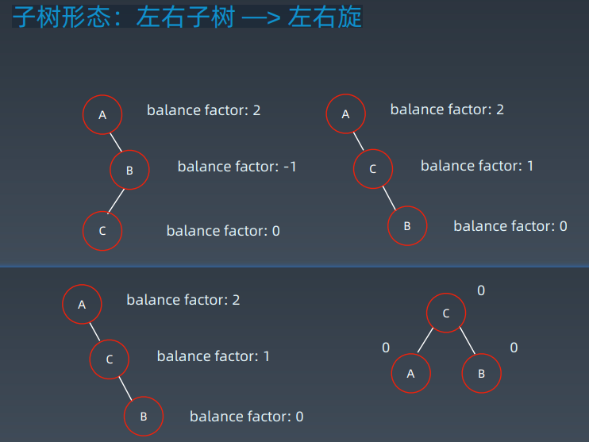

# 第15课 高级树、AVL树和红黑树


## 回顾树和二叉树


## 二叉树遍历 Pre-order/In-order/Post-order 

- 前序(Pre-order)：根-左-右
- 中序(In-order)：左-根-右
- 后序(Post-order)：左-右-根

### 示例代码

```python
def preorder(self, root):
    if root:
        self.traverse_path.append(root.val)
        self.preorder(root.left)
        self.preorder(root.right)
    
def inorder(self, root):
    if root:
        self.inorder(root.left)
        self.traverse_path.append(root.val)
        self.inorder(root.right)

def postorder(self, root):
    if root:
        self.postorder(root.left)
        self.postorder(root.right)
        self.traverse_path.append(root.val)
```


## Binary Search Tree 二叉搜索树

### 二叉搜索树 Binary Search Tree


二叉搜索树，也称二叉搜索树、有序二叉树（Ordered Binary Tree）、排序二叉树（Sorted Binary Tree），是指一棵空树或者具有下列性质的二叉树：

1. 左子树上所有结点的值均小于它的根结点的值；
2. 右子树上所有结点的值均大于它的根结点的值；
3. 以此类推：左、右子树也分别为二叉查找树。 （这就是 重复性！）

中序遍历：升序排列

### 复习：二叉搜索树


### 如何查找结点


### 极端情况


### 保证性能的关键

1. 保证二维维度！ —> 左右子树结点平衡（recursively）
2. Balanced
3. https://en.wikipedia.org/wiki/Selfbalancing_binary_search_tree

### 思考：如何平衡？


## AVL树

1. 发明者 G. M. Adelson-Velsky 和 Evgenii Landis

2. Balance Factor（平衡因子）：是它的左子树的高度减去它的右子树的高度（有时相反）。

   balance factor = {-1, 0, 1}

3. 通过旋转操作来进行平衡（四种）

4. https://en.wikipedia.org/wiki/Selfbalancing_binary_search_tree

### 记录左右子树高度


### 增加14



### 增加 3


### 旋转操作

1. 左旋
2. 右旋
3. 左右旋
4. 右左旋

### 子树形态：右右子树 —> 左旋


### 子树形态：左左子树 —> 右旋


### 子树形态：左右子树 —> 左右旋


### 子树形态：右左子树 —> 右左旋


### 子树形态：左右子树 —> 左右旋



### 向右旋转


### 增加 15


### 向右旋转


### 向左旋转


### AVL 总结

1. 平衡二叉搜索树
2. 每个结点存 balance factor = {-1, 0, 1}
3. 四种旋转操作

不足：结点需要存储额外信息、且调整次数频繁


## 红黑树 Red-black Tree 

红黑树是一种近似平衡的二叉搜索树（Binary Search Tree），它能够确保任何一个结点的左右子树的高度差小于两倍。具体来说，红黑树是满足如下条件的二叉搜索树：

- 每个结点要么是红色，要么是黑色
- 根节点是黑色
- 每个叶节点（NIL节点，空节点）是黑色的。
- 不能有相邻接的两个红色节点
- 从任一节点到其每个叶子的所有路径都包含相同数目的黑色节点。


### 关键性质

从根到叶子的最长的可能路径不多于最短的可能路径的两倍长。

### 对比

- AVL trees provide faster lookups than Red Black Trees because they are more strictly balanced.
- Red Black Trees provide faster insertion and removal operations than AVL trees as fewer rotations are done due to relatively relaxed balancing.
- AVL trees store balance factors or heights with each node, thus requires storage for an integer per node whereas Red Black Tree requires only 1 bit of information per node.
- Red Black Trees are used in most of the language libraries like map, multimap, multisetin C++ whereas AVL trees are used in databases where faster retrievals are required.

