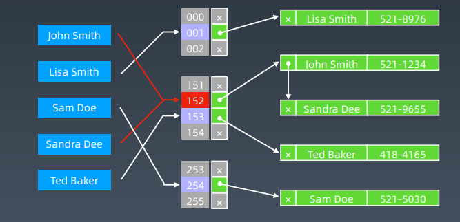
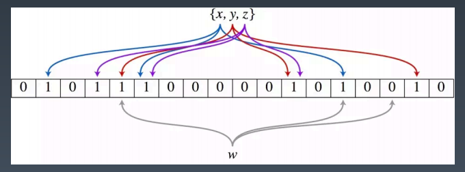
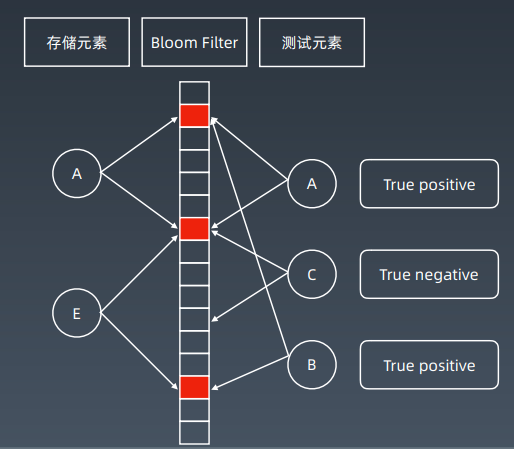
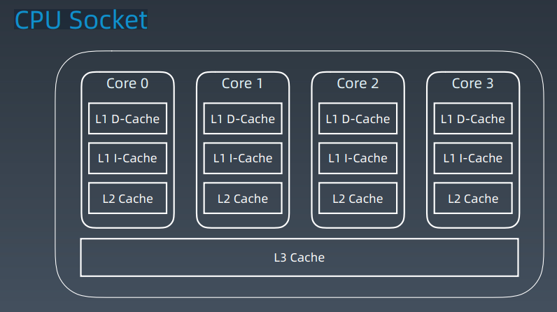
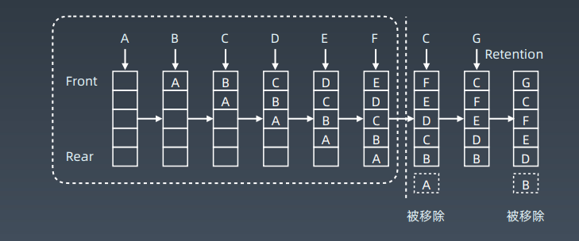

# 第17课 布隆过滤器、LRU Cache


## 布隆过滤器 Bloom Filter

### HashTable + 拉链存储重复元素



### Bloom Filter vs Hash Table

一个很长的二进制向量和一系列随机映射函数。布隆过滤器可以用于检索一个元素是否在一个集合中。

优点是空间效率和查询时间都远远超过一般的算法，

缺点是有一定的误识别率和删除困难。

### 布隆过滤器示意图





### 案例

1. 比特币网络
2. 分布式系统（Map-Reduce） — Hadoop、search engine
3. Redis 缓存
4. 垃圾邮件、评论等的过滤

科普：https://www.cnblogs.com/cpselvis/p/6265825.html
https://blog.csdn.net/tianyaleixiaowu/article/details/74721877

### Python 实现

```python
from bitarray import bitarray
import mmh3

class BloomFilter:
    def __init__(self, size, hash_num):
        self.size = size
        self.hash_num = hash_num
        self.bit_array = bitarray(size)
        self.bit_array.setall(0)\
        
    def add(self, s):
    	for seed in range(self.hash_num):
            result = mmh3.hash(s, seed) % self.size
            self.bit_array[result] = 1
            
    def lookup(self, s):
    	for seed in range(self.hash_num):
    		result = mmh3.hash(s, seed) % self.size
    		if self.bit_array[result] == 0:
    			return "Nope"
    	return "Probably"
    
bf = BloomFilter(500000, 7)
bf.add("dantezhao")
print (bf.lookup("dantezhao"))
print (bf.lookup("yyj"))
```

### 其他实现

Python:
https://www.geeksforgeeks.org/bloom-filters-introductionand-python-implementation/
https://github.com/jhgg/pybloof

Java：
https://github.com/lovasoa/bloomfilter/blob/master/src/main/java/BloomFilter.java
https://github.com/Baqend/Orestes-Bloomfilter


## LRU Cache

### Cache 缓存

1. 记忆
2. 钱包 - 储物柜
3. 代码模块

### CPU Socket



https://www.sqlpassion.at/archive/2018/01/06/understandingthe-meltdown-exploit-in-my-own-simple-words/

### LRU Cache

- 两个要素： 大小 、替换策略

- Hash Table + Double LinkedList

- O(1) 查询

  O(1) 修改、更新

### LRU cache 工作示例



### 替换策略

- LFU - least frequently used

- LRU - least recently used

替换算法总览：
https://en.wikipedia.org/wiki/Cache_replacement_policies

### 实战题目

 https://leetcode-cn.com/problems/lru-cache/#/

### LRU Cache — Python

```python
class LRUCache(object):
    
    def __init__(self, capacity):
        self.dic = collections.OrderedDict()
        self.remain = capacity
    
    def get(self, key):
        if key not in self.dic:
        	return -1
        v = self.dic.pop(key)
        self.dic[key] = v # key as the newest one
        return v

    def put(self, key, value):
        if key in self.dic:
        	self.dic.pop(key)
        else:
        	if self.remain > 0:
        		self.remain -= 1
        	else: # self.dic is full
        		self.dic.popitem(last=False)
        self.dic[key] = value
```

### LRU Cache — Java

```java
public class LRUCache {
    private Map<Integer, Integer> map;
    public LRUCache(int capacity) {
    	map = new LinkedCappedHashMap<>(capacity);
    }
    public int get(int key) {
        if(!map.containsKey(key)) { return -1; }
    	return map.get(key);
    }
    public void put(int key, int value) {
    	map.put(key,value);
    }
    private static class LinkedCappedHashMap<K,V> extends LinkedHashMap<K,V> {
    	int maximumCapacity;
    	LinkedCappedHashMap(int maximumCapacity) {
    		super(16, 0.75f, true);
    		this.maximumCapacity = maximumCapacity;
   		 }
    	protected boolean removeEldestEntry(Map.Entry eldest) {
    		return size() > maximumCapacity;
    	}
    }
}
```


