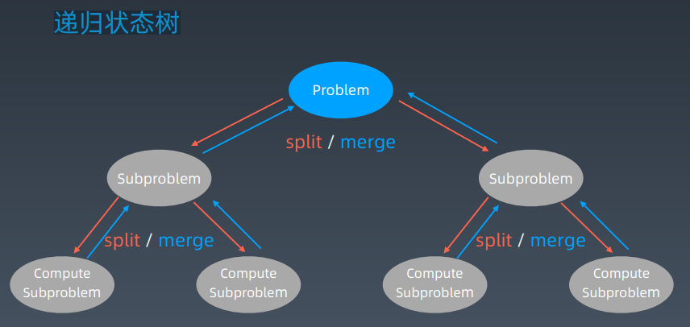

# 第19课 高级动态规划

## 提纲

1. 动态规划复习；附带 递归、分治
2. 多种情况的动态规划的状态转移方程串讲
3. 进阶版动态规划的习题


## 递归、分治、回溯、动态规划复习

### 递归 - 函数自己调用自己

```java
public void recur(int level, int param) {
	// terminator
	if (level > MAX_LEVEL) {
		// process result
		return;
	}
	// process current logic
	process(level, param);
	// drill down
	recur(level: level + 1, newParam);
	// restore current status
}
```

### 分而治之 Divide & Conquer

分治代码模板：

```python
def divide_conquer(problem, param1, param2, ...):
    # recursion terminator
    if problem is None:
    print_result
    return

    # prepare data
    data = prepare_data(problem)
    subproblems = split_problem(problem, data)
    
    # conquer subproblems
    subresult1 = self.divide_conquer(subproblems[0], p1, ...)
    subresult2 = self.divide_conquer(subproblems[1], p1, ...)
    subresult3 = self.divide_conquer(subproblems[2], p1, ...)
    …
    # process and generate the final result
    result = process_result(subresult1, subresult2, subresult3, …)
   
	# revert the current level states
```

### 感触

1. 人肉递归低效、很累
2. 找到最近最简方法，将其拆解成可重复解决的问题
3. 数学归纳法思维

本质：寻找重复性 —> 计算机指令集

### 递归状态树



#### Fib(6) 状态树、重复子状态


### 动态规划 Dynamic Programming

1. “Simplifying a complicated problem by breaking it down into simpler sub-problems”(in a recursive manner)
2. Divide & Conquer + Optimal substructure 分治 + 最优子结构
3. 顺推形式： 动态递推

#### DP 顺推模板

```javascript
function DP():
	dp = [][] # ⼆维情况
	for i = 0 .. M {
		for j = 0 .. N {
			dp[i][j] = _Function(dp[i’][j’]…)
		}
	}
	return dp[M][N];
```

#### 关键点

动态规划 和 递归或者分治 没有根本上的区别（关键看有无最优的子结构）

拥有共性：找到重复子问题

差异性：最优子结构、中途可以淘汰次优解


## 常见的 DP 题目和状态方程

### 爬楼梯

递归公式：f(n) = f(n - 1) + f(n - 2) , f(1) = 1, f(0) = 0


```python
def f(n):
	if n <= 1: return 1
	return f(n - 1) + f(n - 2)
```

上述代码时间复杂度：O(2^n)

```python
def f(n):
    if n <= 1: return 1
    if n not in mem:
    	mem[n] = f(n - 1) + f(n - 2)
    return mem[n]
```

上述代码时间复杂度：O(n) 

```python
def f(n):
    dp = [1] * (n + 1)
    for i in range(2, n + 1):
    	dp[i] = dp[i - 1] + dp[i - 2]
    return dp[n]
```

上述代码时间复杂度：O(n)

```python
def f(n):
    x, y = 1, 1
    for i in range(1, n):
        y, x = x + y, y
	return 
```

上述代码时间复杂度：O(n)、O(1)

### 不同路径
递归公式：f(x, y) = f(x-1, y) + f(x, y-1)


```python
def f(x, y):
    if x <= 0 or y <= 0: return 0
    if x == 1 and y == 1: return 1
    return f(x - 1, y) + f(x, y - 1)
```

```python
def f(x, y):
    if x <= 0 or y <= 0: return 0
    if x == 1 and y == 1: return 1
    if (x, y) not in mem:
    	mem[(x, y)] = f(x - 1, y) + f(x, y - 1)
    return mem[(x, y)]
```

上述代码时间复杂度：O(mn), O(mn)

```python
def f(x, y):
    dp = [[0] * (m + 1) for _ in range(n + 1)]
    dp[1][1] = 1
    for i in range(1, y + 1):
    	for j in range(1, x + 1):
    		dp[i][j] = dp[i - 1][j] + dp[j][i - 1]
    return dp[y][x]
```

上述代码时间复杂度：O(mn), O(mn)

### 打家劫舍

dp[i]状态的定义： max $ of robbing A[0 -> i]


dp[i] = max(dp[i - 2] + nums[i], dp[i - 1])

dp[i][0]状态定义： max $ of robbing A[0 -> i] 且没偷 nums[i]

dp[i][1]状态定义： max $ of robbing A[0 -> i] 且偷了 nums[i]


```
dp[i][0] = max(dp[i - 1][0], dp[i - 1][1]);
dp[i][1] = dp[i - 1][0] + nums[i];
```

### 最小路径和

dp[i][j]状态的定义： `minPath(A[1 -> i][1 -> j])`

`dp[i][j] = min(dp[i - 1][j], dp[i][j - 1]) + A[i][j] `

### 股票买卖


https://leetcode-cn.com/problems/best-time-to-buy-and-sell-stock/solution/yi-ge-fang-fatuan-mie-6-dao-gu-piao-wen-ti-by-l-3/

`dp[i][k][0 or 1] (0 <= i <= n-1, 1 <= k <= K)`

- i 为天数
-  k 为最多交易次数
- [0,1] 为是否持有股票

总状态数： n * K * 2 种状态

```python
for 0 <= i < n:
	for 1 <= k <= K:
		for s in {0, 1}:
			dp[i][k][s] = max(buy, sell, rest)
```

https://leetcode-cn.com/problems/best-time-to-buy-and-sell-stock/solution/yi-ge-fang-fatuan-mie-6-dao-gu-piao-wen-ti-by-l-3/

```
dp[i][k][0] = max(dp[i-1][k][0], dp[i-1][k][1] + prices[i])
			  max( 选择 rest , 选择 sell )
```

解释：今天我没有持有股票，有两种可能：

- 我昨天就没有持有，然后今天选择 rest，所以我今天还是没有持有；
- 我昨天持有股票，但是今天我 sell 了，所以我今天没有持有股票了。

```
dp[i][k][1] = max(dp[i-1][k][1], dp[i-1][k-1][0] - prices[i])
              max( 选择 rest , 选择 buy )
```

解释：今天我持有着股票，有两种可能：

- 我昨天就持有着股票，然后今天选择 rest，所以我今天还持有着股票；
- 我昨天本没有持有，但今天我选择 buy，所以今天我就持有股票了。

初始状态：

```
dp[-1][k][0] = dp[i][0][0] = 0
dp[-1][k][1] = dp[i][0][1] = -infinity
```

状态转移方程：

```
dp[i][k][0] = max(dp[i-1][k][0], dp[i-1][k][1] + prices[i])
dp[i][k][1] = max(dp[i-1][k][1], dp[i-1][k-1][0] - prices[i])
```

https://leetcode-cn.com/problems/best-time-to-buy-and-sell-stock/solution/yi-ge-fang-fa-tuan-mie-6-dao-gu-piao-wen-ti-by-l-3/


## 高阶的 DP 问题

### 复杂度来源

1. 状态拥有更多维度（二维、三维、或者更多、甚至需要压缩）
2. 状态方程更加复杂

本质：内功、逻辑思维、数学

### 爬楼梯问题改进

- 1、2、3
- x1, x2, …, xm 步
- 前后不能走相同的步伐

Homework:https://leetcode-cn.com/problems/min-cost-climbing-stairs/

### 编辑距离

如果` word1[i]` 与 `word2[j]` 相同，显然` dp[i][j]=dp[i-1][j-1]`

如果 `word1[i]` 与 `word2[j]` 不同，那么` dp[i][j] `可以通过

1. 在 dp[i-1][j-1] 的基础上做 replace 操作达到目的
2. 在 dp[i-1][j] 的基础上做 insert 操作达到目的
3. 在 dp[i][j-1] 的基础上做 delete 操作达到目的

取三者最小情况即可


## Homework

1.  https://leetcode-cn.com/problems/longest-increasing-subsequence/

2. https://leetcode-cn.com/problems/decode-ways/

3. https://leetcode-cn.com/problems/longest-valid-parentheses/

4. https://leetcode-cn.com/problems/maximal-rectangle/

5. https://leetcode-cn.com/problems/distinct-subsequences/

6. https://leetcode-cn.com/problems/race-car/