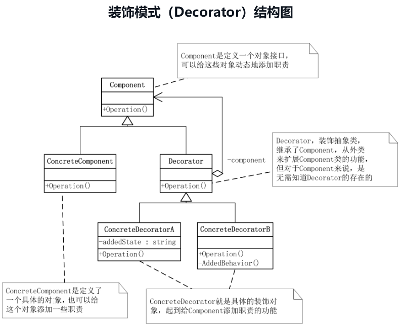

# 装饰模式

装饰模式：
- 动态地给一个对象添加一些额外的职责，就增加功能来说，装饰模式比生成子类更为灵活。




代码设计如下：

```csharp
namespace DecoratorPattern
{
    //对象接口
    abstract class Component
    {
        public abstract void Operation();
    }

    // 定义一个具体对象
    class ConcreteComponent : Component
    {
        public override void Operation()
        {
            Console.WriteLine("具体对象的操作");
        }
    }

    //装饰抽象类
    abstract class Decorator : Component
    {
        protected Component component;
        //设置Component，装饰模式是利用SetComponent来对对象进行包装的
        public void SetComponent(Component component)
        {
            this.component = component;
        }
        //重写Operation()，实际执行的是Component的Operation()
        public override void Operation()
        {
            if (component != null)
            {
                component.Operation();
            }
        }
    }

    //具体的装饰对象
    class ConcreteDecoratorA : Decorator
    {
        //本类的独有功能，以区别于ConcreteDecoratorB
        private string addedState;
        public override void Operation()
        {
            //首先运行原Component的Operation()，再执行本类的功能，如addedState，相当于对原Component进行了装饰
            base.Operation();
            addedState = "New State";
            Console.WriteLine("具体装饰对象A的操作");
        }
    }

    class ConcreteDecoratorB : Decorator
    {
        public override void Operation()
        {
            //首先运行原Component的Operation()，再执行本类的功能，如AddedBehavior()，相当于对原Component进行了装饰
            base.Operation();
            AddedBehavior();
            Console.WriteLine("具体装饰对象B的操作");
        }
        //本类独有的方法，以区别于ConcreteDecoratorA
        private void AddedBehavior()
        {
            
        }
    }

    internal class Program
    {
        static void Main(string[] args)
        {
            ConcreteComponent c = new ConcreteComponent();
            ConcreteDecoratorA d1 = new ConcreteDecoratorA();
            ConcreteDecoratorB d2 = new ConcreteDecoratorB();

            /*
             装饰的方法是：
             首先用ConcreteComponent实例化对象c，
             然后用ConcreteDecoratorA的实例化对象d1来包装c，
             再用ConcreteDecoratorB的对象d2包装d1，最终执行d2.Operation()
             */
            d1.SetComponent(c);
            d2.SetComponent(d1);
            d2.Operation();
            Console.Read();
        }
    }
}
```

装饰模式是利用SetComponent来对对象进行包装的。这样每个装饰对象的实现就和如何使用这个对象分离开了，每个装饰对象只关心自己的功能，不需要关心如何被添加到对象链当中。

如果只有一个ConcreteComponent类而没有抽象的Component类，那么Decorator类可以是ConcreteComponent的一个子类。同样道理，如果只有一个ConcreteDecorator类，那么就没有必要建立一个单独的Decorator类，而可以把Decorator和ConcreteDecorator的责任合并成一个类。

装饰模式是为已有功能动态地添加更多功能的一种方式。装饰模式把每个要装饰的功能，放在单独的类中，并让这个类包装它所要装饰的对象，因此，当需要执行特殊行为时，客户代码就可以在运行时根据需要有选择地、按顺序地使用装饰功能包装对象了。

装饰模式的优点：把类中的装饰功能从类中搬移去除，这样可以简化原有的类；能够有效的把类的核心职责和装饰功能区分开了。而且可以去除相关类中重复的装饰逻辑。

