# Elasticsearch 安装与配置

由于Elasticsearch需要基于java环境运行，因此安装前必须先安装好java11。


### 下载安装包

下载地址：https://artifacts.elastic.co/downloads/elasticsearch/elasticsearch-7.4.2-linux-x86_64.tar.gz 不同版本，只需要更改一下版本号即可下载。

下载完成之后，上传到Linux下的 /home/software/ 目录下。

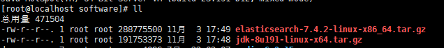


### 解压并安装

解压到当前目录：

```shell
[root@localhost software]# tar -zxvf elasticsearch-7.4.2-linux-x86_64.tar.gz 
```

将解压后的目录移动到/usr/local/目录下：

```shell
[root@localhost software]# mv elasticsearch-7.4.2 /usr/local/
```

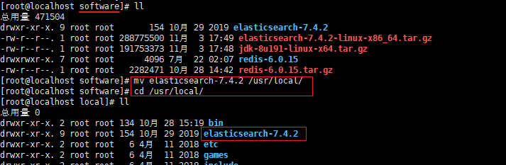

进入到elasticsearch目录，并创建数据目录data：

```shell
[root@localhost local]# cd elasticsearch-7.4.2/
[root@localhost elasticsearch-7.4.2]# mkdir data
```

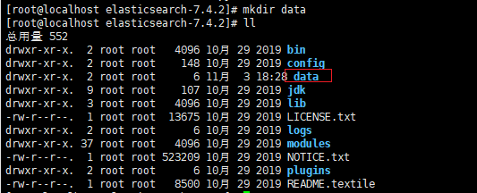

elasticsearch目录介绍：

- bin：可执行文件在里面，运行es的命令就在这个里面，包含了一些脚本文件等
- config：配置文件目录
- JDK：java环境
- lib：依赖的jar，类库
- logs：日志文件
- modules：es相关的模块
- plugins：可以自己开发的插件
- data：这个目录没有，自己新建一下，后面要用 -&gt; mkdir data，这个作为索引目录

### 配置 elasticsearch

进入到config目录：

```shell
[root@localhost elasticsearch-7.4.2]# pwd
/usr/local/elasticsearch-7.4.2
[root@localhost elasticsearch-7.4.2]# cd config/
[root@localhost config]# ll
总用量 36
-rw-rw----. 1 root root  2831 10月 29 2019 elasticsearch.yml
-rw-rw----. 1 root root  3593 10月 29 2019 jvm.options
-rw-rw----. 1 root root 17545 10月 29 2019 log4j2.properties
-rw-rw----. 1 root root   473 10月 29 2019 role_mapping.yml
-rw-rw----. 1 root root   197 10月 29 2019 roles.yml
-rw-rw----. 1 root root     0 10月 29 2019 users
-rw-rw----. 1 root root     0 10月 29 2019 users_roles
```

关于 elasticsearch 的配置都是在该目录下的文件中进行。

#### elasticsearch.yml 相关的配置

- 配置集群的名称，即使单节点也可以进行设置：

  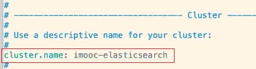

- 配置节点的名称：

  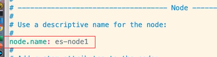

- 配置日志目录和数据存放的目录，这里设置为上述创建的data目录：

  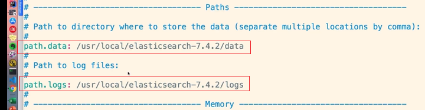

- 配置网络绑定的地址：

  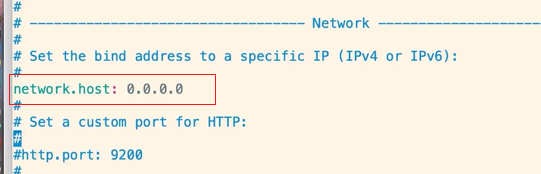

  默认端口号，也可以自定义修改，默认是9200，如上图所示。

- 配置允许跨域访问elasticsearch，默认是没有该内容的，需要手动增加，一般写在Network部分：

  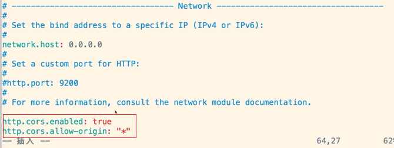

- 配置集群发现的节点，这里的节点名称要和上文的节点名称一致：

  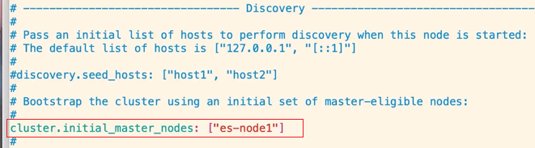

配置完成之后，保存并退出。

#### jvm.options 相关的配置

- 配置JVM参数，这里由于ES运行在虚拟机中，所以只配置了128M：

  

  ==配置建议：Xmx 和 Xms 设置成一样，并且不要超过机器内存的50%，且最大不要超过30G。==

配置完成之后，保存并退出。


## 运行 elasticsearch

elasticsearch不允许使用root权限，因此需要将目录的权限授权给普通用户。

创建一个新用户：


将目录的权限授权给该用户：

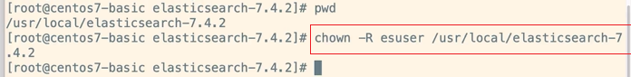

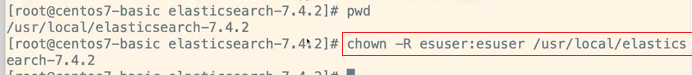

进入到bin目录：

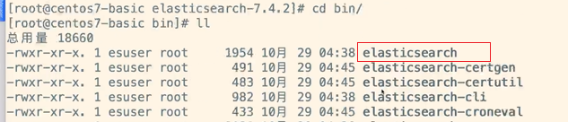

切换为普通用户，运行elasticsearch：

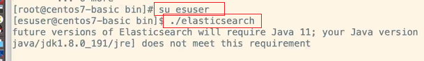

假如启动之后，发现节点是停止状态，出现如下问题：

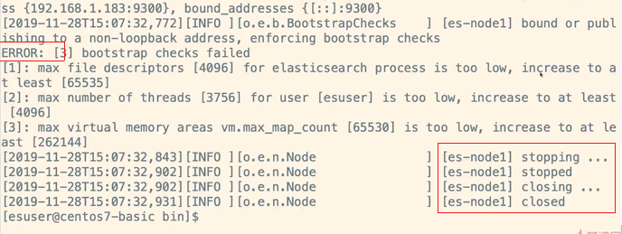

上图中一共出现了3个错误，需要针对每个错误类型调整配置，可以谷歌搜索一下，下述仅是参考，实际要以具体错误具体分析。

此时需要以root身份，对/etc/security/limits.conf文件的内容进行修改：


在文件的末尾，追加如下内容：

```
* soft nofile 65536
* hard nofile 131072
* soft nproc 2048
* hard nproc 4096
```

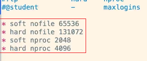

保存并退出该文件。

再以root身份，修改 /etc/sysctl.conf文件内容：


在文件中，追加如下内容：

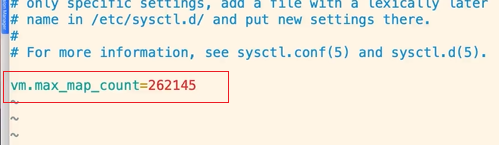

这里的262145是根据上文中运行elasticsearch输出的报错信息262144来设置的。

保存并退出，刷新配置：

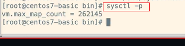

所有的配置修改完成之后，再次切换回esuser，再次执行elasticsearch：


端口号意义：

- 9200：http协议，用于外部通讯；
- 9300：TCP协议，ES集群之间是通过9300通讯的；

如果没有问题，浏览器访问9200端口，可以看到如下信息：


### 以后台方式运行 elasticsearch

上述是以前台方式运行elasticsearch，如果要退出，可以执行ctrl+C，如果想要以后台形式运行elasticsearch，可以加上-d，执行如下命令：

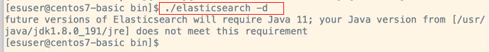

### 删除进程

如果要关闭以后台方式运行的进程，需要先查询进程编号，然后kill：

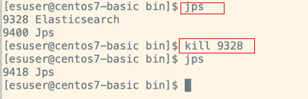


## 插件的安装

### elasticsearch-head

elasticsearch可视化插件，github有详细介绍。

推荐使用谷歌浏览器的插件形式进行安装。https://chrome.google.com/webstore/category/extensions?utm_source=chrome-ntp-icon


-------------------------------------todo-----------------------------


查看已安装的插件：

```
bin/elasticsearch-plugin list
```

安装插件：

```
bin/elasticsearch-plugin install analysis-icu
```

analysis-icu 是一个分词插件。

### 6、实例的运行

运行单个 Elasticsearch 实例：

```
bin/elasticsearch -E node.name=node1 -E cluster.name=geektime -E path.data=node1_data -d
```

运行多个 Elasticsearch 实例：

```
bin/elasticsearch -E node.name=node1 -E cluster.name=geektime -E path.data=node1_data -d
bin/elasticsearch -E node.name=node2 -E cluster.name=geektime -E path.data=node2_data -d
bin/elasticsearch -E node.name=node3 -E cluster.name=geektime -E path.data=node3_data -d
```

注意：不同实例节点的cluster.name应该指向同一个name。

### 7、删除进程

```
ps | grep elasticsearch
kill -9 9937
```

