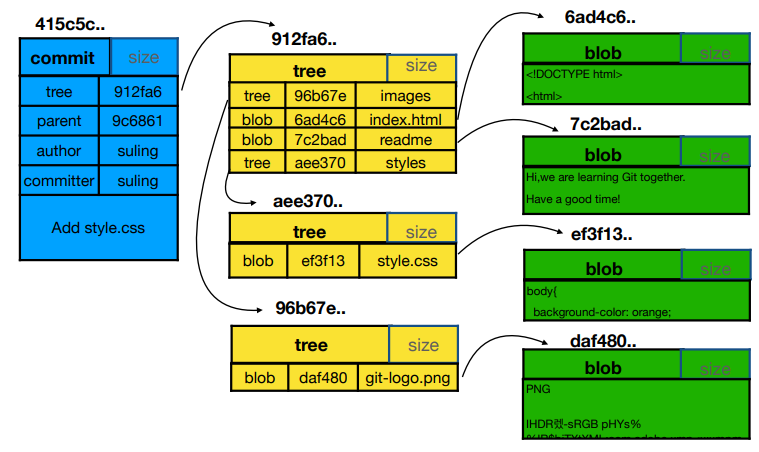

# Git知识点概述


## 牢记准则

- **时刻进行git add**。任何的更改，都要执行git add命令，git add命令相当于将不受控的文件通过git进行控制。这样，无论是文件删除、更改、还原、提交、快照等，都可以通过其他git命令实现。


## 工作区、暂存区、版本库

工作区：当天项目所在的目录。

暂存区：将工作区中的文件，使用git add命令，即将其添加到了暂存区。

版本库：工作区中的隐藏目录.git即为版本库，使用git commit命令，即将文件写入到版本库中。


## Git核心对象类型

Git中的核心对象类型有：

- commit
- tree （文件的集合）
- blob
- tag

三者之间的关系：

每次执行提交，都会创建一个commit对象。

一个commit只对应一个tree。这个tree表示的是当前提交的文件和文件夹对应的快照。而每一个tree，又可以包含多个blob（对应具体的文件）和其他tree（对应其他的文件夹）。




## 分离头指针（detached HEAD）

指当前进行的工作不在任何分支上，即当前工作在没有分支的状态下，处于分离状态。

 分离头指针一般只用于不依赖分支的尝试性的变更。

一般基于commit切换分支，会出现分离头指针的情况，如下：

```shell
$ git checkout b892227762
Note: switching to 'b892227762'.

You are in 'detached HEAD' state. You can look around, make experimental
changes and commit them, and you can discard any commits you make in this
state without impacting any branches by switching back to a branch.
...
```

一旦进行了文件变更，使用git status查看状态时：

```shell
$ git status
HEAD detached at b892227
Changes not staged for commit:
  (use "git add <file>..." to update what will be committed)
  (use "git restore <file>..." to discard changes in working directory)
        modified:   a1.txt

no changes added to commit (use "git add" and/or "git commit -a")

```

当修改了一个文件，再次提交时：

```shell
$ git commit -am'test ssss'
[detached HEAD f7c8002] test ssss
 1 file changed, 1 insertion(+)
```

使用git log查看日志：

```shell
$ git log
commit f7c800206769b562fb4409d838ef22f92b6b52d4 (HEAD)
Author: wy <wy@163.com>
Date:   Thu Nov 7 12:52:17 2019 +0800

    test ssss


```

注意，正常情况下，是可以看到关联的分支的，例如：

```shell
$ git log
commit 4e9bdb48841dd949728a8bded94db4c5b9055fc4 (HEAD -> master)
Author: wy <wy@163.com>
Date:   Thu Oct 24 19:24:42 2019 +0800

    提交内容

```

而分离头指针，只能看到末尾的(HEAD)，而不是 (HEAD -> master)。

分离头指针由于没有绑定分支，因此在切换分支的时候，在分离头指针上做的更改和提交，很容易被清理掉造成丢失。


## HEAD和branch

HEAD 是当前分支引用的指针，它总是指向该分支上的最后一次提交。HEAD将是下一次提交的父结点。 通常，理解 HEAD 的最简方式，就是将它看做 **你的上一次提交（最近一次）** 的快照。

每个git仓库只有一个HEAD，对应.git/HEAD文件。HEAD 文件是一个符号引用（symbolic reference），指向目前所在的分支。

可以通过git checkout命令，改变HEAD的指向。

远程引用和分支（位于 `refs/heads` 目录下的引用）之间最主要的区别在于，远程引用是只读的。 虽然可以 `git checkout` 到某个远程引用，但是 Git 并不会将 HEAD 引用指向该远程引用。因此，你永远不能通过 `commit` 命令来更新远程引用。 Git 将这些远程引用作为记录远程服务器上各分支最后已知位置状态的书签来管理。


