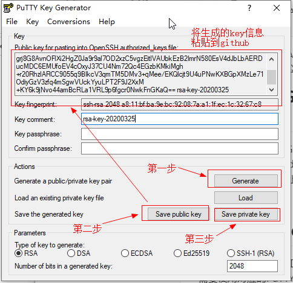

# 使用SSH连接到远端服务器

使用SSH连接到GitHub，可参考链接：https://help.github.com/cn/github/authenticating-to-github/connecting-to-github-with-ssh，其他服务器的连接与GitHub类似。这里对主要步骤进行总结。


## 第一步：检查现有SSH密钥

打开 Git Bash，输入 `ls -al ~/.ssh` 以查看是否存在现有 SSH 密钥：

```shell
$ ls -al ~/.ssh
# 列出 .ssh 目录中的文件（如果有）
```

检查目录列表以查看是否已经有 SSH 公钥。 默认情况下，公钥的文件名是以下之一：

- *id_rsa.pub*
- *id_ecdsa.pub*
- *id_ed25519.pub*

## 第二步：生成SSH密钥

打开 Git Bash，输入下述命令：

```shell
$ ssh-keygen -t rsa -b 4096 -C "AngYony@163.com"
```

如果不想设置SSH密码的话，直接一路回车到最后。

此时可以看到.pub文件类型的公共密钥信息：

```shell
$ ls -al
total 20
drwxr-xr-x 1 AngYony 197121    0 11月 20 11:22 ./
drwxr-xr-x 1 AngYony 197121    0 11月 20 11:22 ../
-rw-r--r-- 1 AngYony 197121 3381 11月 20 11:22 id_rsa
-rw-r--r-- 1 AngYony 197121  741 11月 20 11:22 id_rsa.pub
```

其中：id_rsa文件是私钥文件，留在本地；id_rsa.pub是公钥文件，一般会将其内容放到公网上面。

## 第三步：在GitHub上添加SSH公钥内容

Settings=>SSH and GPG keys=>SSH keys=>New SSH key，在弹出的界面中，粘贴上述id_rsa.pub公钥文件中的内容，Title可以不用填写，默认以邮箱地址作为Title。

配置完成之后，即可使用Git命令进行推送操作。但还不能直接使用TortoiseGit工具。

## 使用TortoiseGit工具

如果使用TortoiseGit工具以SSH的形式（非Https）形式访问仓库，需要使用对应的PuTTY工具，生成PuTTY key（私钥）。

注意：TortoiseGit生成的private key（私钥）和Git自身生成的私钥是不能互相解析的，因此在使用TortoiseGit工具时，需要重新生成自己的private key。并且也需要将public key粘贴到GitHub上。

如下图所示：




参考链接：https://www.cnblogs.com/zy20160429/p/7493693.html