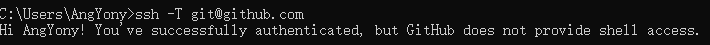

# 使用代理无法推送Github代码解决办法

如果使用了梯子，可以通过浏览器访问Github，但是无法推送和克隆代码。


## 第一步：创建config文件

查看"C:\Users\AngYony\.ssh"目录下是否有config文件，如果没有，手动创建该文件即可。

config文件的内容如下：

```
#Windows用户，注意替换你的端口号和connect.exe的路径，7890是代理端口号
ProxyCommand "D:\ProgramData\Git\mingw64\bin\connect" -S 127.0.0.1:7890 -a none %h %p

#MacOS用户用下方这条命令，注意替换你的端口号
#ProxyCommand nc -v -x 127.0.0.1:51837 %h %p

Host github.com
  User git
  Port 22
  Hostname github.com
  # 注意修改路径为你的路径
  IdentityFile "C:\Users\AngYony\.ssh\id_rsa"
  TCPKeepAlive yes

Host ssh.github.com
  User git
  Port 443
  Hostname ssh.github.com
  # 注意修改路径为你的路径
  IdentityFile "C:\Users\AngYony\.ssh\id_rsa"
  TCPKeepAlive yes

```

执行下述命令进行验证：

```
ssh -T git@github.com
```



上述提示已经通过了认证，接下来直接在目录中使用`git clone`命令进行验证即可。

如果验证无法通过，需要重新生成ssh key，参见《[使用SSH连接到远端服务器.md](使用SSH连接到远端服务器.md)》。

