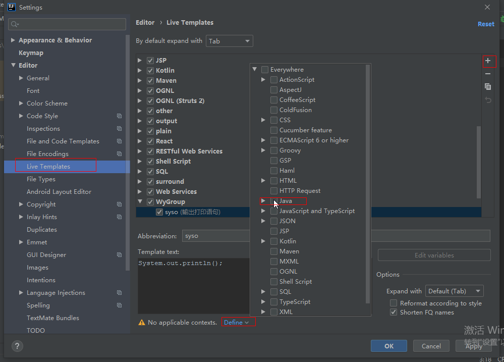

# IDEA使用技巧


### 自定义代码模板

在Live Templates中，先点击下图中的“+”创建自己的模板分组（例如WyGroup)，然后选中WyGroup，再次点击“+”，创建自己的代码模板，如下图所示。

注意：创建完成之后，一定要选择Define，以便设置该模板生效的内容，下图中会勾选“java”。




### 如何取消方法的形参提示

例如：func(s:"wy")，如果不想每次调用方法时，都出现“s:”的提示，可以使用下述方法进行去除：

```
Settings => Editor => General => Appearance => 取消“Show parameter name hints”的选中
```

执行了上述设置后，再次键入调用的方法，传入参数时，IDEA不会出现形参的提示信息。


### 创建TODO待办事项

```java
//TODO:创建代办事项
```


### 用断点调试程序

关注点：Frame视图和Variable视图。

Step Over：执行一行

Step Out：继续执行直到遇到下一个断点或者程序结束。

Evaluate Expression：在对话框输入代码，直接执行看结果值。右击代码，选择“Evaluate Expression..“

条件断点：给断点设置条件，只有满足条件时，程序才会在该断点停住。右击断点图标。

Step Into：进入被调用的方法内部继续调试

 