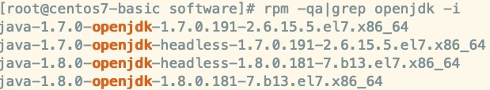
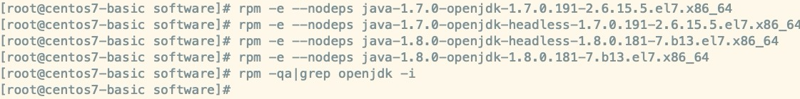

# CentOS7 安装JDK

购买云服务器后，厂商会提供一个公网IP和内网IP，我们需要使用SSH工具连接到云服务器，随后就能在命令行中操作linux系统。

- 公网IP：39.106.215.59
- 内网IP：172.17.41.6

若在本地虚拟机中操作linux，只需要配置静态IP即可，比如：192.168.1.88。


## 检查是否安装了JDK

服务器安装JDK之前，先确保有没有默认安装JDK，执行以下命令进行检查：

```
java -version
```

如果是自己在虚拟机上安装的<code>centos7.x</code>或者<code>centos6.x</code>，则会默认帮你安装好OpenJDK，如下截图：


## 卸载 OpenJDK

如果系统自动安装了OpenJDK，需要卸载，卸载步骤如下：

第一步：检查系统安装的OpenJDK

```
rpm -qa|grep openjdk -i
```



第二步：删除以上四项<code>openjdk</code>的安装包并且检查后显示删除完毕。

```
rpm -e --nodeps 需要删除的软件
```



如果是在阿里云或者腾讯云上的centos系统，一般不会自带jdk，但是以上步骤还是建议检查一下，如若发现自带jdk，建议删除后重新安装。


## 安装 JDK

第一步：新建jdk安装目录

```
mkdir /usr/java
```

第二步：新建jdk安装包存放目录（如：/home/software），使用ftp工具（FileZilla）将安装包上传到该目录下。

第三步：解压jdk压缩包

```
tar -zxvf jdk-8u191-linux-x64.tar.gz
```

第四步：把解压后的jdk放到 /usr/java下，这个目录专门用于存放jdk。

```
mv jdk1.8.0_191/ /usr/java/
```

第五步：配置环境变量

- 修改profile文件

  ```
  vim /etc/profile
  ```

- 配置jdk环境变量

  ```
  export JAVA_HOME=/usr/java/jdk1.8.0_191
  export CLASSPATH=.:%JAVA_HOME%/lib/dt.jar:%JAVA_HOME%/lib/tools.jar  
  export PATH=$PATH:$JAVA_HOME/bin
  ```

  注：环境变量配置在profile文件的最末尾即可

- 刷新profile，使其生效

  ```
  source /etc/profile
  ```

第六步：再次检查jdk，`java -version`。