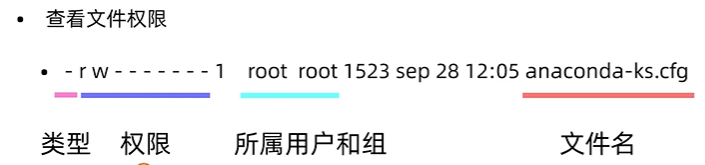
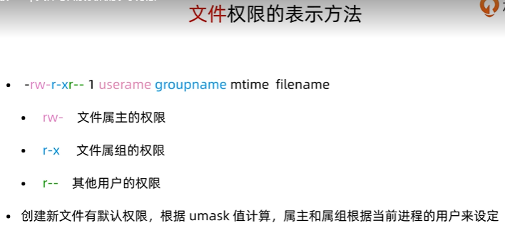
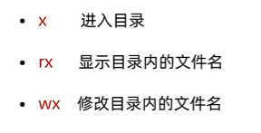

# Linux 概述

牢记：

- 一切皆文件
- 


Linux内核：https://www.kernel.rog/

内核版本分为三个部分：主版本号、次版本号、末版本号。其中，次版本号为奇数为开发版，偶数为稳定版。

所以在选择内核时，应该选择此版本号是偶数的。

发行版本：

- RedHat
- Fedora（组件比RedHat新，没进过测试，类似于预览版）
- CentOS
- Debian  （图形化）
- Ubuntu  


普通用户：$提示符

root用户：#提示符


终端：

- 图形终端
- 命令行终端
- 远程终端（SSH、VNC）


常见目录：

- `/` ：根目录
- `/root`：root用户的家目录
- `/home/username`：普通用户的家目录
- `/etc`：配置文件目录
- `/bin`：命令目录
- `/sbin`：管理命令目录
- `/usr/bin`、`/usr/sbin`：系统预装的其他命令

总结：带`bin`的都是命令目录。


内部命令和外部命令：

shell（命令解释器）自带的命令称为内部命令。其他是外部命令。在使用help查看帮助时，内部命令使用类似`help cd`的形式，外部命令需要使用`ls --help`的形式。

可以使用type命令来区分是内部命令还是外部命令。

```shell
[root@bogon ~]# type cd
cd 是 shell 内嵌
[root@bogon ~]# type ls
ls 是 `ls --color=auto' 的别名
[root@bogon ~]# ls --help
```


帮助命令：

- man，例如：`man ls`，退出man帮助，按下【Q】键。

- help，例如：`help cd` 用于内部命令， `ls --help`用于外部命令。

- info，比help跟详细，作为help的补充，全英文版。例如：`info ls`，同样按下【Q】退出。

  


一切皆文件：

- 查看文件
- 目录文件的创建与删除
- 通配符
- 文件操作
- 文本内容查看


Shell中的通配符的使用：

在Shell中输入命令时，可以使用通配符。

- `*`：匹配任意字符串
- `?`：匹配一个字符
- `[xyz]`：匹配xyz中的任意一个字符
- `[a-z]`：匹配一个范围
- `[!xyz]`或`[^xyz]`：不匹配

例如，查看文件或目录名以file开头的，并且后面只有一个字符的对象：

```
ls file?
```


文本查看命令：

- `cat`：文本内容显示到终端

- `head`：查看文件开头

- `tail`：查看文件结尾
- `wc`：统计文件内容信息


文件和目录打包命令：

- tar


vim四种模式：

- 正常模式
- 插入模式
- 命令模式
- 可视模式


用户管理相关的配置文件：

- /etc/passwd ：用户的配置文件，可以直接编辑该文件来创建和删除用户。
- /etc/shadow：保存用户和用户密码相关信息的文件。
- /etc/group：用户组相关的配置文件。


查看文件权限：






umask的值为：022,666-022=644，即为默认创建用户的权限。

目录权限的表示方法：

