# Linux服务器的IP配置和XShell连接

本文主要介绍如何使用XShell工具连接虚拟机中的Linux服务器，以及虚拟机中的Linux服务器的固定IP的配置。

## 环境

虚拟机：VMware Workstation

Linux：CentOS 7 或 RedHat

工具：XShell（或 PuTTY）

## 配置过程

#### 第一步：配置虚拟机的网络适配器

在启用虚拟机之前，需要先配置虚拟机的网络配置器，有两种方式打开“虚拟机设置”对话框，可以右击虚拟机名称，选择“设置”，也可以直接在打开的虚拟机窗口点击“网络适配器”选项。两种方式如下图所示：

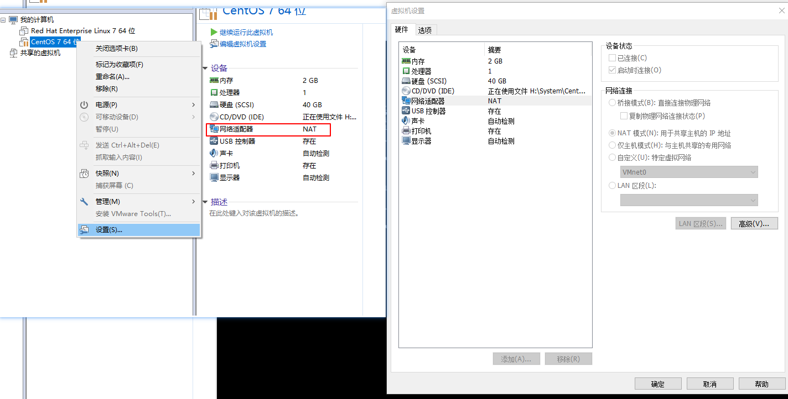

关于该项的详细说明，请参阅[配置虚拟网络适配器设置](https://docs.vmware.com/cn/VMware-Workstation-Pro/14.0/com.vmware.ws.using.doc/GUID-C82DCB68-2EFA-460A-A765-37225883337D.html)。

其中比较重要的是“网络连接”的配置，关于该项的详细说明，请参阅[配置网络连接](https://docs.vmware.com/cn/VMware-Workstation-Pro/14.0/com.vmware.ws.using.doc/GUID-6F7ECBA6-A29A-40AE-B565-3D0F2E74FEA4.html)，如果只是用于简单的功能，不是将虚拟机用作Web服务器向主机以外的网络中的系统发送Web页面，那么推荐使用NAT模式；否则推荐使用桥接模式，一般来说，如果是将虚拟机作为Web服务器向主机以外的系统发送响应，一般使用桥接模式，相当于一台全新的独立的服务器。

本文选择的是桥接模式，关于该模式的说明，请参阅[配置桥接模式网络连接](https://docs.vmware.com/cn/VMware-Workstation-Pro/14.0/com.vmware.ws.using.doc/GUID-3D56BF46-5980-48F1-AB47-CC0CDB814D8B.html)

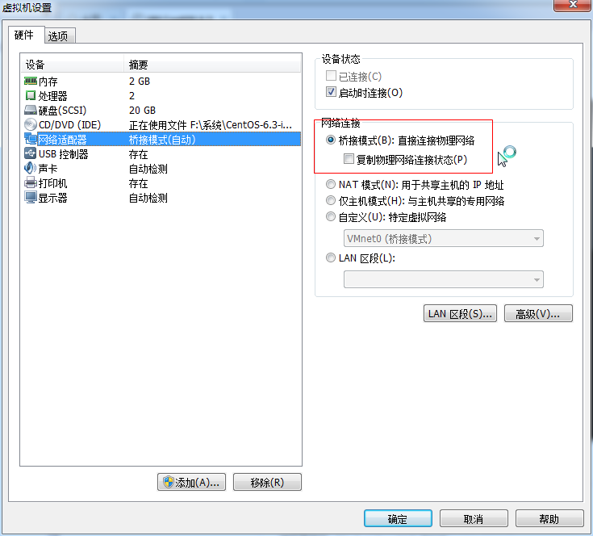

#### 第二步：查看Linux服务器的IP和连接状态

在虚拟机中开启Linux系统，输入用户名和密码进行登录。输入`ifconfig`指令，看有没有eth0（网卡）的信息，如果没有显示相关信息，可以输入`ifup eth0`指令启动网卡。随后再次输入`ifconfig`指令，查看IP信息。

为了验证虚拟机是否可以通过主机进行IP访问，可以在主机中使用`ping`命令：

同样的，也可以在虚拟机中的Linux系统中使用ping命令，验证是否可以访问其他网络，例如：`ping baidu.com`

如果在主机中使用`ping`命令无法连接虚拟机，有可能虚拟机的网络设置存在问题，可以参考以下进行解决：

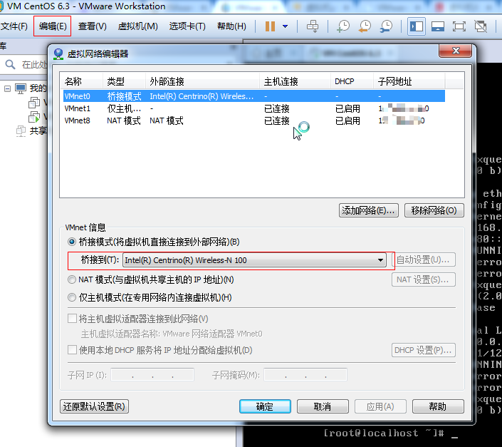

修改完成之后，重新ping IP看是否可以访问，如果不能访问，可能需要重启虚拟机，重启虚拟机不能解决就尝试重启主机。

提示：为了方便快速解决问题，最好在启动虚拟机之前，就设置好上述的“虚拟网络编辑器”。

#### 第三步：使用XShell工具进行连接

运行XShell工具，设置要连接的Linux服务器相关信息，包括用户名、密码（一般为了安全不会录入）、IP等，有些项使用默认值即可：

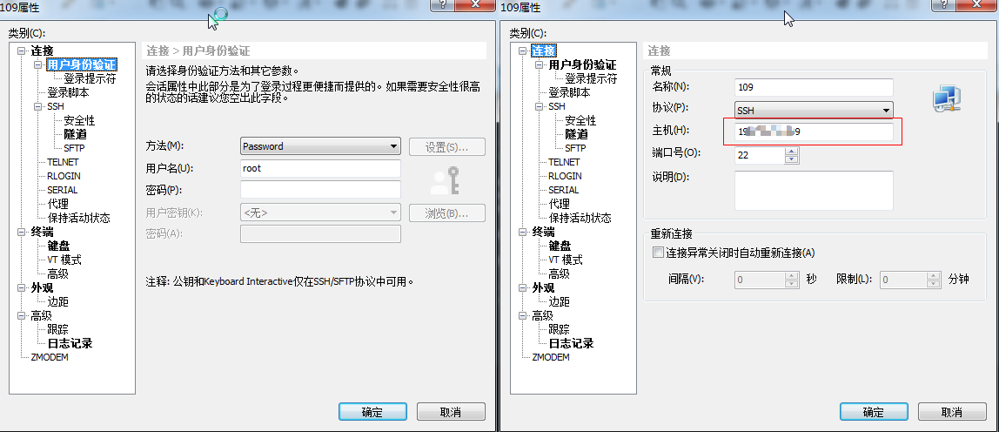

#### 使用setup为Linux设置固定IP

如果虚拟机的网络设置选择的是桥接模式，那么每次重启主机或虚拟机后，Linux的IP都会发生变化，它是动态的，为了使XShell能够连接到Linux不变的IP，需要使用setup工具为Linux指定固定的IP。

setup工具是CentOS（或RedHat）自带的工具，其他Linux版本不能使用。

1、在Linux系统中，输入`setup`指令，弹出如图所示，选择网络设置，回车：

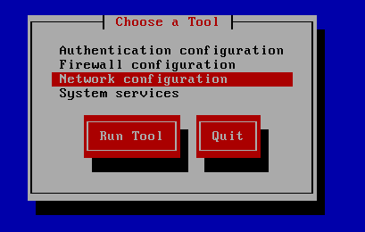

2、选择Device Configuration项，回车：

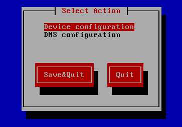

3、选择eth0，回车：

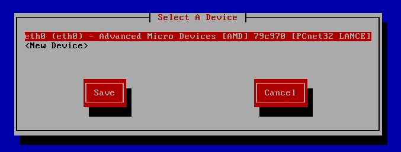

4、将Use DHCP换成空格，表示非自动选择IP，使用手工输入：

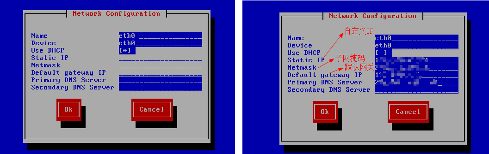

下图是Xshell工具远程Linux执行setup需要进行网络配置的示例图：

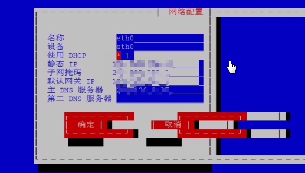

关于右侧需要输入的内容，可以参考主机中的网络信息，双击下图中的“网络连接”，单击“详细信息”可以看到DNS服务器IP、默认网关、子网掩码等信息。

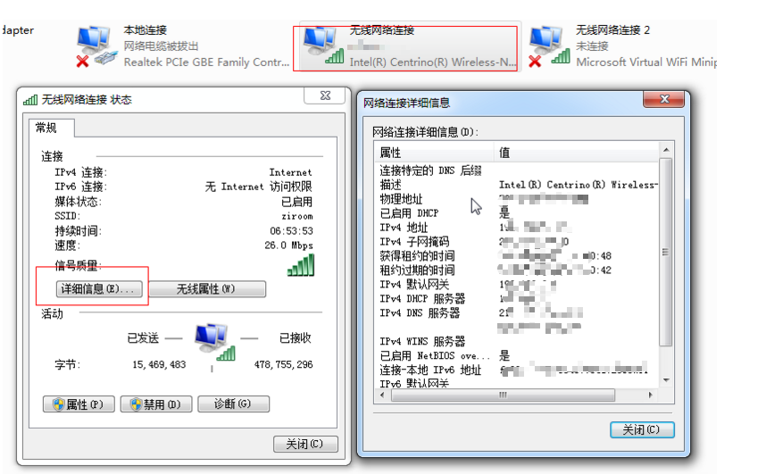

5、配置好后点击“OK”，一步步保存，直到退出。

6、在Linux系统中执行`service network restart`指令，用于重启网络服务。

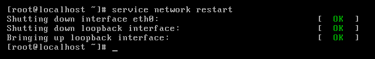

7、再次输入`ifconfig`指令，如果不能看到，输入`ifup eth0`指令，然后再次输入`ifconfig`指令，查看网络信息（参阅上述第二步）。

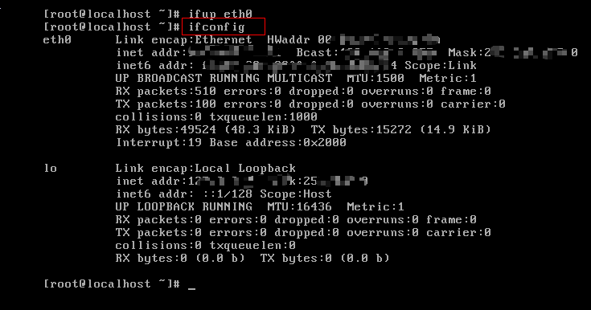

8、使用ping命令进行验证，如果成功，使用XShell进行连接即可（参阅上述中的第二步、第三步）。

