# 虚拟机中的CentOS网络配置


## 环境

虚拟机：VMware Workstation 15 Pro

Linux：CentOS 7 或 RedHat

主机：Win10 专业版

### 重要说明

建议在安装虚拟机的时候，就要配置网络连接，可以选择以太网NAT，保证能够连接到外部网络，这样在配置的过程中，缺少相关组件时，可以在线下载安装。

虽然本文介绍了在2种不同的模式（桥接模式和NAT模式）下，如何进行CentOS的网络配置，但是在实际应用中，桥接模式并不好用，存在无法访问外网和内网的情况（但是通过主机是可以访问虚拟机的IP的）。也许和个人电脑所在的环境有关。

NAT模式不存在这种情况，可以设置静态IP，通过NAT模式访问任何网络。因此目前推荐使用NAT模式进行配置。


## 第一步：配置虚拟机的“虚拟网络编辑器”

点击：“编辑” => “虚拟网络编辑器...”，打开虚拟网络编辑器对话框。

在配置之前，如果已经进行过设置，为了保证正确性，建议先执行“还原默认设置”操作，然后再按照该文档进行配置。

### 方式一：NAT模式（推荐）

1、选择列表中的第三行”NAT模式“，默认已经填写了”子网IP“和”子网掩码“，这里不需要进行任何更改。如果之前已经重新设置过”子网IP“和”子网掩码“，可以直接点击”还原默认设置“按钮，将会对该对话框中所有已经设置的信息进行重置。重置后，“子网IP”和“子网掩码”将会被设置为默认值，使用默认值即可，不需要进行任何更改。

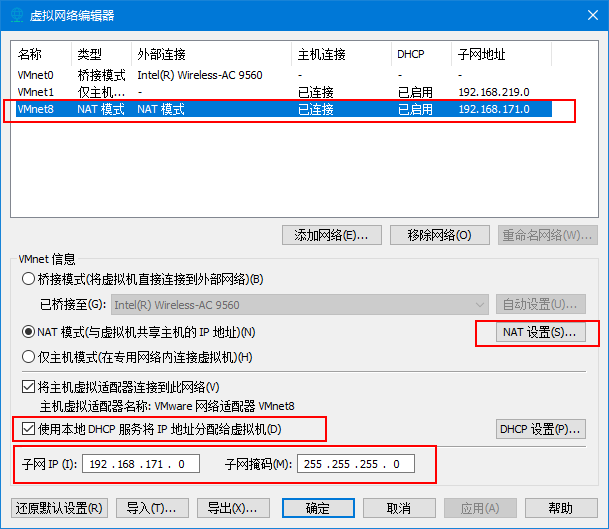

此处，子网IP为：192.168.171.0，子网掩码为：255.255.255.0。这两个信息很重要，将会被配置到CentOS中。

2、点击“NAT设置...“按钮，配置网关IP。网关IP要和子网IP是同一个网段，一般可以配置为.1或者.2，如下：

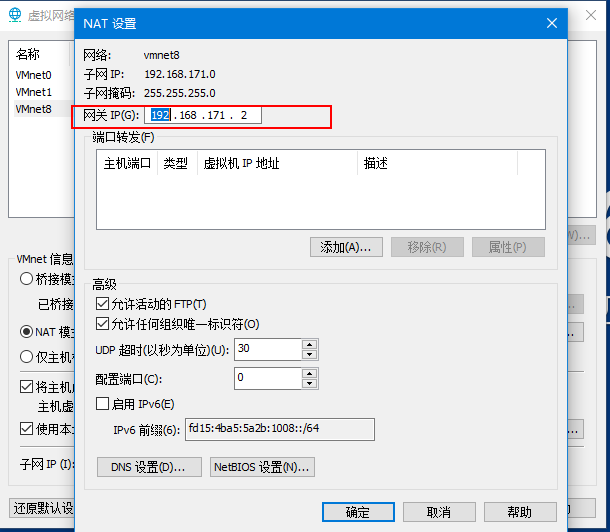

配置的网关IP，最终也会被配置到CentOS中。注意：这里最好以默认的网关IP为主，不要去改它。

3、点击“DHCP设置...”按钮，查看IP地址的范围，最终CentOS设置的IP地址，必须在这个范围内。

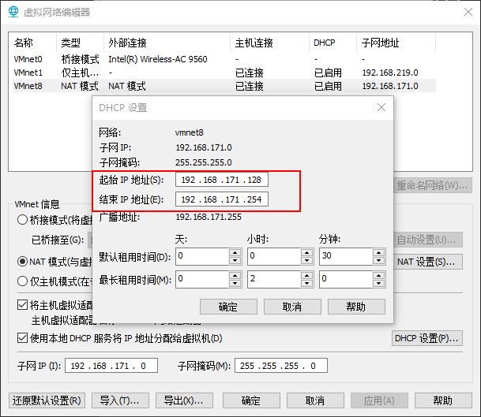

上图中指示IP的范围在128~254之间，这里将最终设置的IP地址指定为：192.168.171.222。

有了上述三个过程，得到以下信息：

- 子网IP：192.168.171.0
- **子网掩码：255.255.255.0**
- **网关IP：192.168.171.2**
- **目标IP：192.168.171.222**

其中，后三个是将要被配置到CenOS中，必须用到的。

### 方式二：桥接模式

选择列表中的第一行“桥接模式”，在下拉框中选择当前正在使用的网络固件。

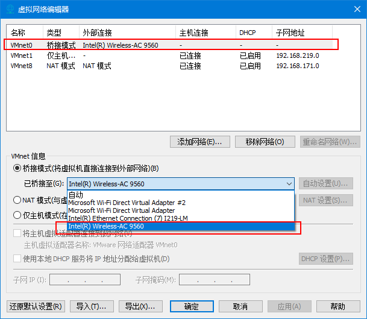


## 第二步：为虚拟机选择网络适配器

打开“虚拟机设置”窗口，选择“网络适配器”。

### 方式一：选择NAT模式（推荐）

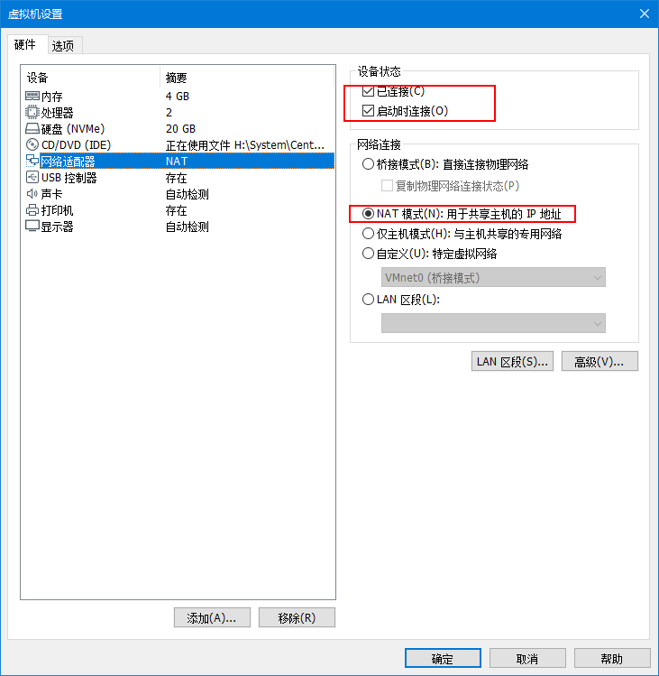

### 方式二：选择桥接模式

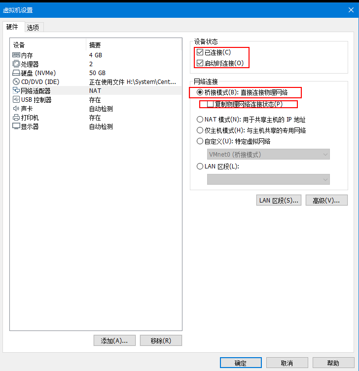


## 第三步：开启虚拟机，配置CentOS的网卡信息

### 一、检验Linux服务器的IP连接状态

在虚拟机中开启Linux系统，输入用户名和密码进行登录。输入`ifconfig`指令，看有没有eth0（网卡）的信息，如果没有显示相关信息，可以输入`ifup eth0`指令启动网卡。随后再次输入`ifconfig`指令，查看IP信息。

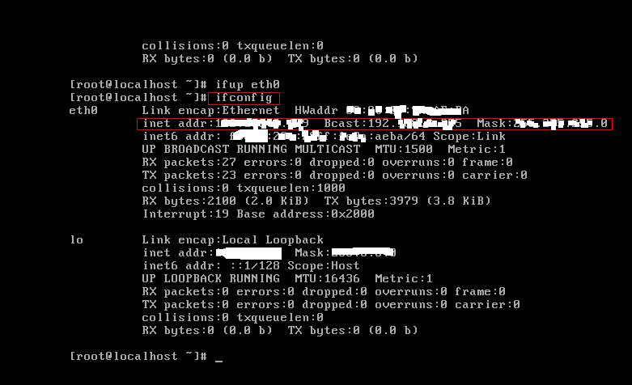

为了验证虚拟机是否可以通过主机进行IP访问，可以在主机中使用`ping`命令：

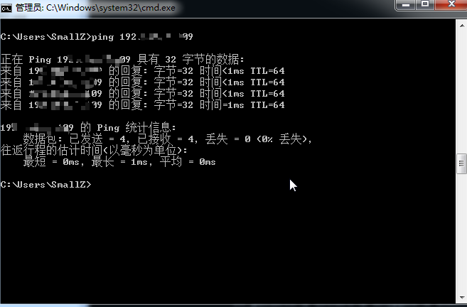

同样的，也可以在虚拟机中的Linux系统中使用ping命令，验证是否可以访问其他网络，例如：`ping baidu.com`

### 二、配置网卡信息

第1步：首先切换到/etc/sysconfig/network-scripts目录中（存放着网卡的配置文件）。

```shell
[root@localhost ~]# cd /etc/sysconfig/network-scripts/
```

第2步：找到网卡设备，名字以ifcfg开头，这里的网卡设备文件是ifcfg-ens33。

```shell
[root@localhost network-scripts]# ls
ifcfg-ens33  ifdown-ppp       ifup-ib      ifup-Team
ifcfg-lo     ifdown-routes    ifup-ippp    ifup-TeamPort
...
```

第3步：使用vim对该文件进行编辑。

```shell
vim ifcfg-ens33 
```

该文件中，需要设置的选项有：

| 选项      | 说明         | 设定值                                                       |
| --------- | ------------ | ------------------------------------------------------------ |
| TYPE      | 设备类型     | TYPE=Ethernet                                                |
| BOOTPROTO | 地址分配模式 | BOOTPROTO=static（默认为dchp，表示自动获取；static表示手动设置） |
| NAME      | 网卡名称     | 不需要更改，保持原有值即可                                   |
| ONBOOT    | 是否启动     | ONBOOT=yes，默认为no.                                        |
| IPADDR    | 目标IP地址   | 必须设定                                                     |
| NETMASK   | 子网掩码     | 必须设定                                                     |
| GATEWAY   | 网关地址     | 必须设定                                                     |
| DNS1      | DNS地址      | 必须设定，可以设置多个，分别为DNS2、DNS3..                   |

上述中，最重要的是IPADDR、NETMASK、GATEWAY、DNS1的值的设置。这些值与所选择的连接模式紧密相关，NAT模式和桥接模式对应的值各不相同。

#### NAT模式的网卡信息配置（推荐）

在”第一步：配置虚拟机的“虚拟网络编辑器”“中，已经得到了如下信息：

子网IP：192.168.171.0 （不重要）

子网掩码（NETMASK）：255.255.255.0

网关IP（GATEWAY）：192.168.171.2

目标IP（IPADDR）：192.168.171.222

还差DNS地址未得到。可以通过如下方式查看主机的网络对应的DNS地址：

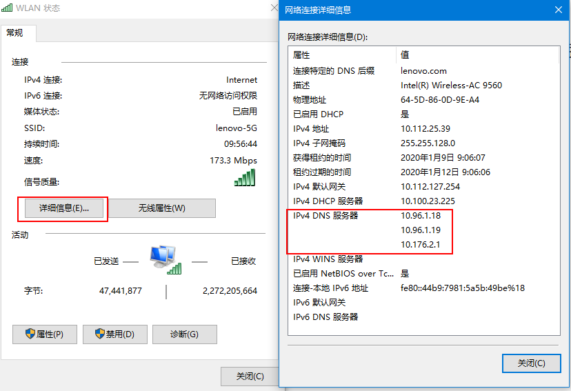

可以看到共有三个DNS，在ifcfg-ens33文件中，按照上述的规则进行设置：

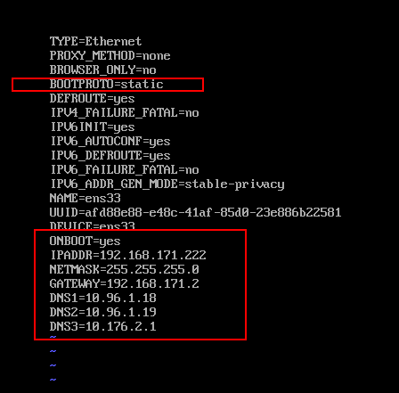

最后，使用vim保存并退出即可。

#### 桥接模式的网卡信息配置

NAT模式在“第一步：配置虚拟机的虚拟网络编辑器”中，就可以得到绝大多数的信息。但是桥接模式，需要借助主机信息，才能得到上述配置项。

“cmd” => 输入“ipconfig /all”命令，可以得到网络详细信息，找到主机的IP信息部分：

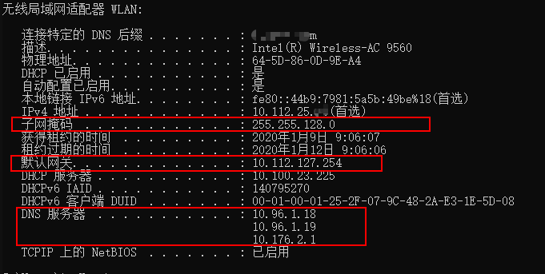

可以根据当前的IP设置目标IP，建议在设置前，先ping一下目标IP，防止要设置的IP被占用。

然后将上图中的值，使用vim在ifcfg-ens33文件中进行配置：

```shell
TYPE=Ethernet
BOOTPROTO=static
NAME=ens33
ONBOOT=yes
IPADDR=10.112.25.222 #目标IP
d=255.255.128.0 #子网掩码
GATEWAY=10.112.127.254 #默认网关
DNS1=10.96.1.18
DNS2=10.96.1.19
DNS3=10.176.2.1
PROXY_METHOD=none
BROWSER_ONLY=no
```

设置完成后，保存退出即可。

==特别说明：在实际使用中，发现采用桥接模式配置CentOS，会出现虚拟机无法访问外网甚至是局域网的情况，但是主机可以通过虚拟机的IP地址ping通。因此建议使用NAT模式进行网络连接。==

### 三、重启网络服务并测试网络是否联通

```shell
[root@localhost network-scripts]# systemctl restart network
[root@localhost network-scripts]# ping -c 4 192.168.171.222
PING 192.168.171.222 (192.168.171.222) 56(84) bytes of data.
64 bytes from 192.168.171.222: icmp_seq=1 ttl=64 time=0.778 ms
64 bytes from 192.168.171.222: icmp_seq=2 ttl=64 time=0.395 ms
64 bytes from 192.168.171.222: icmp_seq=3 ttl=64 time=1.96 ms
64 bytes from 192.168.171.222: icmp_seq=4 ttl=64 time=3.84 ms

--- 192.168.171.222 ping statistics ---

[root@localhost network-scripts]# ping -c 4  baidu.com
PING baidu.com (39.156.69.79) 56(84) bytes of data.
64 bytes from 39.156.69.79 (39.156.69.79): icmp_seq=1 ttl=128 time=6.87 ms
64 bytes from 39.156.69.79 (39.156.69.79): icmp_seq=2 ttl=128 time=7.97 ms
64 bytes from 39.156.69.79 (39.156.69.79): icmp_seq=3 ttl=128 time=6.75 ms
64 bytes from 39.156.69.79 (39.156.69.79): icmp_seq=4 ttl=128 time=6.85 ms

--- baidu.com ping statistics ---

```


## 解决电脑睡眠后，虚拟机无法连接的问题

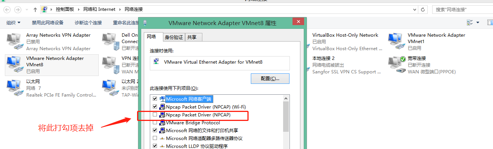

