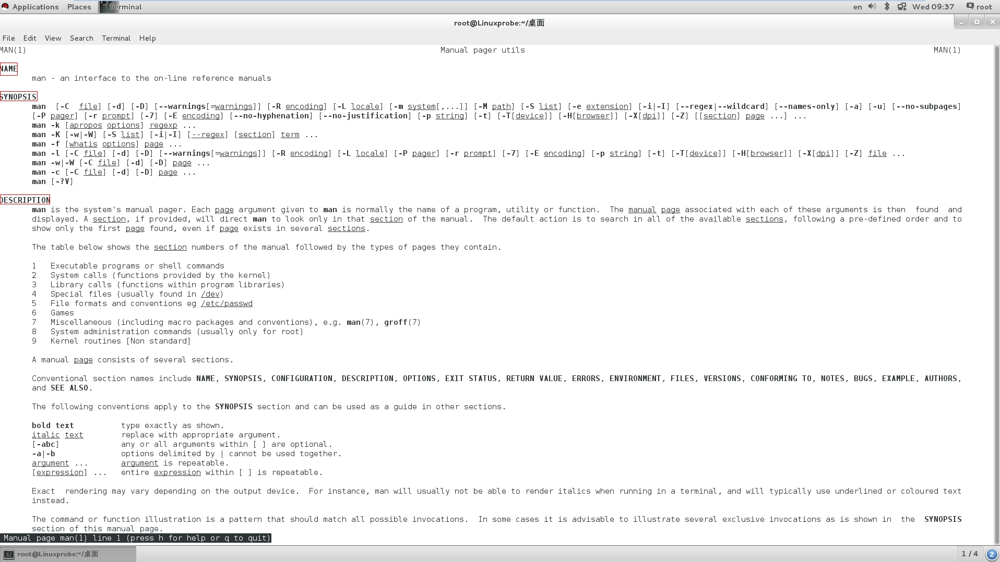

# Linux命令简介

常见的执行Linux命令的格式如下：

```
命令名称 [命令参数] [命令对象]
```

- 命令名称
- 命令参数：参数值会根据命令和需求情况的不同而发生改变。命令参数可以使用长格式（完整的选项名称，使用`--`作为前缀），也可以使用短格式（单个字母的缩写，使用`-`作为前缀）。
- 命令对象：一般是指要处理的文件、目录、用户等资源 。

在Linux系统中的命令参数有长短格式之分，**长格式和长格式之间不能合并，长格式和短格式之间也不能合并，但短格式和短格式之间是可以合并的**，合并后仅保留一个`-`（减号）即可。注意：有的命令可以允许参数不加减号（`-`），例如：`ps aux`。

以`man`命令为例，`man`命令是Linux下的帮助指令，通过`man`指令可以查看Linux中的指令帮助、配置文件帮助和编程帮助等信息。

打开终端，输入`man man`命令来查看`man`命令自身的帮助信息。

```shell
[root@Linuxprobe 桌面]# man man
```

将会输出如下内容：

上述图片显示的是`man`命令帮助信息所在的界面，该命令展示的信息内容会很长很多，在该界面中，可使用如下按键操作，快速方便的查询信息：

| 按键     | 作用                                 |
| -------- | ------------------------------------ |
| 空格键   | 向下翻一页                           |
| PageDown | 向下翻一页                           |
| PageUp   | 向上翻一页                           |
| home     | 直接前往首页                         |
| end      | 直接前往尾页                         |
| /        | 从上至下搜索某个关键词，如“`/linux`” |
| ?        | 从下至上搜索某个关键词，如“`?linux`” |
| n        | 定位到下一个搜索到的关键词           |
| N        | 定位到上一个搜索到的关键词           |
| q        | 退出帮助文档                         |

同时，我们也注意到，显示的文档信息有自己的目录结构和操作方法（图片中的红色框部分），如下表所示：

| 结构名称    | 代表意义                 |
| ----------- | ------------------------ |
| NAME        | 命令的名称               |
| SYNOPSIS    | 参数的大致使用方法       |
| DESCRIPTION | 介绍说明                 |
| EXAMPLES    | 演示（附带简单说明）     |
| OVERVIEW    | 概述                     |
| DEFAULTS    | 默认的功能               |
| OPTIONS     | 具体的可用选项（带介绍） |
| ENVIRONMENT | 环境变量                 |
| FILES       | 用到的文件               |
| SEE ALSO    | 相关的资料               |
| HISTORY     | 维护历史与联系方式       |

这些内容，不仅适用于`man`命令，而且也适用于其他所有的命令。大多数不知道命令的用法，是因为不知道如何使用命令参数，通过命令帮助文档，可以很快的知道该命令的具体内容和使用规则，希望这些内容对您有所帮助。


#### 补充部分

> 如果我们在系统终端中执行一个命令后想立即停止它，可以同时按下Ctrl + C组合键（生产环境中比较常用的一个快捷键），这样将立即终止该命令的进程。或者，如果有些命令在执行时不断地在屏幕上输出信息，影响到后续命令的输入，则可以在执行命令时在末尾添加上一个&符号，这样命令将进入系统后台来执行。


------


#### 参考资源

- 《Linux就应该这么学》
- [Linux man命令使用方法](https://www.linuxidc.com/Linux/2017-03/142407.htm)


本文后续会随着知识的积累不断补充和更新，内容如有错误，欢迎指正。

本文最后一次更新时间：2018-07-18

------

