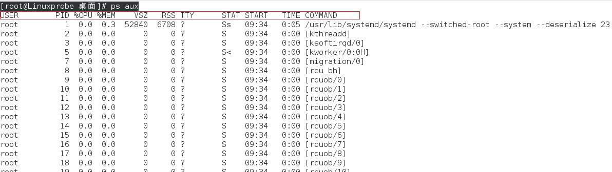

# Linux常用系统工作命令

- echo命令
- date命令
- reboot命令
- poweroff命令
- wget命令
- ps命令
- top命令
- pidof命令
- kill命令
- killall命令


------


#### echo命令

`echo`命令用于在终端输出字符串或变量提取后的值。

格式：

```
echo [字符串|$变量]
```

示例一，输出一个指定的字符串：

```shell
[root@Linuxprobe 桌面]# echo linuxstudy
linuxstudy
```

实例二，输出变量的值：

```shell
[root@Linuxprobe 桌面]# echo $SHELL
/bin/bash
```


------


#### date命令

`date`命令用于显示及**设置**系统的时间或日期 。

格式：

```
date [选项] ["+指定的格式"]
```

说明：

在`date`命令中输入以“`+`”开头的参数，就可以按照指定格式来输出系统的时间和日期。常用的参数如下：

| 参数 | 作用           |
| ---- | -------------- |
| `%t` | 制表符[Tab键]  |
| `%H` | 小时（00～23） |
| `%I` | 小时（00～12） |
| `%M` | 分钟（00～59） |
| `%S` | 秒（00～59）   |
| `%j` | 今年中的第几天 |

示例一，使用`date`输出当前系统时间：

```shell
[root@Linuxprobe 桌面]# date
Wed Jul 18 14:56:45 CST 2018
```

实例二，按照“年-月-日 小时:分钟:秒”的格式查看当前系统时间：

```shell
[root@Linuxprobe 桌面]# date "+%Y-%m-%d %H:%M:%S"
2018-07-18 14:59:17
```

示例三，使用`date`命令设置系统当前时间为2018年8月8日8点8分：

```shell
[root@Linuxprobe 桌面]# date -s "20180808 8:08:08"
Wed Aug  8 08:08:08 CST 2018
```

示例四，使用`date`命令的参数%j查看今天是当年中的第几天：

```shell
[root@Linuxprobe 桌面]# date "+%j"
199
```


------


#### reboot命令

`reboot`命令用于重启系统。

格式：

```
reboot
```

说明：

由于重启计算机这种操作会涉及硬件资源的管理权限，因此默认只能使用root管理员来重启。

示例，以root管理员身份重启计算机：

```shell
[root@Linuxprobe 桌面]# reboot
```


------


#### poweroff命令

`poweroff`命令用于关闭系统。

格式：

```
poweroff
```

说明：

该命令与`reboot`命令相同，都会涉及硬件资源的管理权限，因此默认只有root管理员才可以关闭电脑。

示例：

```shell
[root@Linuxprobe 桌面]# poweroff
```

同时使用`init 0`命令也可以实现关闭系统操作，但是不建议这么使用。


------


#### wget命令

`wget`命令用于在终端中下载网络文件。

格式：

```
wget [参数] 下载地址
```

说明：

`wget`命令常用于网络相关的操作，它提供了许多的参数，常用的参数如下：

| 参数 | 作用                                 |
| ---- | ------------------------------------ |
| `-b` | 后台下载模式                         |
| `-P` | 下载到指定目录                       |
| `-t` | 最大尝试次数                         |
| `-c` | 断点续传                             |
| `-p` | 下载页面内所有资源，包括图片、视频等 |
| `-r` | 递归下载                             |

示例一，使用`wget`命令下载网络上的一张图片：

```shell
[root@Linuxprobe 桌面]# wget http://www.images.com/abc.jpg
```

【上述示例只是为了说明该命令的使用格式，实际上并不存在“http://www.images.com/abc.jpg”】

实例二，使用`wget`命令下载某个网站（例如www.baidu.com）内的所有页面数据以及文件，下载完成后自动保存到当前路径下某个目录（目录名www.baidu.com）：

```shell
[root@Linuxprobe 桌面]# wget -r -p https://baidu.com
```

【上述将会把下载的内容保存到当前路径下对应的网站名目录中】


------


#### ps命令

`ps`命令用于查看系统中的进程状态。

格式：

```
ps [参数]
```

说明：

`ps`命令常和管道符搭配使用，用来抓取与某个指定服务进程相对应的`PID`号码。该命令常用参数如下：

| 参数 | 作用                               |
| ---- | ---------------------------------- |
| `-a` | 显示所有进程（包括其他用户的进程） |
| `-u` | 用户以及其他详细信息               |
| `-x` | 显示没有控制终端的进程             |

> Linux系统中时刻运行着许多进程，如果能够合理地管理它们，则可以优化系统的性能。在Linux系统中，有5种常见的进程状态，分别为运行、中断、不可中断、僵死与停止，其各自含义如下所示。
>
> - R（运行）：进程正在运行或在运行队列中等待。
> - S（中断）：进程处于休眠中，当某个条件形成后或者接收到信号时，则脱离该   状态。
>
> - D（不可中断）：进程不响应系统异步信号，即便用kill命令也不能将其中断。
>
> - Z（僵死）：进程已经终止，但进程描述符依然存在, 直到父进程调用wait4()系统函数后将进程释放。
>
> - T（停止）：进程收到停止信号后停止运行。

示例，使用`ps`命令查看进程状态：

```shell
[root@Linuxprobe 桌面]# ps aux
```

`ps aux`采用短格式合并的形式，并且该命令允许不加`- `，执行上述命令将会输出如下结果：

上述结果中，红框部分分别代表的含义如下：

| 名称      | 说明                       |
| --------- | -------------------------- |
| `USER`    | 进程的所有者               |
| `PID`     | 进程ID号                   |
| `%CPU`    | 运算器占用率               |
| `%MEM`    | 内存占用率                 |
| `VSZ`     | 虚拟内存使用量(单位是KB)   |
| `RSS`     | 占用的固定内存量(单位是KB) |
| `TTY`     | 所在终端                   |
| `STAT`    | 进程状态                   |
| `START`   | 被启动的时间               |
| `TIME`    | 实际使用CPU的时间          |
| `COMMAND` | 命令名称与参数             |


------


#### top命令

`top`命令用于动态地监视进程活动与系统负载等信息。

格式：

```
top
```

说明：

`top`命令能够动态的查看系统运维状态，可以把它看作Linux中的“强化版的Windows任务管理器” 。

示例：

```shell
[root@Linuxprobe 桌面]# top
```

执行上述命令输出如下：

输出结果中的红框部分（共5行）为系统整体的统计信息，其代表的含义如下：

> - 第1行：系统时间、运行时间、登录终端数、系统负载（三个数值分别为1分钟、5分钟、15分钟内的平均值，数值越小意味着负载越低）。
> - 第2行：进程总数、运行中的进程数、睡眠中的进程数、停止的进程数、僵死的进程数。
>
> - 第3行：用户占用资源百分比、系统内核占用资源百分比、改变过优先级的进程资源百分比、空闲的资源百分比等。其中数据均为CPU数据并以百分比格式显示，例如“97.1 id”意味着有97.1%的CPU处理器资源处于空闲。
>
> - 第4行：物理内存总量、内存使用量、内存空闲量、作为内核缓存的内存量。
>
> - 第5行：虚拟内存总量、虚拟内存使用量、虚拟内存空闲量、已被提前加载的内存量。


------


####pidof命令

`pidof`命令用于查询某个指定服务进程的`PID`值。

格式：

```
pidof [参数] [服务名称]
```

说明：

每个进程的进程号码值（`PID`）是唯一的，因此可以通过`PID`来区分不同的进程。

示例，使用`pidof`命令查询本机上sshd服务程序的`PID`：

```shell
[root@Linuxprobe 桌面]# pidof sshd
1824
```


------


#### kill命令

`kill`命令用于终止某个指定`PID`的服务进程。

格式：

```
kill [参数] [进程PID]
```

说明：

kill命令可以强制性的终止`PID`所代表的进程。

示例：

```shell
[root@Linuxprobe 桌面]# kill 1824
```

【这种操作的效果等同于强制停止sshd服务】


------


#### killall命令

`killall`命令用于终止某个指定名称的服务所对应的全部进程。

格式：

```
killall [参数] [服务名称]
```

说明：

复杂软件的服务程序会有多个进程协同为用户提供服务，如果逐个去结束这些进程会比较麻烦，此时可以使用`killall`命令来批量结束某个服务程序带有的全部进程。

示例，使用`killall`命令结束httpd服务程序全部进程：

```shell
[root@Linuxprobe 桌面]# killall httpd
```


------


#### 参考资源

- 《Linux就应该这么学》


本文后续会随着知识的积累不断补充和更新，内容如有错误，欢迎指正。

本文最后一次更新时间：2018-07-18


------


