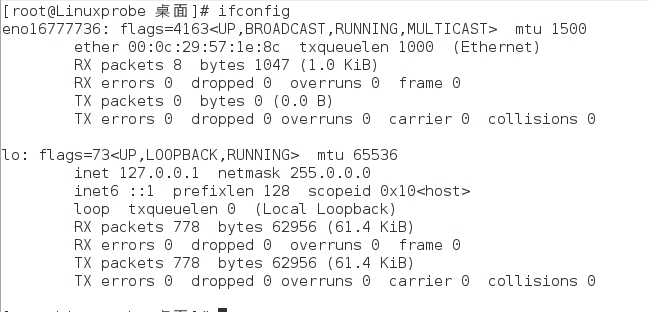
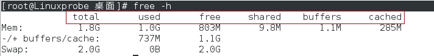

# Linux 系统状态检测命令

- ifconfig命令
- uname命令
- uptime命令
- free命令
- who命令
- last命令
- history命令
- sosreport命令


------


#### ifconfig命令

`ifconfig`命令用于获取网卡配置与网络状态等信息。

格式：

```
ifconfig [网络设备] [参数]
```

说明：

使用`ifconfig`命令来查看本机当前的网卡配置与网络状态等信息时，其实主要查看的就是网卡名称、`inet`参数后面的IP地址、`ether`参数后面的网卡物理地址（又称为MAC地址），以及RX、TX的接收数据包与发送数据包的个数及累计流量。

示例：

```shell
[root@Linuxprobe 桌面]# ifconfig
```

执行结果：




------


#### uname命令

`uname`命令用于查看系统内核与系统版本等信息。

格式：

```
uname [-a]
```

说明：

在使用`uname`命令时，一般会固定搭配上`-a`参数来完整地查看当前系统的内核名称、主机名、内核发行版本、节点名、系统时间、硬件名称、硬件平台、处理器类型以及操作系统名称等信息。 

示例一：

```shell
[root@Linuxprobe 桌面]# uname -a
```

示例一执行结果：

```
Linux Linuxprobe.com 3.10.0-123.el7.x86_64 #1 SMP Mon May 5 11:16:57 EDT 2014 x86_64 x86_64 x86_64 GNU/Linux
```

示例二，查看当前系统版本的详细信息：

【附加知识：如果要查看当前系统版本的详细信息，则需要查看`redhat-release`文件，可以执行如下命令】

```shell
[root@Linuxprobe 桌面]# cat /etc/redhat-release
Red Hat Enterprise Linux Server release 7.0 (Maipo)
```


------


#### uptime命令

`uptime`用于查看系统的负载信息 。

格式：

```
uptime
```

说明：

`uptime`命令可以显示当前系统时间、系统已运行时间、启用终端数量以及平均负载值等信息。

平均负载值指的是系统在最近1分钟、5分钟、15分钟内的压力情况（下面加粗的信息部分）；负载值越低越好，尽量不要长期超过1，在生产环境中不要超过5。 

示例：

```shell
[root@Linuxprobe 桌面]# uptime
 16:10:53 up 44 min,  2 users,  load average: 0.04, 0.10, 0.13
```


------


#### free命令

`free`用于显示当前系统中内存的使用量信息。

格式：

```
free [-h]
```

说明：

在使用`free`命令时，可以结合使用`-h`参数以更人性化的方式输出当前内存的实时使用量信息。 

示例，使用`free`命令输出当前计算机的内存使用情况：

```shell
[root@Linuxprobe 桌面]# free -h
```

执行结果：



上述结果中，红框部分代表的含义如下：

| 名称    | 含义             |
| ------- | ---------------- |
| total   | 内存总量         |
| used    | 已用量           |
| free    | 可用量           |
| shared  | 进程共享的内存量 |
| buffers | 磁盘缓存的内存量 |
| cached  | 缓存的内存量     |


------


#### who命令

`who`用于查看当前登入主机的用户终端信息。

格式：

```
who [参数]
```

说明：

使用`who`命令可以快速显示出所有正在登录本机的用户的名称以及他们正在开启的终端信息。

示例，显示登录的用户名信息：

```shell
[root@Linuxprobe 桌面]# who
root     :0           2018-07-30 15:30 (:0)
root     pts/0        2018-07-30 15:45 (:0)
```


------


#### last命令

`last`命令用于查看所有系统的登录记录。

格式：

```
last [参数]
```

示例，使用`last`命令查看本机的登录记录 ：

```shell
[root@Linuxprobe 桌面]# last
root     pts/0        :0               Mon Jul 30 15:45   still logged in   
root     :0           :0               Mon Jul 30 15:30   still logged in   
(unknown :0           :0               Mon Jul 30 15:26 - 15:30  (00:03)    
reboot   system boot  3.10.0-123.el7.x Mon Jul 30 23:26 - 16:27  (-6:-58) 
```

注意：千万不要单纯以该命令的输出信息而判断系统有无被恶意入侵，因为这些信息都是以日志文件的形式保存在系统中，因此黑客可以很容易地对内容进行篡改。


------


#### history命令

`history`命令用于显示历史执行过的命令。

格式：

```
history [-c]
```

说明：

执行`history`命令能显示出当前用户在本地计算机中执行过的最近1000条命令记录。如果觉得1000不够用，还可以自定义`/etc/profile`文件中的`HISTSIZE`变量值。

使用`history`命令时，如果加上`-c`参数，则会清空所有的命令历史记录。

可以在使用`history`命令输出历史命令记录后，使用“`!编码数字`”的方式来重复执行某一次的命令。

示例一，输出最近使用过的命令记录：

```shell
[root@Linuxprobe 桌面]# history
    1  man man
    2  ./vmware-install.pl 
    3  man man
    4  man man
    5  echo linuxstudy
    6  echo $SHELL
    7  date
```

示例二，使用“`!编码数字`”的方式来重复执行某一次的命令 （历史命令记录中的编码数字为`40`的是`ifconfig`命令）：

```shell
[root@Linuxprobe 桌面]# !40
ifconfig
eno16777736: flags=4163<UP,BROADCAST,RUNNING,MULTICAST>  mtu 1500
        ether 00:0c:29:57:1e:8c  txqueuelen 1000  (Ethernet)
        RX packets 31  bytes 4407 (4.3 KiB)
        RX errors 0  dropped 0  overruns 0  frame 0
```

补充说明：

历史命令会被保存到用户家目录中的`.bash_history`文件中，可以用`cat`命令查看其文件内容。

```shell
[root@Linuxprobe 桌面]# cat ~/.bash_history
man man
./vmware-install.pl 
man man
man man
echo linuxstudy
echo $SHELL
date
```

示例三，清空当前用户在本机上执行的Linux命令历史记录信息 ：

```shell
[root@Linuxprobe 桌面]# history -c
```


------


#### sosreport命令

`sosreport`命令用于收集系统配置及架构信息并输出诊断文档。

格式：

```
sosreport
```

说明：

可以使用`sosreport`命令来简单收集系统的运行状态和服务配置信息。

示例：

```shell
[root@Linuxprobe 桌面]# sosreport
```

执行结果：


在上面的输出信息中，加粗的部分是收集好的资料压缩文件以及校验码，将其发送给技术支持人员即可。


------


#### 参考资源

- 《Linux就应该这么学》


本文后续会随着知识的积累不断补充和更新，内容如有错误，欢迎指正。

最后一次更新时间：2018-07-30


------

