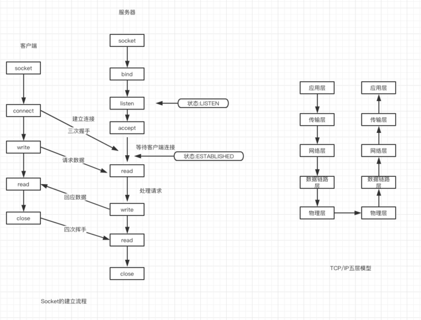

# OSI-TCP-UDP-HTTP-Socket-RPC

OSI就是网络模型，全称： Open System Interconnect，意思是开放网络互联，是由国际标准化组织(ISO)和国际电报电话咨询委员会(CCITT)共同出版的，他是一种网络互联模型，也是一种规范。

## 七层网络模型

网络模型分为七层，也就是当用户发起请求到服务器接收，会历经七道工序，或者说用户利用互联网发送消息给另一个用户，也会历经七道工序。

这七层可以分为如下：

| 层级   | 名称       | 说明                                     |
| ------ | ---------- | ---------------------------------------- |
| 第七层 | 应用层     | 与用户行为交互                           |
| 第六层 | 表示层     | 定义数据格式以及数据加密                 |
| 第五层 | 会话层     | 创建、管理以及销毁会话                   |
| 第四层 | 传输层     | 创建、管理请求端到响应端（端到端）的连接 |
| 第三层 | 网络层     | 请求端的IP地址                           |
| 第二层 | 数据链路层 | 提供介质访问与链路管理                   |
| 第一层 | 物理层     | 传输介质，物理媒介                       |

以上七层每层可以与上下相邻层进行通信。

### 应用层（7层）

应用层是面向用户的，在这一层最常见的协议有：HTTP,HTTPS,FTP,SMTP,POP3等。

为了让用户和计算机交互，在计算机里会有很多软件，比如eclipse，idea，qq，nginx等，这些都是应用软件，用户可以通过这些应用软件和计算机交互，交互的过程其实就是接口的调用，Nginx在本层，为七层负载均衡。

举例：我要寄一封信给远在天边的老外LiLei，我会打开快递软件下单，这个时候我是**用户**，快递软件就是**应用服务**，是建立在计算机上的，提供给用户交互的一种服务或称之为手段。

### 表示层（6层）

表示层提供数据格式编码以及加密功能，确保**请求端**的数据能被**响应端的应用层**识别。

举例：我写中文给LiLei，他看不懂，这个时候我就会使用翻译软件把中文翻译成英文，随后信中涉及到一些比较隐私的信息我会加密一下，这个时候翻译软件和加密器就充当了**表示层**的作用，他用于显示用户能够识别的内容。

### 会话层（5层）

会话可以理解为session，请求发送到接受响应的这个过程之间存在会话，会话层就充当了这一过程的管理者，从创建会话到维护会话最后销毁会话。

举例：我每次写信给LiLei都会记录在一个小本本上，寄信时间日期，收信时间日期，这本小本本上存有每次通信记录，这个小本本就相当于是一个会话的管理者。

又或者说，我们平时在打电话，首先需要拨打电话，这是**建立会话**，对方接听电话，此时正在通话（**维持并管理会话**），通话结束后**会话销毁**，那么这也是一次会话的生命周期。

### 传输层（4层）

传输层建立端到端的连接，他提供了数据传输服务，在传输层通信会涉及到端口号，本层常见的协议为TCP、UDP，LVS就是在传输层，也就是四层负载均衡。

举例：我和LiLei通信过程中会借助快递公司，快递公司会分配快递员取件和寄件，那么这个快递员则充当**传输层**的作用。

### 网络层/IP层（3层）

网络层也能称之为IP层。

网络通信的时候必须要有本机IP和对方的IP，请求端和响应端都会有自己的IP的，IP就相当于你家地址门牌号，在网络上云服务器有固定的公网IP，普通计算机也有，只不过是动态IP，运营商每天会分配不同的IP给你的计算机。

IP是互联网的基础根本。能提供IP分配的设备则为路由器或交换机。

举例：对于拥有固定IP的云服务来说，他们都是由腾讯云、阿里云等这样的供应商提供的，他们为云服务器提供固定ip；电信、移动、联调等运营商为你的计算机动态分配ip，每天都不同；则这些供应商和运营商都是网络层。同理，快递员由物流公司分配和管理，那么物流公司就是**网络层**咯。

### 数据链路层（2层）

数据链路层会提供计算机MAC地址，通信的时候会携带，为了确保请求投递正确，所以他会验证检测MAC地址，以确保请求响应的可靠性。

举例：快递员在投递派送的时候，他（或客服）会预先提前打电话给你，确认你家地址对不对、有没有人、货到付款有没有准备好钱等等，这个时候快递员（或客服）就充当了**数据链路层**的职责。

### 物理层（1层）

端到端请求响应过程中的媒介，物理介质，比如网线、中继器等等设备，都是你在端到端交互过程中不可缺少的基础设备。
举例：快递员在投递的过程中，你写的信会历经一些交通运输工具，比如首先通过飞机运输到国外，在海关统一拿到信以后会通过汽车运输到LiLei所在城市的物流集散地，最后快递员通过三轮电频车寄到LiLei家里，这个时候，飞机、汽车、三轮电瓶车都是**物理层**的媒介。

## TCP/IP 网络模型

 

TCP/IP（Transmission Control Protocol/Internet Protocol）即传输控制协议/网间协议，是一个工业标准的协议集，它是为广域网（WANs）设计的。

UDP（User Data Protocol，用户数据报协议）是与TCP相对应的协议。它是属于TCP/IP协议族中的一种。

TCP/IP协议族包括运输层、网络层、链路层。

TCP/IP协议包括了：

- TCP协议
- UDP协议
- 其他属于TCP/IP协议族中的协议

# TCP、UDP、HTTP、Socket、RPC

TCP、UDP 在传输层（传输层比较常见的协议是TCP,UDP, SCTP等）

HTTP 位于应用层，需要有传输层来承载HTTP协议。由于UDP不可靠, SCTP有自己特殊的运用场景, 所以一般情况下HTTP是由TCP协议承载的(可以使用wireshark抓包然后查看各层协议)。

TCP如何建立起来，牵扯到三次握手，四次挥手机制。

### socket

Socket是应用层与TCP/IP协议族通信的中间软件抽象层，它是一组接口。在设计模式中，Socket其实就是一个门面模式，它把复杂的TCP/IP协议族隐藏在Socket接口后面，对用户来说，一组简单的接口就是全部，让Socket去组织数据，以符合指定的协议。

所以说, 要想能够对客户端http请求进行回应的话, 就首先需要建立起来TCP连接, 也就是socket. 即Socket是连接HTTP与TCP之间的介质。

