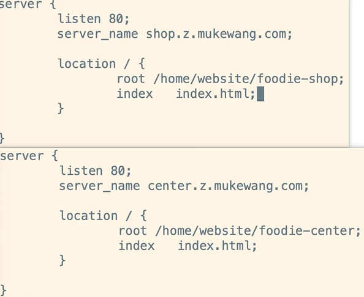

# Nginx 动静分离

静态数据：所有静态资源文件，包括css/js/html/images/audios/videos/...

动态数据：得到的响应可能会和上一次不同

## 动静分离的特点

- 分布式
- 前后端解耦
- 静态归nginx
- 接口服务化

## 动静分离的方式

- CDN
- Nginx

## 动静分离的问题

- 跨域 （Spring Boot / Nginx / jsonp ）
- 分布式会话 （Redis）

## Nginx 动静分离实现方式

- 一级域名用于访问网站的前端静态资源，比如：wenyi.com。这些静态资源可以直接放在nginx中。也可以在nginx中指定upstream多台上游服务器，实现静态资源的nginx集群。

  

- 当需要访问后端接口或服务时，使用二级域名，比如api.wenyi.com。通过upstream指定的多台代理服务器，实现应用程序的nginx集群。

  

### 动态部分的配置

一般会将配置放在一个独立的配置文件中，然后在nginx.conf中进行include。

tomcats.conf：

上述图片中的`location ~ `,建议换成`location / `

### 静态部分的配置

将配置放在一个独立的配置文件中，然后在nginx.conf中进行include。

frontend.conf：

