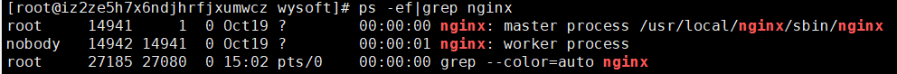

# Nginx 安装与j基本配置


## 安装

### 查看是否安装过 Nginx

```shell
# ps -ef|grep nginx
```



### 查看 Nginx 的版本

```
[root@iz2ze5h7x6ndjhrfjxumwcz wysoft]# /usr/local/nginx/sbin/nginx -v
nginx version: nginx/1.18.0
```


### Nginx 源码下载链接

http://nginx.org/download/

下载完成之后，将软件安装包上传到Linux系统上，如放在如下目录：/home/software

```
[root@VM-0-5-centos ~]# mkdir -p /home/software
[root@VM-0-5-centos ~]# cd /home/software
```


### 安装依赖环境

- 安装 gcc 环境

  ```
  yum install gcc-c++
  ```

- 安装 PCRE 库，用于解析正则表达式

  ```
  yum install -y pcre pcre-devel
  ```

- 安装 zlib 压缩和解压缩依赖

  ```
  yum install -y zlib zlib-devel
  ```

- 安装 SSL 安全的加密的套接字协议层，用于HTTP安全传输，也就是https

  ```
  yum install -y openssl openssl-devel
  ```


上述四项是必须要安装的，也可以直接使用下述命令一步安装编译工具及依赖项：

```
yum -y install gcc pcre-devel zlib-devel openssl-devel libxml2-devel libxslt-devel gd-devel GeoIP-devel jemalloc-devel libatomic_ops-devel perl-devel perl-ExtUtils-Embed
```

 

### 解压安装包

解压，需要注意，解压后得到的是源码，源码需要编译后才能安装。

```
tar -zxvf nginx-1.16.1.tar.gz
```


### 创建 nginx 临时目录

编译之前，先创建nginx临时目录，如果不创建，在启动nginx的过程中会报错。

```
mkdir /var/temp/nginx -p
```


### 编译 Nginx 所有功能模块

第一步：进入到nginx源码目录，执行下述命令，创建出makefile文件，makeifile文件是进行编译和安装的必要文件。

```
./configure 
...
```

第二步：make编译

```
make
```

第三步：安装

```
make install
```

以上三步可以使用下述命令一次性完成，注意prefix选项用于指定Nginx安装的位置：

```
[root@VM-0-5-centos source]# cd nginx-1.17.8/
[root@VM-0-5-centos source]# ./configure \
--prefix=/usr/local/nginx \
--with-threads \
--with-file-aio \
--with-http_ssl_module \
--with-http_v2_module \
--with-http_realip_module \
--with-http_addition_module \
--with-http_xslt_module=dynamic \
--with-http_image_filter_module=dynamic \
--with-http_geoip_module=dynamic \
--with-http_sub_module \
--with-http_dav_module \
--with-http_flv_module \
--with-http_mp4_module \
--with-http_gunzip_module \
--with-http_gzip_static_module \
--with-http_auth_request_module \
--with-http_random_index_module \
--with-http_secure_link_module \
--with-http_degradation_module \
--with-http_slice_module \
--with-http_stub_status_module \
--with-stream=dynamic \
--with-stream_ssl_module \
--with-stream_realip_module \
--with-stream_geoip_module=dynamic \
--with-stream_ssl_preread_module \
--with-compat \
--with-pcre-jit \
--pid-path=/var/run/nginx/nginx.pid \
--lock-path=/var/lock/nginx.lock \
--error-log-path=/var/log/nginx/error.log \
--http-log-path=/var/log/nginx/access.log \
--http-client-body-temp-path=/var/temp/nginx/client \
--http-proxy-temp-path=/var/temp/nginx/proxy \
--http-fastcgi-temp-path=/var/temp/nginx/fastcgi \
--http-uwsgi-temp-path=/var/temp/nginx/uwsgi \
--http-scgi-temp-path=/var/temp/nginx/scgi \
make && make install
```

编译后，默认安装目录为 /usr/local/nginx。

上述配置命令说明：

| 命令                          | 解释                                 |
| ----------------------------- | ------------------------------------ |
| –prefix                       | 指定nginx安装目录                    |
| –pid-path                     | 指向nginx的pid                       |
| –lock-path                    | 锁定安装文件，防止被恶意篡改或误操作 |
| –error-log                    | 错误日志                             |
| –http-log-path                | http日志                             |
| –with-http_gzip_static_module | 启用gzip模块，在线实时压缩输出数据流 |
| –http-client-body-temp-path   | 设定客户端请求的临时目录             |
| –http-proxy-temp-path         | 设定http代理临时目录                 |
| –http-fastcgi-temp-path       | 设定fastcgi临时目录                  |
| –http-uwsgi-temp-path         | 设定uwsgi临时目录                    |
| –http-scgi-temp-path          | 设定scgi临时目录                     |


### 进入 sbin 目录启动nginx

启动 nginx：

```
./nginx
```

停止 nginx：

```
./nginx -s stop
```

重新加载：

```
./nginx -s reload
```

到目前为止，nginx已经安装完成。


### 注意事项

- 如果在云服务器安装，需要开启默认的nginx端口：80
- 如果在虚拟机/本地win/mac 安装，都需要关闭防火墙


## 后续配置（可选）

下述内容，在别人不知情的情况下，会增加复杂性。

### 把Nginx执行文件的路径添加到环境变量中（建议）

Nginx编译成功后，为了便于操作维护，建议把Nginx执行文件的路径添加到环境变量中，可以通过如下命令完成：

```shell
cat >/etc/profile.d/nginx.sh << EOF
PATH=$PATH:/usr/local/nginx/sbin
EOF
source /etc/profile
```

### 将Nginx的conf目录软连接到/etc目录下（建议）

在CentOS操作系统中，配置文件通常放在/etc目录下，建议将Nginx的conf目录软连接到/etc目录下。

```
[root@VM-0-5-centos ~]# ln -s /usr/local/nginx/conf /etc/nginx
```

一旦建立的软连接，就可以直接使用nginx命令。

### 注册系统服务（可选）

CentOS系统环境中使用systemd进行系统和服务管理，可以按需守护进程，并通过systemctl命令进行systemd的监测和控制。为了方便Nginx应用进程的维护和管理，此处把Nginx注册成系统服务，由systemd进行服务管理，命令如下。

```
cat >/usr/lib/systemd/system/nginx.service <<EOF
[Unit]
Description=The Nginx Http and reverse proxy server
After=network.target remote-fs.target nss-lookup.target

[Service]
Type=forking
PIDFile=/run/nginx.pid
ExecStartPre=/usr/bin/rm -f /run/nginx.pid
ExecStartPre=/usr/local/nginx/sbin/nginx -t -q
ExecStart=/usr/local/nginx/sbin/nginx -g "pid /run/nginx.pid;"
ExecReload=/usr/local/nginx/sbin/nginx -t -q
ExecReload=/usr/local/nginx/sbin/nginx -s reload -g "pid /run/nginx.pid;"
ExecStop=/bin/kill -s HUP
KillSignal=SIGQUIT
TimeoutStopSec=5
KillMode=process
PrivateTmp=true

[Install]
WantedBy=multi-user.target
EOF
```

上述命令的说明如下（注意：执行的时候，需要将其中的中文注释去除掉）：

```
cat >/usr/lib/systemd/system/nginx.service <<EOF
[Unit]			                                          # 记录service文件的通用信息
Description=The Nginx Http and reverse proxy server       # Nginx服务描述信息
After=network.target remote-fs.target nss-lookup.target   # Nginx服务启动依赖，在指定服务之后启动

[Service]	                                       # 记录service文件的service信息
Type=forking                                       # 标准UNIX Daemon使用的启动方式
PIDFile=/run/nginx.pid                             # Nginx服务的pid文件位置
ExecStartPre=/usr/bin/rm -f /run/nginx.pid         # Nginx服务启动前删除旧的pid文件
ExecStartPre=/usr/local/nginx/sbin/nginx -t -q     # Nginx服务启动前执行配置文件检测
ExecStart=/usr/local/nginx/sbin/nginx -g "pid /run/nginx.pid;"     # 启动Nginx服务
ExecReload=/usr/local/nginx/sbin/nginx -t -q       # nginx服务重启前执行配置文件检测
ExecReload=/usr/local/nginx/sbin/nginx -s reload -g "pid /run/nginx.pid;"    #重启Nginx服务
ExecStop=/bin/kill -s HUP $MAINPID                 # 关闭Nginx服务
KillSignal=SIGQUIT
TimeoutStopSec=5
KillMode=process
PrivateTmp=true

[Install]                                          # 记录service文件的安装信息
WantedBy=multi-user.target                         # 多用户环境下启动
EOF
```


### 将 Nginx 服务注册为系统启动后自动启动

该命令及下述命名均是将nginx添加到了环境变量后，执行的命令。

```
[root@VM-0-5-centos ~]# systemctl enable nginx
```

### 启动 Nginx 服务命令

```
systemctl start nginx
```

### 重启 Nginx 服务命令

```
systemctl reload nginx
```

### 停止 Nginx 服务命令

```
systemctl stop nginx
```

### 查看 Nginx 服务运行状态命令

```
systemctl status nginx
```


## 其他命令

### 检测配置文件是否正确

检测默认配置文件：

```shell
[root@iz2zea1fyfqa1d360k1vjaz nginx]# nginx -t
nginx: the configuration file /sundot/nginx/conf/nginx.conf syntax is ok
nginx: configuration file /sundot/nginx/conf/nginx.conf test is successful
```

检测指定的配置文件：

```shell
[root@iz2zea1fyfqa1d360k1vjaz nginx]# nginx -tc /sundot/nginx/nginx.conf
```

### Nginx 启动

按照指定的配置文件启动Nginx：

```
[root@iz2zea1fyfqa1d360k1vjaz ~]# /sundot/nginx/sbin/nginx -c /sundot/nginx/nginx.conf
```

### 查看开放的端口号

```shell
[root@localhost ~]#   firewall-cmd --list-all
```

### 设置开放的端口号

```
firewall-cmd --add-service=http --permanent
firewall-cmd --add-port=80/tcp --permanent
```

### 重启防火墙

```
firewall-cmd --reload
```

