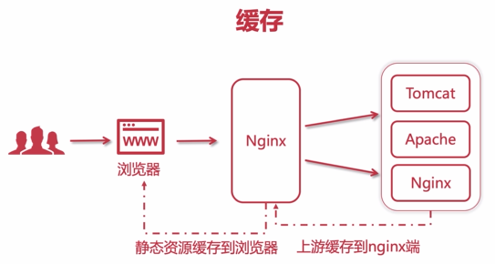
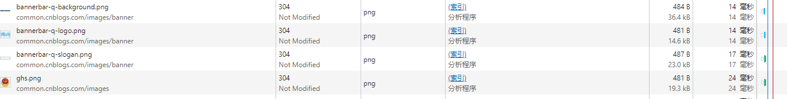
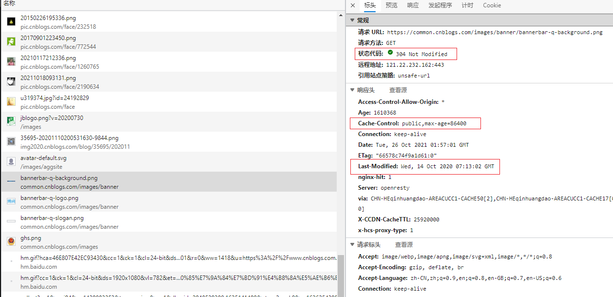
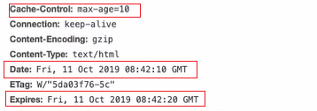

# Nginx 缓存

Nginx的缓存主要包括两部分：

- Nginx的配置实现静态资源缓存到浏览器中，减少用户带宽损耗。
- Nginx的反向代理缓存，上游服务器的静态资源缓存到Nginx中，减少内网带宽损耗。




## 设置浏览器缓存

本身浏览器自带了缓存，Nginx主要用于配置静态资源过期的时间的。

直接访问某个图片，刷新页面时，在开发者工具中，可以看到缓存的静态资源：



单击某个缓存资源，查看其响应头，信息如下：




### expires 指令

expires指令的用法有以下几种。

### expires [time]

设置缓存过期的时间。

```nginx
...
location /static {
	alias /home/imooc;
	expires 10s;
}
...
```

当配置了上述内容后，在浏览器的响应头上，可以看到Cache-Control信息：



此时，当文件发生了更改，重新访问页面时，会发现header中的Last-Modified内容发生了变化。

一般来说设置*.css/*.js设置个3到7d，图片文件设置个14d或30d就行了。

### expires @[time]

绝对过期时间，指定在某个时间点到期。

```nginx
...
location /static {
	alias /home/imooc;
	expires @22h30m;
}
...
```

以天为单位，在每天的22点30分静态资源缓存过期。

### expires -[time]

用于设置缓存提前到期时间。

```nginx
...
location /static {
	alias /home/imooc;
	expires -1h;
}
...
```

表示距离现在的前一个小时过期。

### expires epoch

设置缓存时间为1970年，相当于一直处于过期状态。

如果只使用epoch，访问浏览器还是304状态码，这是因为cache-control的优先级更高一些，所以还需要设置如下内容：

```nginx
...
location /static {
	alias /home/imooc;
	expires epoch;
	# 设置Cache-Control之后，每次访问都是200
	add_header Cache-Control no-store;
}
...
```


### expires off

默认值，关闭缓存。Nginx关闭缓存，不代表浏览器不缓存静态资源，浏览器有自己的缓存机制。

### expires max

采用最大过期时间。

```nginx
...
location /static {
	alias /home/imooc;
	#expires epoch;
	#expires off;
	expires max;
}
...
```


## Nginx 的反向代理缓存（上游缓存到 Nginx 端）

```nginx
upstream myApp{
    ...
}
...
proxy_cache_path /usr/local/nginx/myapp_cache keys_zone=myAppCache:5m max_size=5g inactive=8h use_temp_path=off;
...
server {
    listen 80;
    server_name www.smallz.com;
    
    # 设置完proxy_cache_path后，还需要进行开启，名称为上述设置的keys_zone
    proxy_cache myAppCache;
    # 针对200和304状态码的缓存设置过期时间
    proxy_cache_valid 200 304 8h;
    
    ...
    
}
```

- proxy_cache_path：设置缓存保存的目录，如果目录不存在会自动创建目录；
- keys_zone：缓存可以使用的共享内存空间大小，空间名为myAppCache，大小为5M；
- max_size：设置缓存目录的整体大小，指定为5个G；
- inactive：超过此时间，则缓存自动清理。缓存超过8小时之后，会清理缓存目录中的文件。
- use_temp_path：关闭临时目录。

