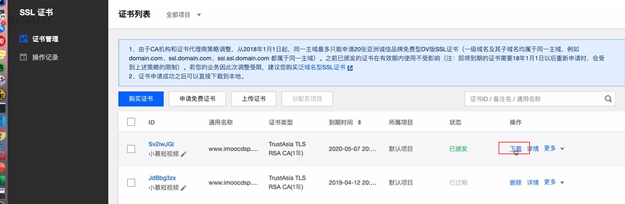

# Nginx 配置SSL证书提供HTTPS访问


### 第一步：申请SSL证书

推荐去腾讯云或阿里云进行SSL证书申请，这些云服务器供应商都提供了相关的帮助文档，可以很方便进行操作。

这里以腾讯云为例。在[我的证书 - SSL 证书 - 控制台 (tencent.com)](https://console.cloud.tencent.com/ssl)页面，可以点击“申请免费证书“，注意：免费证书只能够用于主域名，不能用于其下的子域名。

按照页面指引，申请完之后，就可以下载证书。



下载下来的证书包含了各个服务器相关的证书文件。这里以nginx为例。

将下载下来的证书包解压，并将Nginx目录中的两个文件（crt文件和key文件），上传到Nginx的配置文件目录（/nginx/conf/）中，和nginx.conf文件在同一个目录中。


## 配置 SSL支持

打开nginx.conf文件，添加如下信息：

```nginx 
server {
        #SSL 访问端口号为 443
        listen 443 ssl; 
        #填写绑定证书的域名
        server_name cloud.tencent.com; 
        #证书文件名称
        ssl_certificate 1_cloud.tencent.com_bundle.crt; 
        #私钥文件名称
        ssl_certificate_key 2_cloud.tencent.com.key; 
        ssl_session_timeout 5m;
        #请按照以下协议配置
        ssl_protocols TLSv1 TLSv1.1 TLSv1.2; 
        #请按照以下套件配置，配置加密套件，写法遵循 openssl 标准。
        ssl_ciphers ECDHE-RSA-AES128-GCM-SHA256:HIGH:!aNULL:!MD5:!RC4:!DHE; 
        ssl_prefer_server_ciphers on;
        location / {
           #网站主页路径。此路径仅供参考，具体请您按照实际目录操作。
            root html; 
            index  index.html index.htm;
        }
    }
```

上述内容来自于腾讯云文档：[SSL 证书 Nginx 服务器 SSL 证书安装部署 - 证书安装 - 文档中心 - 腾讯云(tencent.com)](https://cloud.tencent.com/document/product/400/35244)

注意：需要将ssl_certificate和ssl_certificate_key指定为自己的证书文件所在的相对路径，这里已经将证书文件放在了nginx.conf同级目录，因此可以直接使用文件名即可。