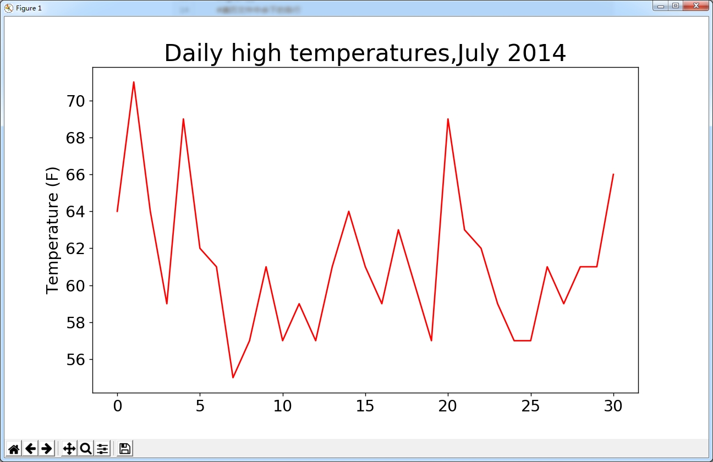
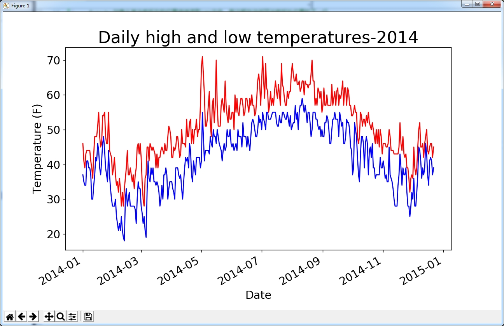
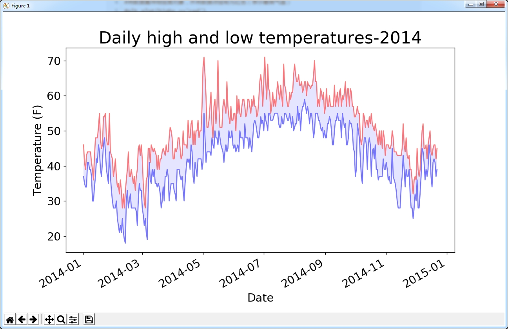

# 使用Python处理CSV格式数据并绘制气温图表

主要使用以下几个模块：

- csv：用于读取和解析CSV格式的数据文件
- matplotlib：用于绘制图表
- datetime：用于日期格式化


## CSV文件格式

要在文本文件中存储数据，最简单的方式是将数据作为一系列以逗号分隔的值（CSV）写入文件。这样的文件称为CSV文件。例如，下面是一行CSV格式的数据：

```
2014-7-1,64,56,50,53,51,48,96,83,58,30.19,30.00,29.79,10,10,10,7,4,,0.00,7,,337
```

注意：并不是所有CSV格式的文件都是以逗号分隔每一列的值，此处是以逗号作为分隔符来说明具体应用的。

#### 分析CSV文件头

在Python的标准库中包含了csv模块，用于分析CSV文件中的数据行。

```python
import csv

filename='sitka_weather_07-2014.csv'
#打开文件并将结果文件对象存储在f中
with open(filename) as f:
    #创建一个与该文件相关联的reader对象
    reader=csv.reader(f)
    #只调用一次next()方法，得到文件的第一行，将第一行数据中的每一个元素存储在列表中
    header_row=next(reader)
    print(header_row)
```

执行上述代码结果如下：

```
['AKDT', 'Max TemperatureF', 'Mean TemperatureF', 'Min TemperatureF', 'Max Dew P
ointF', 'MeanDew PointF', 'Min DewpointF', 'Max Humidity', ' Mean Humidity', ' M
in Humidity', ' Max Sea Level PressureIn', ' Mean Sea Level PressureIn', ' Min S
ea Level PressureIn', ' Max VisibilityMiles', ' Mean VisibilityMiles', ' Min Vis
ibilityMiles', ' Max Wind SpeedMPH', ' Mean Wind SpeedMPH', ' Max Gust SpeedMPH'
, 'PrecipitationIn', ' CloudCover', ' Events', ' WindDirDegrees']
```

为了更好的说明文件第一行信息，可以使用`enumerate()`方法结合循环详细显示每一列的具体索引和值，如下：

```python
import csv

filename='sitka_weather_07-2014.csv'
#打开文件并将结果文件对象存储在f中
with open(filename) as f:
    #创建一个与该文件相关联的reader对象
    reader=csv.reader(f)
    #只调用一次next()方法，得到文件的第一行，将第一行数据中的每一个元素存储在列表中
    header_row=next(reader)
    #print(header_row)
    #打印文件头及其位置
    for index,column_header in enumerate(header_row):
        print(index,column_header)
```

执行结果：

```
0 AKDT
1 Max TemperatureF
2 Mean TemperatureF
。。。
21  Events
22  WindDirDegrees
```

#### 提取并读取数据

```python
import csv

filename='sitka_weather_07-2014.csv'
#打开文件并将结果文件对象存储在f中
with open(filename) as f:
    #创建一个与该文件相关联的reader对象
    reader=csv.reader(f)
    #只调用一次next()方法，得到文件的第一行，将第一行数据中的每一个元素存储在列表中
    header_row=next(reader)
    
    #从文件中获取第二列的值（该列表示最高气温）
    highs=[]
    #遍历文件中余下的各行
    #reader对象从其当前所在的位置继续读取CSV文件，每次都自动返回当前所处位置的下一行
    for row in reader:
        #转换为数字，便于后面让matplotlib能够读取它们
        high=int(row[1])
        highs.append(high)

    print(highs)
```

上述代码中需要注意的是，由于文件第一行表示文件头信息（可以理解为列名），所以数据从第二行开始提取。在调用一次`next()`方法后，阅读器对象自动将当前所处位置由第一行的开头，指向第二行的开头，在调用`for row in reader`语句后，阅读器对象将会依次往下读取CSV文件，并且每次都自动返回当前所处位置的下一行。上述代码还行结果如下：

```
[64, 71, 64, 59, 69, 62, 61, 55, 57, 61, 57, 59, 57, 61, 64, 61, 59, 63, 60, 57,
 69, 63, 62, 59, 57, 57, 61, 59, 61, 61, 66]
```

#### 绘制气温图表

这里使用`matplotlib`创建一个显示每日最高气温的简单图形，具体见代码中的注释说明。

```python
import csv
from matplotlib import pyplot as plt

filename='sitka_weather_07-2014.csv'
#打开文件并将结果文件对象存储在f中
with open(filename) as f:
    #创建一个与该文件相关联的reader对象
    reader=csv.reader(f)
    #只调用一次next()方法，得到文件的第一行，将第一行数据中的每一个元素存储在列表中
    header_row=next(reader)
    
    #从文件中获取第二列的值（该列表示最高气温）
    highs=[]
    #遍历文件中余下的各行
    #reader对象从其当前所在的位置继续读取CSV文件，每次都自动返回当前所处位置的下一行
    for row in reader:
        #转换为数字，便于后面让matplotlib能够读取它们
        high=int(row[1])
        highs.append(high)

#根据数据绘制图形
fig=plt.figure(dpi=128,figsize=(10,6))
#将数据集传给绘图对象，并将数据点绘制为红色（表示最高气温）
plt.plot(highs,c='red')

#设置图形的格式
#这是字体大小和标签
plt.title("Daily high temperatures,July 2014",fontsize=24)
#X轴暂不设置标签
plt.xlabel('',fontsize=16)
#设置标签
plt.ylabel("Temperature (F)",fontsize=16)

plt.tick_params(axis='both',which='major',labelsize=16)

plt.show()
```

执行后显示效果如下图所示：




#### 使用datetime模块

上述代码中并没有给X轴设置日期标签，这里使用模块`datetime`对CSV文件中的日期格式数据进行处理。文件中的日期数据是一个字符串，我们需要将其转换为日期类型的数据。可以使用`datetime`模块中的`strptime()`方法：

```python
>>> from datetime import datetime
>>> first_date=datetime.strptime('2018-10-16','%Y-%m-%d')
>>> print(first_date)
2018-10-16 00:00:00
>>> 
```

方法`strptime()`可接受各种实参，并根据它们来决定如何解读日期。

| 实参 | 含义                             |
| ---- | -------------------------------- |
| %A   | 星期的名称，如Monday             |
| %B   | 月份名，如January                |
| %m   | 用数字表示的月份（ 01~12）       |
| %d   | 用数字表示月份中的一天（ 01~31） |
| %Y   | 四位的年份，如2018               |
| %y   | 两位的年份，如15                 |
| %H   | 24小时制的小时数（ 00~23）       |
| %I   | 12小时制的小时数（ 01~12）       |
| %p   | am或pm                           |
| %M   | 分钟数（ 00~59）                 |
| %S   | 秒数（ 00~61）                   |

#### 在图表中添加日期和最低气温数据

之前的代码并没有为`X`轴添加日期标签，此处结合`datetime`模块添加日期的显示，代码如下，具体说明见代码注释：

```python
import csv
from datetime import datetime
from matplotlib import pyplot as plt

filename='sitka_weather_2014.csv'
#打开文件并将结果文件对象存储在f中
with open(filename) as f:
    #创建一个与该文件相关联的reader对象
    reader=csv.reader(f)
    #只调用一次next()方法，得到文件的第一行，将第一行数据中的每一个元素存储在列表中
    header_row=next(reader)
    
    #用于分别保存日期和最高气温，最低气温的列表
    dates,highs,lows=[],[],[]
    #遍历文件中余下的各行
    #reader对象从其当前所在的位置继续读取CSV文件，每次都自动返回当前所处位置的下一行
    for row in reader:
        try:
            #将包含日期信息的数据（row[0])转换为datetime对象
            current_date=datetime.strptime(row[0],"%Y-%m-%d")
            #转换为数字，便于后面让matplotlib能够读取它们
            high=int(row[1])
            #读取最低气温
            low=int(row[3])
        except ValueError:
            print(current_date,'missing data')
        else:
            dates.append(current_date)
            highs.append(high)
            lows.append(low)

#根据数据绘制图形
fig=plt.figure(dpi=128,figsize=(10,6))
#将数据集传给绘图对象，并将数据点绘制为红色（表示最高气温）
#plt.plot(highs,c='red')
#同时将日期和最高气温列表传递给plot()
plt.plot(dates,highs,c='red')
#使用蓝色绘制最低气温
plt.plot(dates,lows,c='blue')

#设置图形的格式
#这是字体大小和标签
plt.title("Daily high and low temperatures-2014",fontsize=24)
plt.xlabel('Date',fontsize=16)
#为了避免X轴日期显示彼此重叠，调用该方法，将以倾斜的形式显示日期标签
fig.autofmt_xdate()

#设置标签
plt.ylabel("Temperature (F)",fontsize=16)
plt.tick_params(axis='both',which='major',labelsize=16)

plt.show()

```

执行后显示效果如下图：




#### 给图表区域着色

使用方法`fill_between()`为图表进行范围区域着色，该方法接受一个`x`值系列和两个`y`值系列，并填充两个`y`值系列之间的空间。

对上述中的代码进行改写：

```python
...
#根据数据绘制图形
fig=plt.figure(dpi=128,figsize=(10,6))
#将数据集传给绘图对象，并将数据点绘制为红色（表示最高气温）
#plt.plot(highs,c='red')
#同时将日期和最高气温列表传递给plot(),alpha指定颜色的透明度
plt.plot(dates,highs,c='red',alpha=0.5)
#使用蓝色绘制最低气温
plt.plot(dates,lows,c='blue',alpha=0.5)
plt.fill_between(dates,highs,lows,facecolor='blue',alpha=0.1)
...
```

上述代码中，`plt.plot(dates,lows,c='blue',alpha=0.5)`的`alpha`参数用来指定颜色的透明度，Alpha值为`0`表示完全透明，`1`（默认设置）表示完全不透明。

`plt.fill_between(dates,highs,lows,facecolor='blue',alpha=0.1)`函数传递了一个`x`值系列：列表`dates`，还传递了两个`y`值系列： `highs`和`lows`。实参`facecolor`指定了填充区域的颜色，我们还将`alpha`设置成了较小的值`0.1`，让填充区域将两个数据系列连接起来的同时不分散观察者的注意力。

执行后显示效果如下图：




------


#### 参考资源

- 《Python编程：从入门到实践》

 

本文后续会随着知识的积累不断补充和更新，内容如有错误，欢迎指正。

最后一次更新时间：2018-10-17

------

