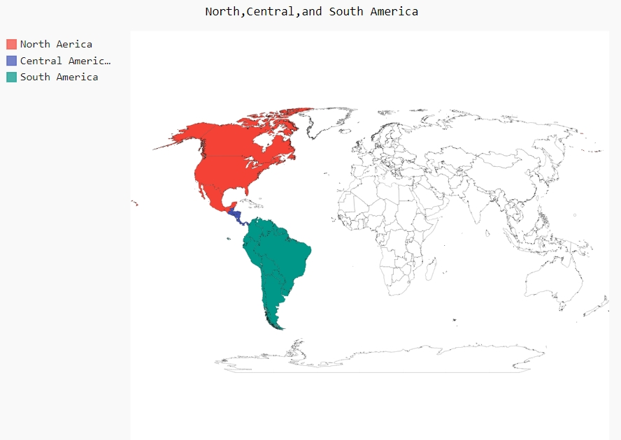
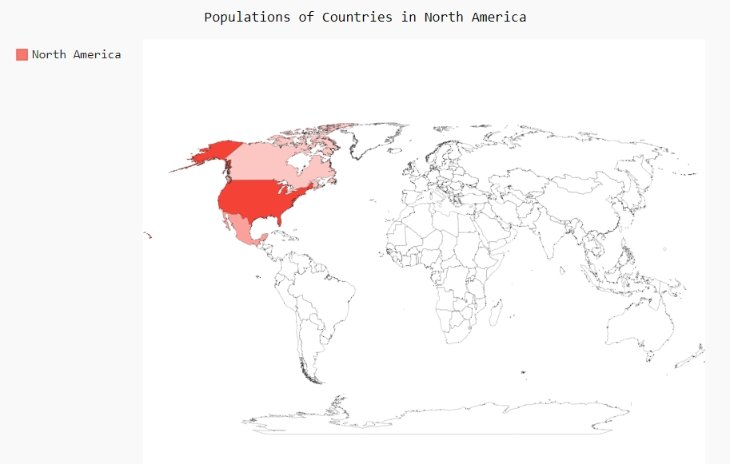
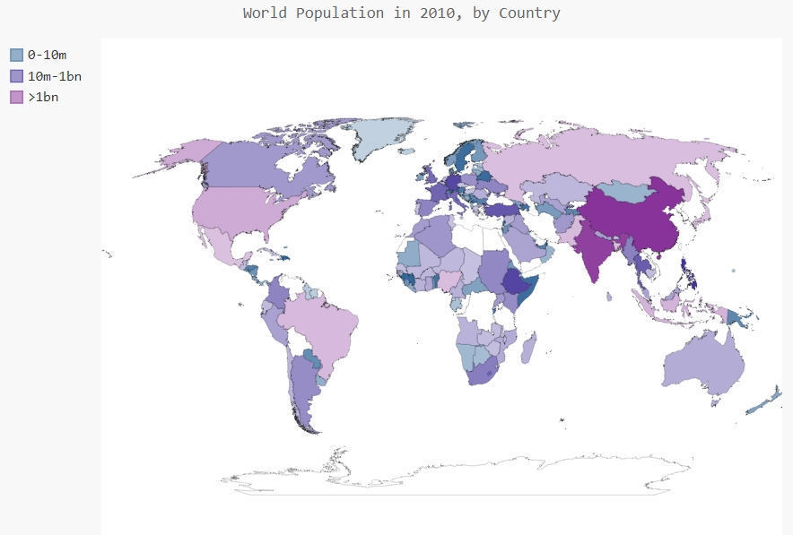

# 使用Python处理JSON格式数据并绘制人口地图

主要使用以下几个模块：

- json：用于解析JSON格式数据。
-  pygal_maps_world.i18n：位于pygal-maps-world包中，用来处理国别码相关的操作。


## 解析JSON格式数据

population_data.json文件的数据内容如下：

```json
[
  {
    "Country Name": "Arab World",
    "Country Code": "ARB",
    "Year": "1960",
    "Value": "96388069"
  },
  {
    "Country Name": "Arab World",
    "Country Code": "ARB",
    "Year": "1961",
    "Value": "98882541.4"
  },
  ....
]
```

其中每个元素都是一个包含四个键的字典：国家名、国别码、年份以及表示人口数量的值。

使用`json`模块，对上述数据进行解析，代码如下：

```python
import json

filename = 'population_data.json'
with open(filename) as f:
    # 将数据加载到一个列表中
    pop_data = json.load(f)
    # 打印每个国家2010年的人口数量
    for pop_dict in pop_data:
        # 遍历pop_data中的每个元素，每个元素都是一个字典，包含4个键值对
        if pop_dict['Year'] == '2010':
            country_name = pop_dict['Country Name']
            #将人口数量由字符串转换为数字值
            #由于在JSON文件中，含有小数部分，这里只需要保留整数，因此需要先转换为浮点数，再转换为整数，将自动丢弃小数部分
            population =int(float( pop_dict['Value']))
            print(country_name + ": " + str(population))
```

上述代码中需要注意在获取人口数量时，使用了`population =int(float( pop_dict['Value']))`，这是因为JSON文件中的人口含有小数点字符串，为了获取正确的整数值，需要使用`float()`函数先将字符串转换为浮点数，再使用`int()`函数由浮点数转换为整数，对于小数部分，该函数自动丢弃，只返回整数部分。


## 获取国别码

在绘制地图时，要求数据为特定的格式：用国别码表示国家，以及用数字表示人口数量。处理地理政治数据时，经常需要用到几个标准化国别码集。这里使用的国别码存储在包pygal-maps-world中，使用之前需要先安装该包，接着导入该包中的`pygal_maps_world.i18n`模块。在该模块中，字典`COUNTRIES`包含的键和值分别为两个字母的国别码和国家名。下述代码用来显示该模块中所有的国别码：

```python
from pygal_maps_world.i18n import COUNTRIES
#将键按字母顺序排序并遍历
for country_code in sorted(COUNTRIES.keys()):
    print(country_code,COUNTRIES[country_code])
```

上述代码中，先将键安装字母顺序排序，然后输出每个国标码及其对应的国家，执行后，显示结果如下：

```
cn China
co Colombia
cr Costa Rica
cu Cuba
cv Cape Verde
cy Cyprus
cz Czech Republic
...
```

为了方便获取指定国家对应的国别码，这里编写一个函数，根据国家名名称返回`COUNTRIES`中的对应国别码，该函数存在country_codes.py文件中，内容如下：

```python
from pygal_maps_world.i18n import COUNTRIES

def get_country_code(country_name):
    """根据指定的国家，返回pygal使用的两个字母的国别码"""
    for code,name in COUNTRIES.items():
        if name== country_name:
            return code

    #如果没有找到指定的国家，就返回None
    return None

#测试方法是否正确
#print(get_country_code('Andorra'))
```

在之前的代码中引入该模块，并调用该函数，代码如下：

```python
import json
from country_codes import get_country_code

filename = 'population_data.json'
with open(filename) as f:
    # 将数据加载到一个列表中
    pop_data = json.load(f)
    # 打印每个国家2010年的人口数量
    for pop_dict in pop_data:
        # 遍历pop_data中的每个元素，每个元素都是一个字典，包含4个键值对
        if pop_dict['Year'] == '2010':
            country_name = pop_dict['Country Name']
            #将人口数量由字符串转换为数字值
            #由于在JSON文件中，含有小数部分，这里只需要保留整数，因此需要先转换为浮点数，再转换为整数，将自动丢弃小数部分
            population =int(float( pop_dict['Value']))
            code = get_country_code(country_name)
            #如果有国别码就显示国别码和人口数量
            if code:
                print(code + ": "+ str(population))
            else:
                print('ERROR - ' + country_name)
```

执行结果如下：

```
...
dz: 35468000
ERROR - American Samoa
ad: 84864
ao: 19082000
ERROR - Antigua and Barbuda
...
```

备注：之所以会显示ERROR，是因为JSON文件中的数据有的是地区名称和经济类群，而不是国家名，并且有的国家名格式并不标准，此处只需要忽略该错误即可。


## 绘制世界地图

绘制包含各国数据的世界地图，需要导入`pygal.maps.world`模块，代码如下：

```python
import pygal.maps.world

#创建地图对象
wm = pygal.maps.world.World()
#设置地图title
wm.title='North,Central,and South America'
#添加一组标签和国别码列表，列表中的国别码对应的国家将会以同一种颜色显示
wm.add('North Aerica',['ca','mx','us'])
wm.add('Central Americal',['bz','cr','gt','hn','ni','pa','sv'])
wm.add('South America',['ar','bo','br','cl','co','ec','gf','gy','pe','py','sr','uy','ve'])
#创建一个包含该图表的.svg文件
wm.render_to_file('americas.svg')
```

上述代码中的`add()`方法，它接受一个标签和一个列表，其中后者包含我们要突出的国家的国别码。每次调
用`add()`都将为指定的国家选择同一种新颜色，并在图表左边显示该颜色和指定的标签。代码中调用了三次`add()`方法，因此执行后显示的结果只标注了3个不同的颜色，如下图：



#### 在世界地图上呈现数字数据

跟之前唯一不同的是为`add()`方法指定字典，而不是单一的列表。代码如下：

```python
import pygal.maps.world

wm = pygal.maps.world.World()
wm.title='Populations of Countries in North America'
#为方法传递一个字典，将会根据这些数字自动给不同国家着以深浅不一的颜色
wm.add('North America', {'ca': 34126000, 'us': 309349000, 'mx': 113423000})
wm.render_to_file('na_populations.svg')
```

执行后显示效果如下图：



备注：在浏览器中，这幅地图具有交互性：如果你将鼠标指向某个国家，将看到其人口数量。

#### 绘制完整的世界人口地图

完整的地图包含的功能有：

- 根据各个国家的人口数量，标记不同的颜色。
- 根据人口数量将国家分组，使不同量级的人口数量的国家以较大差别的颜色进行显示。例如：超过10亿人口，小于1000万人口，介于它们两者之间的，以及超过10亿的。
- 设置地图的样式，包括主题，颜色等，使其更加美观。

完整的代码如下：

```python
import json
import pygal.maps.world
from country_codes import get_country_code
#from pygal.style import LightColorizedStyle,RotateStyle
from pygal.style import LightColorizedStyle as LCS, RotateStyle as RS


#将数据加载到一个列表中
filename='population_data.json'
with open(filename) as f:
    #加载JSON数据到列表pop_data中
    pop_data=json.load(f)
  
#创建一个包含人口数量的字典
cc_populations={}

#打印每个国家2010年的人口数量
for pop_dict in pop_data:
    #遍历pop_data中的每个元素，每个元素都是一个字典，包含4个键值对
    #获取字典对应键的值
    if pop_dict['Year']=='2010':
        country_name=pop_dict["Country Name"]
        #将字符串转换为数字
        population=int(float(pop_dict['Value']))
        code=get_country_code(country_name)
        if code:
            cc_populations[code]=population
        #else:
        #    print("ERROR - "+country_name)

#根据人口数量将所有国家分成三组，每组都是独立的字典
cc_pops_1,cc_pops_2,cc_pops_3={},{},{}
#遍历每个国家的人口数量
for cc,pop in cc_populations.items():
    if pop<10000000:
        cc_pops_1[cc]=pop
    elif pop<100000000:
        cc_pops_2[cc]=pop
    else:
        cc_pops_3[cc]=pop

#输出每组分别包含多少个国家
print(len(cc_pops_1),len(cc_pops_2),len(cc_pops_3))

#设置地图基于的基色和图表的主题，包括背景色、标签以及各个国家的颜色
#wm_style = RotateStyle('#336699')
wm_style = RS('#336699',base_style=LCS)
wm = pygal.maps.world.World(style= wm_style)
wm.title = 'World Population in 2010, by Country'

# 传递由国别码和人口数量组成的字典
#wm.add('2010', cc_populations)
#将分组后的字典传递给add()方法，这里调用了三次add()方法，将使用三种不同的颜色显示，
#同一组中的不同国家，将按照人口数量从少到多，从浅到深的显示该颜色
wm.add('0-10m', cc_pops_1)
wm.add('10m-1bn', cc_pops_2)
wm.add('>1bn', cc_pops_3)

wm.render_to_file('world_population.svg')
```

代码中，根据人口数量分成了三个字典，使用了`add()`方法将三个字典写入到地图中，由于调用了三次`add()`方法，将会使用三种不同的颜色进行显示，每个字典中包含了多个国家，这些国家将会按照人口数量从少到多以由浅到深的方式显示该组对应的颜色。

为了使地图看起来更加美观，引入了`pygal.style`模块，导入了样式`RotateStyle`和`LightColorizedStyle`。


###### `RotateStyle`

创建这个类的实例时，需要提供一个实参——十六进制的RGB颜色， Pygal将根据指定的颜色为每组选择颜色。十六进制格式的RGB颜色是一个以井号（`#`）打头的字符串，后面跟着6个字符，其中前两个字符表示红色分量，接下来的两个表示绿色分量，最后两个表示蓝色分量。每个分量的取值范围为`00`（没有相应的颜色）~`FF`（包含最多的相应颜色）。这里使用的颜色值（`#336699`）混合了少量的红色（`33`）、多一些的绿色（`66`）和更多一些的蓝色（`99`），它为`RotateStyle`提供了一种淡蓝色基色。`RotateStyle`返回一个样式对象，我们将其存储在`wm_style`中。为使用这个样式对象，我们在创建`Worldmap`实例时以关键字实参的方式传递它。

###### `LightColorizedStyle`

Pygal通常默认使用较暗的颜色主题。可以使用`LightColorizedStyle`加亮地图的颜色，这个类修改整个图表的主题，包括背景色、标签以及各个国家的颜色。

使用这个类时，并不能直接控制使用的颜色， Pygal将选择默认的基色。要设置颜色，可结合使用`RotateStyle`，并将`LightColorizedStyle`作为基本样式。为此，导入`LightColorizedStyle`和`RotateStyle`：

```python
from pygal.style import LightColorizedStyle, RotateStyle
```

再使用`RotateStyle`创建一种样式，并传入另一个实参`base_style`：

```python
wm_style = RotateStyle('#336699', base_style=LightColorizedStyle)
```

整个代码执行后，显示效果如下图：




---


参考资源

- 《Python编程：从入门到实践》

 

本文后续会随着知识的积累不断补充和更新，内容如有错误，欢迎指正。

最后一次更新时间：2018-10-17

---


