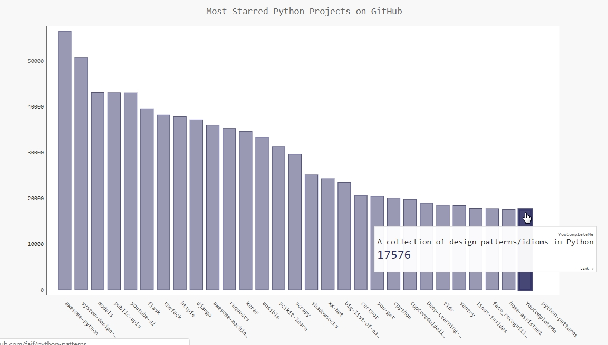

# 使用Python调用Web API实现图表统计

Web API：Web应用编程接口，用于URL请求特定信息的程序交互，请求的数据大多以非常易于处理的格式返回，比如JSON或CSV等。

本文将使用Python中的requests包实现Web API的调用，API接口来自于GitHub提供的公用API，最后使用图表对API调用的结果进行图表统计显示。

API地址为：`https://api.github.com/search/repositories?q=language:python&sort=stars`，该调用返回GitHub当前托管了多少个Python项目，包括最受欢迎的Python仓库的信息，结果如下：

```json
{
  "total_count": 3114636,
  "incomplete_results": false,
  "items": [
    {
      "id": 21289110,
      "node_id": "MDEwOlJlcG9zaXRvcnkyMTI4OTExMA==",
      "name": "awesome-python",
      "full_name": "vinta/awesome-python",
      "private": false,
      "owner": {
        "login": "vinta",
        "id": 652070,
        "node_id": "MDQ6VXNlcjY1MjA3MA==",
        "avatar_url": "https://avatars2.githubusercontent.com/u/652070?v=4",
...
```


## 使用Web API

如果想要Python调用Web API，需要使用requests包，该包用于处理网络请求和返回响应信息。可以使用pip工具输入以下命令进行安装：

```powershell
$ pip install --user requests
```

#### 使用requests处理API响应

```python
import requests

#执行API调用并存储响应
url='https://api.github.com/search/repositories?q=language:python&sort=stars'
# 调用url，将响应对象存储在变量r中
r=requests.get(url)
# 查看请求返回的http 状态码，200表示请求成功
print("Stauts Code",r.status_code)

# 使用json()将API的响应信息（json格式）转换为一个Python字典或JSON对象
response_dict=r.json()

#处理结果
print(response_dict.keys())
```

执行后，输出结果如下：

```python
Stauts Code 200
dict_keys(['total_count', 'incomplete_results', 'items'])
```

#### 对返回的结果进行深度处理

针对上述API返回的结果，进一步的进行解析，返回每一个仓库的详细信息。具体见代码注释说明：

```python
import requests

#执行API调用并存储响应
url='https://api.github.com/search/repositories?q=language:python&sort=stars'
# 调用url，将响应对象存储在变量r中
r=requests.get(url)
# 查看请求返回的http 状态码，200表示请求成功
print("Stauts Code",r.status_code)

# 使用json()将API的响应信息（json格式）转换为一个Python字典或JSON对象
response_dict=r.json()
# 获取GitHub包含的Python库数量
print("Total repositories:",response_dict["total_count"])


#探索有关仓库的信息，items是由多个字典组成的列表，每一个字典包含一个仓库信息
repo_dicts=response_dict['items']
print("Repositories returned:",len(repo_dicts))

##研究第一个仓库
#repo_dict=repo_dicts[0]

#print("\nKeys:",len(repo_dict))
#for key in sorted(repo_dict.keys()):
#    print(key)

print("\nSelected information about each repository:")
# 循环遍历获取每一个仓库的详细信息
for repo_dict in repo_dicts:
    # 项目名称
    print('\nName:', repo_dict['name'])
    # 键owner来访问表示所有者的字典，再使用键key来获取所有者的登录名。
    print('Owner:', repo_dict['owner']['login'])
    print('Stars:', repo_dict['stargazers_count'])
    print('Repository:', repo_dict['html_url'])
    print('Created:', repo_dict['created_at'])
    print('Updated:', repo_dict['updated_at'])
    print('Description:', repo_dict['description'])
```

上述代码返回的结果如下：

```
Stauts Code 200
Total repositories: 3114623
Repositories returned: 30

Selected information about each repository:

Name: awesome-python
Owner: vinta
Stars: 56507
Repository: https://github.com/vinta/awesome-python
Created: 2014-06-27T21:00:06Z
Updated: 2018-10-21T22:26:31Z
Description: A curated list of awesome Python frameworks, libraries, software an
d resources

Name: system-design-primer
Owner: donnemartin
Stars: 50650
Repository: https://github.com/donnemartin/system-design-primer
Created: 2017-02-26T16:15:28Z
Updated: 2018-10-21T22:02:07Z
Description: Learn how to design large-scale systems. Prep for the system design
 interview.  Includes Anki flashcards.

Name: models
....
```

注意：大多数API都存在速率限制，即你在特定时间内可执行的请求数存在限制。要获悉你是否接近了GitHub的限制，请在浏览器中输入https://api.github.com/rate_limit，你将看到类似于下面的响应：

```json
{
  "resources": {
    "core": {
      "limit": 60,
      "remaining": 60,
      "reset": 1540177458
    },
    "search": {
      "limit": 10,
      "remaining": 10,
      "reset": 1540173918
    },
    "graphql": {
      "limit": 0,
      "remaining": 0,
      "reset": 1540177458
    }
  },
  "rate": {
    "limit": 60,
    "remaining": 60,
    "reset": 1540177458
  }
}
```

通过结果可以指定，极限为每分钟10个请求。


## 使用Pygal对分析的结果进行可视化

完整代码如下所示，具体说明见代码中的详细注释：

```python
import requests
import pygal
from pygal.style import LightColorizedStyle as LCS, LightenStyle as LS

#执行API调用并存储响应
url='https://api.github.com/search/repositories?q=language:python&sort=stars'
# 调用url，将响应对象存储在变量r中
r=requests.get(url)
# 查看请求返回的http 状态码，200表示请求成功
print("Stauts Code",r.status_code)

# 使用json()将API的响应信息（json格式）转换为一个Python字典或JSON对象
response_dict=r.json()
# 获取GitHub包含的Python库数量
print("Total repositories:",response_dict["total_count"])

#探索有关仓库的信息，items是由多个字典组成的列表，每一个字典包含一个仓库信息
repo_dicts=response_dict['items']
#print("Repositories returned:",len(repo_dicts))
## 创建两个空列表存储包含在图表中的信息，名称用于条形图表的标签，星的数量用于确定条形图表的高度
#names,stars=[],[]
# plot_dicts用于添加自定义工具提示
names,plot_dicts=[],[]


for repo_dict in repo_dicts:
    names.append(repo_dict["name"])
    # 并不是每个节点一定有description，所以加if判断
    if repo_dict["description"]:
        plot_dict={
        # Pygal根据与键'value'相关联的数字来确定条形的高度
        'value':int(repo_dict["stargazers_count"]),
        # 使用与'label'相关联的字符串给条形创建工具提示
        'label':repo_dict["description"],
        # 为条形图表添加可点击的链接
        'xlink': repo_dict['html_url'],
        }
        plot_dicts.append(plot_dict)

#可视化，定义样式，将其基色设置为深蓝色，并传入LightColorizedStyle
my_style=LS('#333366',base_style=LCS)

my_config = pygal.Config()
# 表示让标签绕x轴旋转45度
my_config.x_label_rotation = 45
# 表示隐藏了图例
my_config.show_legend = False
# 图表标题字体大小
my_config.title_font_size = 24
# 副标签字体大小，包括x轴上的项目名以及y轴上的大部分数字
my_config.label_font_size = 14
# 主标签字体大小，y轴上为5000整数倍的刻度
my_config.major_label_font_size = 18
# 将较长的项目名缩短为15个字符
my_config.truncate_label = 15
# 隐藏图表中的水平线
my_config.show_y_guides = False
# 设置了自定义宽度
my_config.width = 1000

# 使用Bar()创建一个简单的条形图
# x_label_rotation=45：表示让标签绕x轴旋转45度
# show_legend=False：表示隐藏了图例
# chart=pygal.Bar(style=my_style,x_label_rotation=45,show_legend=False)
# 将上述的配置进行改进，分装为一个my_config对象
# 传递配置设置
chart=pygal.Bar(my_config,style=my_style)
chart.title="Most-Starred Python Projects on GitHub"
chart.x_labels=names

# 暂不需要添加标签
#chart.add('',stars)
# 添加工具提示需要的字典列表
chart.add('',plot_dicts)
chart.render_to_file("python_repos.svg")


#print("\nSelected information about each repository:")
## 循环遍历获取每一个仓库的详细信息
#for repo_dict in repo_dicts:
#    # 项目名称
#    print('\nName:', repo_dict['name'])
#    # 键owner来访问表示所有者的字典，再使用键key来获取所有者的登录名。
#    print('Owner:', repo_dict['owner']['login'])
#    print('Stars:', repo_dict['stargazers_count'])
#    print('Repository:', repo_dict['html_url'])
#    print('Created:', repo_dict['created_at'])
#    print('Updated:', repo_dict['updated_at'])
#    print('Description:', repo_dict['description'])
```

上述代码中，使用了`pygal.Bar()`方法创建一个简单的条形图，并向它传递了`my_style`。同时还传递了另外两个样式实参：让标签绕x轴旋转45度（`x_label_rotation=45`），并隐藏了图例（`show_legend=False`），因为只在图表中绘制一个数据系列。 

执行代码显示结果如下图所示：


------


参考资源

- 《Python编程：从入门到实践》

 

本文后续会随着知识的积累不断补充和更新，内容如有错误，欢迎指正。

最后一次更新时间：2018-10-22

------


