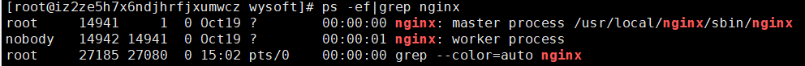

# Nginx 安装与配置

## 安装

### 查看是否安装过 Nginx

```shell
# ps -ef|grep nginx
```



### 查看 Nginx 的版本

```
[root@iz2ze5h7x6ndjhrfjxumwcz wysoft]# /usr/local/nginx/sbin/nginx -v
nginx version: nginx/1.18.0
```

### Nginx 源码下载链接

http://nginx.org/download/

### 下载源码并解压到安装目录

创建安装目录（或进入到安装目录），下载文件并解压：

```
[root@VM-0-5-centos ~]# mkdir -p /opt/data/source
[root@VM-0-5-centos ~]# cd /opt/data/source
[root@VM-0-5-centos source]# wget http://nginx.org/download/nginx-1.17.8.tar.gz
[root@VM-0-5-centos source]# tar zxmf nginx-1.17.8.tar.gz
```

### 安装编译工具及依赖项

```
yum -y install gcc pcre-devel zlib-devel openssl-devel libxml2-devel libxslt-devel gd-devel GeoIP-devel jemalloc-devel libatomic_ops-devel perl-devel perl-ExtUtils-Embed
```

### 编译 Nginx 所有功能模块

```
[root@VM-0-5-centos source]# cd nginx-1.17.8/
[root@VM-0-5-centos source]# ./configure \
--with-threads \
--with-file-aio \
--with-http_ssl_module \
--with-http_v2_module \
--with-http_realip_module \
--with-http_addition_module \
--with-http_xslt_module=dynamic \
--with-http_image_filter_module=dynamic \
--with-http_geoip_module=dynamic \
--with-http_sub_module \
--with-http_dav_module \
--with-http_flv_module \
--with-http_mp4_module \
--with-http_gunzip_module \
--with-http_gzip_static_module \
--with-http_auth_request_module \
--with-http_random_index_module \
--with-http_secure_link_module \
--with-http_degradation_module \
--with-http_slice_module \
--with-http_stub_status_module \
--with-stream=dynamic \
--with-stream_ssl_module \
--with-stream_realip_module \
--with-stream_geoip_module=dynamic \
--with-stream_ssl_preread_module \
--with-compat \
--with-pcre-jit 
make && make install
```

编译后，默认安装目录为 /usr/local/nginx。


## 环境配置

### 把Nginx执行文件的路径添加到环境变量中（建议）

Nginx编译成功后，为了便于操作维护，建议把Nginx执行文件的路径添加到环境变量中，可以通过如下命令完成：

```shell
cat >/etc/profile.d/nginx.sh << EOF
PATH=$PATH:/usr/local/nginx/sbin
EOF
source /etc/profile
```

### 将Nginx的conf目录软连接到/etc目录下（建议）

在CentOS操作系统中，配置文件通常放在/etc目录下，建议将Nginx的conf目录软连接到/etc目录下。

```
[root@VM-0-5-centos ~]# ln -s /usr/local/nginx/conf /etc/nginx
```

一旦建立的软连接，就可以直接使用nginx命令。

### 注册系统服务（可选）

CentOS系统环境中使用systemd进行系统和服务管理，可以按需守护进程，并通过systemctl命令进行systemd的监测和控制。为了方便Nginx应用进程的维护和管理，此处把Nginx注册成系统服务，由systemd进行服务管理，命令如下。

```
cat >/usr/lib/systemd/system/nginx.service <<EOF
[Unit]
Description=The Nginx Http and reverse proxy server
After=network.target remote-fs.target nss-lookup.target

[Service]
Type=forking
PIDFile=/run/nginx.pid
ExecStartPre=/usr/bin/rm -f /run/nginx.pid
ExecStartPre=/usr/local/nginx/sbin/nginx -t -q
ExecStart=/usr/local/nginx/sbin/nginx -g "pid /run/nginx.pid;"
ExecReload=/usr/local/nginx/sbin/nginx -t -q
ExecReload=/usr/local/nginx/sbin/nginx -s reload -g "pid /run/nginx.pid;"
ExecStop=/bin/kill -s HUP
KillSignal=SIGQUIT
TimeoutStopSec=5
KillMode=process
PrivateTmp=true

[Install]
WantedBy=multi-user.target
EOF
```

上述命令的说明如下（注意：执行的时候，需要将其中的中文注释去除掉）：

```
cat >/usr/lib/systemd/system/nginx.service <<EOF
[Unit]			                                          # 记录service文件的通用信息
Description=The Nginx Http and reverse proxy server       # Nginx服务描述信息
After=network.target remote-fs.target nss-lookup.target   # Nginx服务启动依赖，在指定服务之后启动

[Service]	                                       # 记录service文件的service信息
Type=forking                                       # 标准UNIX Daemon使用的启动方式
PIDFile=/run/nginx.pid                             # Nginx服务的pid文件位置
ExecStartPre=/usr/bin/rm -f /run/nginx.pid         # Nginx服务启动前删除旧的pid文件
ExecStartPre=/usr/local/nginx/sbin/nginx -t -q     # Nginx服务启动前执行配置文件检测
ExecStart=/usr/local/nginx/sbin/nginx -g "pid /run/nginx.pid;"     # 启动Nginx服务
ExecReload=/usr/local/nginx/sbin/nginx -t -q       # nginx服务重启前执行配置文件检测
ExecReload=/usr/local/nginx/sbin/nginx -s reload -g "pid /run/nginx.pid;"    #重启Nginx服务
ExecStop=/bin/kill -s HUP $MAINPID                 # 关闭Nginx服务
KillSignal=SIGQUIT
TimeoutStopSec=5
KillMode=process
PrivateTmp=true

[Install]                                          # 记录service文件的安装信息
WantedBy=multi-user.target                         # 多用户环境下启动
EOF
```

### 将 Nginx 服务注册为系统启动后自动启动

```
[root@VM-0-5-centos ~]# systemctl enable nginx
```

### 启动 Nginx 服务命令

```
systemctl start nginx
```

### 重启 Nginx 服务命令

```
systemctl reload nginx
```

### 停止 Nginx 服务命令

```
systemctl stop nginx
```

### 查看 Nginx 服务运行状态命令

```
systemctl status nginx
```

